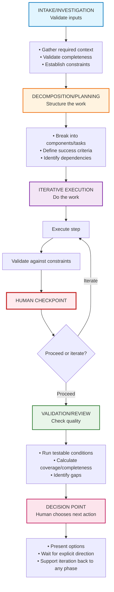

# AI Workflow Engineering: The Universal Pattern

## Table of Contents

- [Quick Start](#quick-start)
- [What Is This?](#what-is-this)
- [The Core Insight](#the-core-insight)
- [How to Use This](#how-to-use-this)
- [Example Skills](#example-skills)
- [The Universal Pattern](#the-universal-pattern)
- [Why This Pattern Emerges](#why-this-pattern-emerges)
- [The 7 Universal Principles](#the-7-universal-principles)
- [Example Domains](#example-domains)
- [Real-World Impact](#real-world-impact)
- [Meta-Pattern Validation](#meta-pattern-validation)
- [Related Patterns in the Wild](#related-patterns-in-the-wild)
- [Contributing](#contributing)
- [References](#references)

## Quick Start

1. **Want to analyze a response?** Use [`skills/comms--response-quality-analysis/SKILL.md`](skills/comms--response-quality-analysis/SKILL.md)
2. **Want to create a new workflow?** Follow [`skills/ai--workflow-engineering/SKILL.md`](skills/ai--workflow-engineering/SKILL.md)
3. **Want to understand the pattern?** Read this README
4. **Want to use as Claude Skills?** Upload any `SKILL.md` file to a Claude.ai Project's Knowledge

## What Is This?

This is a codification of the **universal pattern for building reliable AI workflows** that has independently emerged across multiple successful AI systems:

- **[PDD (Prompt-Driven Development)](https://github.com/strands-agents/agent-sop)** - Strands Agent SOPs
- **[HumanLayer](https://www.humanlayer.dev/)** - Context engineering for coding agents
- **[Spec-Driven Development](https://martinfowler.com/articles/exploring-gen-ai/sdd-3-tools.html)** - Kiro, spec-kit, Tessl
- **Response Quality Analysis** - Ensuring answers address the actual question

These systems, built by different teams solving different problems, converged on the **same meta-architecture**. This repository captures that pattern.

📚 **[Full references and links →](REFERENCES.md)**

## The Core Insight

Building reliable AI workflows requires the same disciplines as software engineering.

**The medium changed (natural language instead of Python), but the engineering discipline is identical.**

This pattern has also emerged in **Spec-Driven Development (SDD)** tools like Kiro, spec-kit, and Tessl, which apply structured specifications to software development. As [Birgitta Böckeler notes](https://martinfowler.com/articles/exploring-gen-ai/sdd-3-tools.html), SDD faces the same challenge our meta-pattern addresses: "how to structure specs that guide AI while keeping humans in control." The convergence extends beyond workflow design into code generation, further validating the universal nature of these patterns.

| Software Engineering | AI Workflow Engineering |
|---------------------|------------------------|
| Type safety | Parameter validation |
| Unit tests | Step constraints |
| Integration tests | Coverage analysis |
| Code review | Human checkpoints |
| Git commits | Checkpoint artifacts |
| CI/CD gates | Decision points |
| Design patterns | SOPs/workflows |

## How to Use This

### To Create a New Workflow

1. Read [`skills/ai--workflow-engineering/SKILL.md`](skills/ai--workflow-engineering/SKILL.md) - the meta-SOP
2. Follow its steps to create your workflow
3. Use [`skills/comms--response-quality-analysis/SKILL.md`](skills/comms--response-quality-analysis/SKILL.md) as a reference example
4. Run validation checklist to verify completeness

### To Improve Existing Workflows

1. Check against the 7 universal principles
2. Add missing phases (intake validation, checkpoints, etc.)
3. Make constraints explicit (convert to MUST/SHOULD/MAY)
4. Add validation tests and quality metrics

### To Deploy Workflows

Workflows created with this pattern can be used as:

- **Claude Skills** (upload `SKILL.md` to Claude.ai via Projects → Knowledge)
- **MCP Server prompts** (use in Claude Code)
- **Agent system prompts** (with Strands or similar frameworks)
- **Documentation** (human-readable process guides)

All skills in this repository follow the Claude Skills format with structured metadata and can be directly uploaded to Claude.ai projects.

## Example Skills

### 1. Meta-SOP: AI Workflow Engineering Pattern
**Skill:** `ai--workflow-engineering`
**File:** [`skills/ai--workflow-engineering/SKILL.md`](skills/ai--workflow-engineering/SKILL.md)

The universal pattern for creating reliable AI workflows. Use this when you need to create a new workflow, SOP, or structured process for solving complex problems with LLMs.

**Key sections:**
- Universal 5-phase structure (Intake → Decomposition → Execution → Validation → Decision)
- Constraint definition patterns (MUST/SHOULD/MAY)
- Checkpoint design principles
- Validation framework
- Artifact specification
- Meta-validation checklist

### 2. Example: Response Quality Analysis SOP
**Skill:** `comms--response-quality-analysis`
**File:** [`skills/comms--response-quality-analysis/SKILL.md`](skills/comms--response-quality-analysis/SKILL.md)

A complete implementation of the meta-pattern, demonstrating how to analyze whether your response actually addresses the question asked.

**What it does:**
- Validates problem is well-formed
- Decomposes problem into components
- Analyzes response coverage
- Runs quality tests
- Provides specific improvement suggestions
- Guides revision process

**Real example:** Takes a Slack response that scored 16% coverage and guides improvement to 68% coverage.

## The Universal Pattern

All successful AI workflows follow this structure:

## Why This Pattern Emerges

**📖 [See detailed explanation in FAQs.md](FAQs.md#why-this-pattern-emerges)**

Multiple teams independently discovered these patterns within a 12-month window (2024-2025) because they address fundamental challenges in managing LLM uncertainty: probabilistic outputs, complex task decomposition, limited context, and human-AI collaboration.

## The 7 Universal Principles

All reliable AI workflows follow these principles:

### 1. Explicit Over Implicit
- Make all constraints explicit (MUST/SHOULD/MAY)
- Make all checkpoints explicit with clear options
- Never rely on LLM "common sense"

### 2. Validate Early and Often
- Validate inputs before processing
- Validate outputs before delivery
- Fail fast with clear error messages

### 3. Human-in-the-Loop at Critical Points
- Auto-progress only on mechanical steps
- Require confirmation for decisions
- Support iteration at any time

### 4. Observable and Measurable
- Every step produces observable artifact
- Every phase has measurable exit criteria
- Every output has quality metrics

### 5. Robust to Interruption
- Support resumption from any checkpoint
- Preserve state in artifacts
- Don't rely on conversation context alone

### 6. Iterative by Design
- Non-linear phase progression
- Easy to revise and refine
- Clear paths back to earlier phases

### 7. Constrained but Flexible
- Rigid structure (phases, checkpoints)
- Flexible content (adapt to domain)
- Hard constraints (MUST) for critical paths

## Example Domains

This pattern works for any complex AI workflow:

**Development:**
- Code review quality
- Design document writing  
- API documentation review
- Test strategy creation

**Communication:**
- Response quality (this repo's example)
- Meeting facilitation
- Technical writing
- Stakeholder communication

**Analysis:**
- Problem decomposition
- Decision making
- Requirements gathering
- Risk assessment

**Planning:**
- Project planning
- Sprint planning
- Roadmap creation
- Resource allocation

## Meta-Pattern Validation

Use this checklist to verify your workflow follows the pattern:

**Core Structure:**
- [ ] Has intake/validation phase
- [ ] Has decomposition/planning phase
- [ ] Has iterative execution phase(s)
- [ ] Has validation/review phase
- [ ] Has decision point phase

**Constraints:**
- [ ] Uses RFC 2119 language (MUST/SHOULD/MAY)
- [ ] Includes rationale for critical constraints
- [ ] Defines anti-patterns to prevent
- [ ] All constraints are testable/observable

**Checkpoints:**
- [ ] At least one per major phase
- [ ] Prevents auto-progression
- [ ] Presents clear options
- [ ] Supports iteration backward

**Validation:**
- [ ] Defines success criteria
- [ ] Has measurable quality metrics
- [ ] Includes pass/fail tests
- [ ] Calculates completeness/coverage

## Contributing

This meta-pattern is designed to evolve. As you build workflows and discover new patterns or principles, they should be added to the meta-SOP at [`skills/ai--workflow-engineering/SKILL.md`](skills/ai--workflow-engineering/SKILL.md).

New workflow examples should be added as new skills in the `skills/` directory following the naming convention: `{category}--{workflow-name}/SKILL.md`

If you're building AI workflows and discovering new patterns, consider contributing them here.

Consider this a living document capturing the emerging discipline of **AI workflow engineering**.

## Real-World Impact

### Before This Pattern

**Typical AI workflow problems:**
- LLM solves wrong problem (pattern-matches to training data)
- Auto-progression skips critical decisions
- No validation that output is actually useful
- Can't resume after interruption
- Quality is inconsistent

**Example:** Slack response about dependency coordination
- Response covered 16% of actual question
- Solved "feature overlap" instead of "request coordination"
- No acknowledgment of gaps
- Context mismatched (Amazon structure assumed)

### After This Pattern

**With structured workflow:**
- Validates problem is well-formed (catches ambiguity early)
- Decomposes into components (ensures comprehensive coverage)
- Explicit checkpoints (human decides, not AI auto-pilot)
- Quality metrics (objective assessment)
- Guided improvement (specific, actionable suggestions)

**Same example with workflow:**
- Identified 4 distinct components
- Measured 16% coverage (honest assessment)
- Pinpointed critical gap (prioritization framework)
- Generated specific improvements
- Guided to 68% coverage with targeted additions

## Related Patterns in the Wild

### Spec-Driven Development (SDD)

The same pattern applied to software development, with three observed levels:

1. **Spec-first** (Kiro) - Write spec before code
2. **Spec-anchored** (spec-kit) - Maintain spec after implementation
3. **Spec-as-source** (Tessl) - Spec is primary artifact, humans never edit code

**Key insight from [Böckeler's analysis](https://martinfowler.com/articles/exploring-gen-ai/sdd-3-tools.html):**
> "The best way for us to stay in control of what we're building are small, iterative steps."

This validates our meta-pattern's emphasis on iterative phases, validation gates, and human checkpoints.

### Historical Context: Model-Driven Development (MDD)

SDD and AI workflow patterns succeed where Model-Driven Development (MDD) failed in the 2000s:

- **MDD failed:** Rigid structure + manual code generation = high overhead
- **SDD/AI workflows succeed:** Flexible structure + LLM generation = low overhead

**Learning:** Structured specifications work when paired with flexible generation (LLMs), not rigid templates.

## The Future

This pattern represents the convergence of multiple independent discoveries. As more teams build AI workflows, we expect to see:

1. **Pattern library** - Catalog of proven workflow patterns for common domains
2. **Tooling** - Automated validation and quality checking
3. **Standards** - Community conventions for workflow structure
4. **Education** - Teaching AI workflow engineering as a discipline

**This is programming for the age of LLMs.**

---

## References

For detailed citations, URLs, and resources about all systems that converged on this pattern, see **[REFERENCES.md](REFERENCES.md)**.

Key resources:
- [Strands Agent SOPs](https://github.com/strands-agents/agent-sop) - PDD and natural language workflows
- [HumanLayer](https://www.humanlayer.dev/) - Context engineering for coding agents
- [Understanding SDD](https://martinfowler.com/articles/exploring-gen-ai/sdd-3-tools.html) - Spec-Driven Development analysis

## License

This meta-pattern is shared as a public good for the AI engineering community.

## Acknowledgments

This pattern emerged through independent discoveries by:
- **Strands Agents team** - Agent SOPs, PDD ([GitHub](https://github.com/strands-agents/agent-sop))
- **HumanLayer team** - Context engineering, human-in-the-loop ([humanlayer.dev](https://www.humanlayer.dev/))
- **SDD Tool Builders** - Kiro, spec-kit, Tessl ([Analysis](https://martinfowler.com/articles/exploring-gen-ai/sdd-3-tools.html))
- **Anthropic** - Claude Skills, structured workflows
- **Individual practitioners** solving real problems

**The pattern is bigger than any single implementation.**

See [REFERENCES.md](REFERENCES.md) for full citations and resources.

---

*"Good design is when you remove something and the system falls apart.  
Great design is when multiple people independently discover the same solution."*
