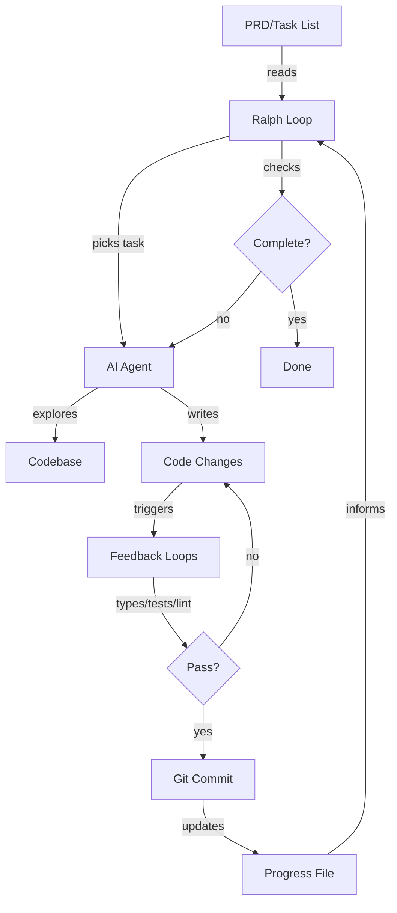

# Ralph Wiggum: Autonomous AI Coding via Loops
**Purpose**: Understand the Ralph Wiggum approach and decide if it fits your workflow.
**Target audience**: Professional software engineers evaluating autonomous AI coding tools.
**What you'll learn**: The mechanics of loop-based AI coding, quantified impacts, when to use it, and how to start safely.

---
## Section A: Core Concepts and Entities

### What is Ralph Wiggum?

**Answer**: Ralph is a shell script that runs your AI coding CLI in a loop. The AI picks tasks from your list, implements them, and repeats until done.
**Explain**: Instead of writing a new prompt for each task, you write one prompt that runs repeatedly. The AI reads your plan, checks what's done, chooses what to do next, implements it, commits the code, and loops. You define the end state. Ralph gets there.
**Educate**: This shifts AI coding from interactive (you watch and steer) to autonomous (you set it running and return later).
### Evolution of AI Coding

```
Vibe Coding → Planning → Multi-Phase Plans → Ralph Loops
(no checks)   (single)   (human writes    (agent chooses
                         each phase)       from your list)
```

**What changed**: The agent now chooses tasks. You don't write phase-by-phase instructions.
**So What**: This scales beyond single context windows without constant human involvement.
**Now What**: You define requirements, not implementation steps. The AI figures out how.
### Key Entities and Relationships



**Core entities**:
- **PRD**: Product Requirements Document - your task list
- **Loop**: Shell script that runs the same prompt repeatedly
- **Progress File**: Tracks completed work between iterations
- **Feedback Loops**: Types, tests, linting - automated checks
- **Commit**: Git commit after each completed task
- **Context Window**: AI's working memory - resets each iteration

**Critical relationship**: Progress file + git history = context preservation. Without these, each loop starts from zero.
### Two Operating Modes

| Mode     | Full Name          | Control    | Best For                  | Risk   |
| -------- | ------------------ | ---------- | ------------------------- | ------ |
| **HITL** | Human-in-the-loop  | You watch  | Learning, risky tasks     | Low    |
| **AFK**  | Away from keyboard | Autonomous | Bulk work, proven prompts | Medium |
**HITL**: Run one iteration. Watch everything. Intervene when needed. Feels like pair programming.
**AFK**: Run 5-50 iterations. Set max count (never infinite). Walk away. Review commits when done.
**Progression**: Start HITL to learn and refine. Go AFK once you trust your prompt.
## Section B: Critical Insights with Impact Quantification

### Insight 1: Context Preservation Unlocks Scale

**What**: AI agents forget everything between context windows. Each iteration starts fresh.
**So What**: Without memory, the agent explores the entire repo every loop. This burns tokens and time.
**Now What**: Use progress files and git commits. The agent reads what's done and jumps to the next task.
**Impact**: Anthropic research shows this pattern enables long-running agents that maintain context across sessions.
**Quantified**: Matt Pocock used Ralph to improve test coverage from **16% to 100%** on AI Hero CLI. Without progress tracking, this would require re-exploring the codebase every iteration.
### Insight 2: Feedback Loops Determine Quality

**What**: Feedback loops are automated checks - TypeScript types, unit tests, linting, pre-commit hooks.
**So What**: The more loops you add, the higher quality code Ralph produces. Best setup blocks commits unless everything passes.
**Now What**: Make feedback loops mandatory in your prompt. Ralph can't declare victory if tests are red.
**Impact Table**:

| Feedback Loop    | What It Catches                | Block Commits? |
| ---------------- | ------------------------------ | -------------- |
| TypeScript types | Type mismatches, missing props | Yes            |
| Unit tests       | Broken logic, regressions      | Yes            |
| Playwright MCP   | UI bugs, interactions          | Optional       |
| ESLint/linting   | Code style, potential bugs     | Yes            |
| Pre-commit hooks | All of the above               | Required       |
**Quantified**: Every tip works for human developers too. Ralph makes them non-negotiable. Great programmers don't trust their own code - they build automations to verify what they ship.

### Insight 3: Agents Amplify What They See

**What**: Your instructions compete with your codebase. One is a few lines. The other is thousands of lines of evidence.
**So What**: You can write "never use `any` types" in your prompt. But if Ralph sees `any` throughout existing code, it follows the codebase, not your instructions.
**Now What**: Clean your codebase before letting Ralph loose. Poor code leads to poorer code. This is software entropy - and Ralph accelerates it.
**Quantified**: A human might commit once or twice a day. Ralph can pile **dozens of commits into a repo in hours**. If those commits are low quality, entropy compounds fast.
**Prevention**: Feedback loops (types, tests, linting) enforce standards. Explicit quality expectations in prompts or `AGENTS.md` files.
### Insight 4: Small Steps Beat Large Chunks

**What**: Rate of feedback is your speed limit. Large tasks mean less frequent feedback and more context rot.
**So What**: LLMs get worse as context windows fill. This is called context rot - the longer you go, the stupider the output.
**Now What**: Keep PRD items small. One logical change per commit. Run feedback loops after each change.
**Tradeoff**: Each iteration has startup costs (pick task, explore repo, gather context). But small steps produce higher quality code, especially for AFK Ralph where you're not watching.
**Guidance**: For AFK Ralph, keep items small. For HITL Ralph, slightly larger is acceptable. Always bias small.
### Insight 5: Risky Tasks Need Human Involvement

**What**: Without guidance, Ralph picks the first item or easiest task. Developers love quick wins.
**So What**: Seasoned engineers nail down hard stuff first. Early architectural decisions cascade through the entire codebase. Shortcuts here compound into technical debt.
**Now What**: Tell Ralph to prioritize architectural work, integration points, and unknown unknowns. Save UI polish and quick wins for later.

**Priority Matrix**:

| Task Type | Priority | Mode | Why |
|-----------|----------|------|-----|
| Architectural decisions | Highest | HITL | Decisions cascade through codebase |
| Integration points | High | HITL | Reveals incompatibilities early |
| Unknown unknowns | High | HITL | Better to fail fast than fail late |
| Standard features | Medium | AFK | Foundation is solid |
| UI polish | Low | AFK | Can be parallelized anytime |
| Quick wins | Lowest | AFK | Easy to slot in |

**Rule**: Use HITL Ralph for risky tasks. Switch to AFK Ralph once foundation is proven.

### Insight 6: Scope Definition Prevents Infinite Loops

**What**: Vague tasks ("improve this codebase") lead to endless improvements or premature victory declarations.
**So What**: Ralph needs explicit stop conditions. Without them, it might loop forever or skip work you consider essential.
**Now What**: Define exactly what "done" looks like. Use structured formats like JSON with `passes` fields.
**Real Example**: Matt ran Ralph to increase test coverage. After three iterations, Ralph reported "Done with all user-facing commands." But it skipped internal commands entirely - decided they weren't user-facing and marked them to be ignored by coverage.**Fix**: Specify files to include, stop conditions, and edge cases. Ralph knows when "complete" actually means complete.
**Quantified**: Anthropic research structures PRD items as JSON with category, description, steps, and `passes: false`. Ralph marks `passes: true` when done. The PRD becomes both scope and progress tracker.

### Insight 7: Safety Requires Sandboxes

**What**: AFK Ralph needs permissions to edit files, run commands, and commit code. You're away from keyboard.
**So What**: What stops it from running `rm -rf ~`? Nothing, unless you isolate it.
**Now What**: Use Docker sandboxes for AFK Ralph. Your project directory is mounted, but Ralph can't touch home directory, SSH keys, or system files.

```bash
docker sandbox run claude
```

**Tradeoff**: Global `AGENTS.md` and user skills won't be loaded. For most Ralph loops, this is fine.
**Rule**: Sandboxes optional for HITL (you're watching). Essential for AFK, especially overnight loops.

### Insight 8: Cost vs. Leverage Trade-off

**What**: Running AFK Ralph overnight - will this rack up enormous bills?
**So What**: Ralph is configurable to how much you want to spend. HITL Ralph still beats multi-phase planning, even if you never run AFK.
**Now What**: Start with HITL. Add AFK when the leverage justifies the cost.
**Quantified**:
- Author's cost: Anthropic 5x Max plan at **~£90/month**
- Typical runtime: **30-45 minutes** per loop (can run for hours)
- Iteration counts: **5-10 for small tasks**, **30-50 for larger tasks**
**Context**: We're in a golden age where you can do magical things with AI faster than humans - but the market still pays human wages. Yes, you pay. But the rewards are there if you're willing to claim them.

**Note**: Open source models aren't good enough for Ralph yet. They require powerful GPUs and output quality isn't there. In AI coding, you pay to play.

## Section C: Implementation Playbook

### Decision Matrix: Should I Use Ralph?

| Your Situation | Use Ralph? | Start With | Notes |
|----------------|-----------|------------|-------|
| Learning AI coding tools | Yes | HITL | Refine prompts, build confidence |
| Bulk work (tests, refactors) | Yes | HITL → AFK | Start supervised, go autonomous |
| One-off large task | Maybe | Multi-phase | Ralph shines on repeated patterns |
| Risky architectural work | Yes | HITL only | Keep human in loop |
| Prototype code | Yes | AFK | Lower quality bar, speed wins |
| Production code | Yes | HITL + feedback loops | Quality non-negotiable |
| Low budget | Yes | HITL only | Still beats manual multi-phase |
| High budget + proven prompt | Yes | AFK | Maximum leverage |

### Basic Ralph Script (Verbatim)

```bash
#!/bin/bash
# ralph.sh
# Usage: ./ralph.sh <iterations>

set -e

if [ -z "$1" ]; then
  echo "Usage: $0 <iterations>"
  exit 1
fi

# For each iteration, run Claude Code with the following prompt
for ((i=1; i<=$1; i++)); do
  result=$(docker sandbox run claude -p \
"@some-plan-file.md @progress.txt \
1. Decide which task to work on next. \
This should be the one YOU decide has the highest priority. \
2. Check any feedback loops, such as types and tests. \
3. Append your progress to the progress.txt file. \
4. Make a git commit of that feature. \
ONLY WORK ON A SINGLE FEATURE. \
If all work is complete, output <promise>COMPLETE</promise>.")

  echo "$result"

  if [[ "$result" == *"<promise>COMPLETE</promise>"* ]]; then
    echo "PRD complete, exiting."
    exit 0
  fi
done
```

### Enhanced Ralph Prompt Template

Use this template for your Ralph prompt. Customize to your repo:

```markdown
@prd.json @progress.txt

# Context
This is [production/prototype] code. [Quality expectations].

# Task Selection
Choose the next task from prd.json based on priority:
1. Architectural decisions and core abstractions
2. Integration points between modules
3. Unknown unknowns and spike work
4. Standard features
5. Polish and quick wins

# Implementation
- Keep changes small and focused
- One logical change per commit
- If a task feels too large, break it into subtasks

# Feedback Loops (MANDATORY)
Before committing, run ALL feedback loops:
1. TypeScript: npm run typecheck (must pass)
2. Tests: npm run test (must pass)
3. Lint: npm run lint (must pass)
Do NOT commit if any loop fails. Fix issues first.

# Progress Tracking
After completing each task, append to progress.txt:
- Task completed and PRD item reference
- Key decisions made
- Files changed
- Blockers or notes for next iteration
Keep entries concise. This file helps future iterations skip exploration.

# Completion
If all PRD items are complete and marked passes: true,
output <promise>COMPLETE</promise>.
```

### PRD Format (JSON)

Generate structured PRD items with this format:

```json
{
  "category": "functional",
  "description": "New chat button creates a fresh conversation",
  "steps": [
    "Click the 'New Chat' button",
    "Verify a new conversation is created",
    "Check that chat area shows welcome state"
  ],
  "passes": false
}
```

Ralph marks `passes: true` when complete. The PRD becomes a living TODO list.

### Progress File Format

Keep it simple and concise:

```text
# Iteration 1
- Completed: Add user authentication (prd-item-3)
- Decision: Used JWT over sessions (stateless scales better)
- Files: auth.ts, middleware.ts, auth.test.ts
- Note: All tests passing, coverage at 87%

# Iteration 2
- Completed: Add logout endpoint (prd-item-4)
- Files: auth.ts, auth.test.ts
- Note: Logout clears token, verified in test
```

Delete `progress.txt` after your sprint. It's session-specific, not permanent docs.

### Quality Definition Template (AGENTS.md)

Add this to your repo's `AGENTS.md` or Ralph prompt:

```markdown
# Code Quality Standards

This codebase will outlive you. Every shortcut you take becomes
someone else's burden. Every hack compounds into technical debt
that slows the whole team down.

You are not just writing code. You are shaping the future of this
project. The patterns you establish will be copied. The corners
you cut will be cut again.

Fight entropy. Leave the codebase better than you found it.

## Specific Standards
- TypeScript: No `any` types without explicit justification
- Tests: 80% coverage minimum, test happy path and edge cases
- Linting: All ESLint rules must pass
- Commits: One logical change per commit with clear messages
```

### Alternative Loop Types Checklist

Ralph isn't just for feature backlogs. Try these patterns:

**Test Coverage Loop**:
- [ ] Point Ralph at coverage metrics
- [ ] Ralph finds uncovered lines
- [ ] Ralph writes tests
- [ ] Iterates until coverage hits target
- [ ] Verified: 16% → 100% coverage on AI Hero CLI

**Linting Loop**:
- [ ] Feed Ralph linting errors
- [ ] Ralph fixes one error per iteration
- [ ] Runs linter to verify each fix
- [ ] Repeats until no errors remain

**Duplication Loop**:
- [ ] Hook Ralph to `jscpd` (duplicate detector)
- [ ] Ralph identifies code clones
- [ ] Ralph refactors into shared utilities
- [ ] Reports what changed

**Entropy Loop**:
- [ ] Ralph scans for code smells (unused exports, dead code)
- [ ] Ralph cleans up one issue per iteration
- [ ] Documents changes in progress.txt
- [ ] Software entropy in reverse

### Safety Checklist (AFK Ralph)

Before running AFK Ralph overnight:
- [ ] Codebase is clean (no existing entropy to amplify)
- [ ] All feedback loops are configured and mandatory
- [ ] PRD items are small and well-defined
- [ ] Stop condition is explicit
- [ ] Docker sandbox is enabled
- [ ] Max iterations are capped (never infinite)
- [ ] Quality expectations are documented in prompt
- [ ] Progress file tracking is enabled
- [ ] You have a way to be notified when done
- [ ] You're comfortable with the cost (check usage limits)

### Getting Started Sequence

1. **Learn with HITL**
   - Create `ralph-once.sh` (runs single iteration)
   - Define 3-5 small PRD items
   - Run HITL Ralph, watch everything
   - Refine prompt based on what you observe

1. **Refine and Test**
   - Add feedback loops (types, tests, lint)
   - Ensure all loops are mandatory
   - Test that Ralph can't commit with failures
   - Run 3-5 HITL iterations on low-risk tasks

1. **First AFK Run**
   - Clean your codebase
   - Define 5-10 small, low-risk PRD items
   - Enable Docker sandbox
   - Run AFK Ralph with max 10 iterations
   - Review all commits carefully

1. **Scale Up**
   - Increase iteration counts (30-50 for larger tasks)
   - Use HITL for risky work, AFK for proven patterns
   - Experiment with alternative loop types
   - Customize Ralph for your workflow

---

## Key Takeaways

**Ralph is a loop**. That simplicity makes it infinitely configurable.
**The agent chooses tasks**. You define the end state, Ralph gets there.
**Context preservation is critical**. Progress files + git commits = memory between iterations.
**Feedback loops determine quality**. Types, tests, linting - make them mandatory.
**Agents amplify what they see**. Clean codebase → clean code. Poor code → entropy.
**Small steps beat large chunks**. Context rot is real. Tight feedback loops win.
**Start HITL, go AFK**. Learn first, automate second.
**Quantified impact**: 16% → 100% test coverage. 30-45 minute typical runtime. £90/month cost. 5-50 iterations per loop.

---
## Source Validation

**Primary Source**: "11 Tips For AI Coding With Ralph Wiggum" by Matt Pocock, published on aihero.dev (2026-01-10)

**Authority**: Matt Pocock, creator of AI Hero CLI and active practitioner of Ralph Wiggum approach

**Supporting Evidence**:
- Anthropic research on long-running agent harnesses
- Real-world examples: AI Hero CLI (16% → 100% coverage), course video manager, entire programming languages built with Ralph
- References to established tools: Claude Code, Docker sandboxes, TypeScript, testing frameworks

**Reliability**: High for practical guidance. Author has direct experience and provides concrete examples with quantified outcomes.

**Limitations**: Single practitioner's perspective. Cost and effectiveness may vary by team, codebase, and AI model used.

---

*This curated context document synthesizes Matt Pocock's comprehensive guide on Ralph Wiggum. It prioritizes ease of recall for professional engineers evaluating autonomous AI coding approaches. All quantified impacts come directly from the source material.*
