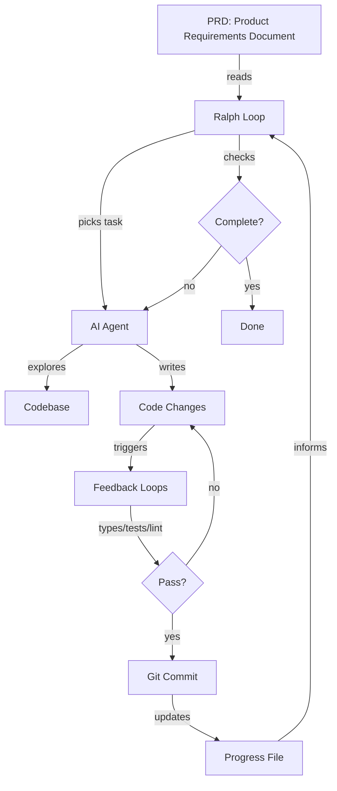

# Ralph Wiggum: Ship Working Code While You Sleep

**Purpose**: Implement autonomous AI coding loops that work through your backlog while you're away from keyboard.

**Target audience**: Software engineers ready to move beyond interactive AI coding to autonomous agent loops.

**What you'll learn**: Why Ralph works, how to set it up safely, and when to use HITL vs AFK modes. Includes quantified impacts, decision matrices, and ready-to-use script templates.

---

## Section A: Core Concepts and Entities

### What is Ralph Wiggum?

**Answer**: Ralph is a bash loop that runs your AI coding CLI repeatedly until all tasks are complete.

**Explain**: Instead of writing a new prompt for each task, you write one prompt that runs in a loop. The AI reads your PRD, checks what's done, picks the next task, implements it, commits the code, and loops. You define the end state. Ralph gets there.

**Educate**: This shifts AI coding from interactive (you watch and steer) to autonomous (you set it running and return hours later). Ralph mirrors how human engineers work—pick a task from the board, complete it, commit, grab the next one, repeat until the sprint is done.

### Why Ralph Emerged: Evolution of AI Coding

AI coding evolved through four distinct stages. Each stage solved real problems but created new ones.

**Vibe Coding** (2023): Chat with AI, copy-paste code, hope it works. No systematic checks. Fast to start, slow to ship. Quality unpredictable.

**Planning Mode** (early 2024): AI creates implementation plan first. You approve, AI executes. Better quality, but plans were single-shot. One context window, one plan, done.

**Multi-Phase Plans** (mid 2024): Break large work into phases. AI runs phase 1, you review, AI runs phase 2, repeat. Better than single-shot, but you write every phase transition. You become the orchestrator—figuring out dependencies, sequencing work, managing the graph.

**Ralph Loops** (late 2024): AI picks its own tasks from your PRD. You define requirements, not implementation steps. The loop handles orchestration. You write what you want, not how to get there.

The key shift: **The agent now chooses tasks**. You stopped being the orchestrator. The loop became the orchestrator. You became the requirements gatherer.

### Key Entities and Relationships



**Core entities**:
- **PRD**: Your task list. JSON, Markdown, or prose. Defines the end state.
- **Loop**: Shell script that runs the same prompt repeatedly.
- **Progress File**: Tracks completed work between iterations. Agent's memory.
- **Feedback Loops**: Types, tests, linting. Automated checks that catch errors.
- **Commit**: Git commit after each task. Preserves context and provenance.
- **Context Window**: AI's working memory. Resets each iteration.

**Critical relationship**: Progress file + git history = context preservation. Without these, each loop starts from zero. The agent forgets everything.

### Two Operating Modes

| Mode | Full Name | Control | Best For | Risk |
|------|-----------|---------|----------|------|
| **HITL** | Human-in-the-loop | You watch | Learning, risky tasks | Low |
| **AFK** | Away from keyboard | Autonomous | Bulk work, proven prompts | Medium |

**HITL**: Run one iteration. Watch everything. Intervene when needed. Feels like pair programming. Use `claude` directly.

**AFK**: Run 5-50 iterations. Set max count (never infinite). Walk away. Review commits when done. Use `docker sandbox run claude` for isolation.

**Progression**: Start HITL to learn and refine prompts. Go AFK once you trust your setup.

---

## Section B: Critical Insights with Impact Quantification

### Insight 1: Context Preservation Unlocks Scale

**What**: AI agents forget everything between context windows. Each iteration starts fresh.

**So What**: Without memory, the agent explores the entire repo every loop. This burns tokens and time. You pay for redundant work.

**Now What**: Use progress files and git commits. The agent reads what's done and jumps to the next task. No redundant exploration.

**Impact**: Anthropic research shows this pattern enables long-running agents that maintain context across sessions. Without it, agents can't work beyond single context windows.

**Quantified**: Matt Pocock used Ralph to improve test coverage from **16% to 100%** on AI Hero CLI. Without progress tracking, this would require re-exploring the codebase every iteration. That's 6x more work, 6x more cost.

### Insight 2: Feedback Loops Determine Quality

**What**: Feedback loops are automated checks. TypeScript types, unit tests, linting, pre-commit hooks.

**So What**: The more loops you add, the higher quality code Ralph produces. Best setup blocks commits unless everything passes. The agent can't declare victory if tests are red.

**Now What**: Make feedback loops mandatory in your prompt. Ralph runs types, runs tests, runs lint. If any fail, Ralph fixes before committing.

**Impact Table**:

| Feedback Loop | What It Catches | Block Commits? |
|---------------|-----------------|----------------|
| TypeScript types | Type mismatches, missing props | Yes |
| Unit tests | Broken logic, regressions | Yes |
| Playwright MCP | UI bugs, interactions | Optional |
| ESLint/linting | Code style, potential bugs | Yes |
| Pre-commit hooks | All of the above | Required |

**Quantified**: Every tip works for human developers too. Ralph makes them non-negotiable. Great programmers don't trust their own code. They build automations to verify what they ship.

### Insight 3: Agents Amplify What They See

**What**: Your instructions compete with your codebase. One is a few lines. The other is thousands of lines of evidence.

**So What**: You can write "never use `any` types" in your prompt. But if Ralph sees `any` throughout existing code, it follows the codebase, not your instructions. Code speaks louder than comments.

**Now What**: Clean your codebase before letting Ralph loose. Poor code leads to poorer code. This is software entropy. Ralph accelerates it.

**Quantified**: A human might commit once or twice a day. Ralph can pile **dozens of commits into a repo in hours**. If those commits are low quality, entropy compounds fast. Thirty bad commits in one night can set a project back weeks.

**Prevention**: Feedback loops (types, tests, linting) enforce standards. Explicit quality expectations in prompts or `AGENTS.md` files. Make standards executable, not aspirational.

### Insight 4: Small Steps Beat Large Chunks

**What**: Rate of feedback is your speed limit. Large tasks mean less frequent feedback and more context rot.

**So What**: LLMs get worse as context windows fill. This is context rot. The longer you go, the stupider the output. Big tasks consume more context, produce worse code.

**Now What**: Keep PRD items small. One logical change per commit. Run feedback loops after each change.

**Tradeoff**: Each iteration has startup costs. Pick task, explore repo, gather context. But small steps produce higher quality code, especially for AFK Ralph where you're not watching.

**Guidance**: For AFK Ralph, keep items small. For HITL Ralph, slightly larger is acceptable. Always bias small.

### Insight 5: Risky Tasks Need Human Involvement

**What**: Without guidance, Ralph picks the first item or easiest task. Developers love quick wins.

**So What**: Seasoned engineers nail down hard stuff first. Early architectural decisions cascade through the entire codebase. Shortcuts here compound into technical debt.

**Now What**: Tell Ralph to prioritize architectural work, integration points, and unknown unknowns. Save UI polish and quick wins for later.

**Priority Matrix**:

| Task Type | Priority | Mode | Why |
|-----------|----------|------|-----|
| Architectural decisions | Highest | HITL | Decisions cascade through codebase |
| Integration points | High | HITL | Reveals incompatibilities early |
| Unknown unknowns | High | HITL | Better to fail fast than fail late |
| Standard features | Medium | AFK | Foundation is solid |
| UI polish | Low | AFK | Can be parallelized anytime |
| Quick wins | Lowest | AFK | Easy to slot in |

**Rule**: Use HITL Ralph for risky tasks. Switch to AFK Ralph once foundation is proven.

### Insight 6: Scope Definition Prevents Infinite Loops

**What**: Vague tasks ("improve this codebase") lead to endless improvements or premature victory declarations.

**So What**: Ralph needs explicit stop conditions. Without them, it might loop forever or skip work you consider essential.

**Now What**: Define exactly what "done" looks like. Use structured formats like JSON with `passes` fields. The PRD becomes both scope and progress tracker.

**Real Example**: Matt ran Ralph to increase test coverage. After three iterations, Ralph reported "Done with all user-facing commands." But it skipped internal commands entirely. Decided they weren't user-facing and marked them to be ignored by coverage.

**Fix**: Specify files to include, stop conditions, and edge cases. Ralph knows when "complete" actually means complete.

**Quantified**: Anthropic research structures PRD items as JSON with category, description, steps, and `passes: false`. Ralph marks `passes: true` when done.

### Insight 7: Safety Requires Sandboxes

**What**: AFK Ralph needs permissions to edit files, run commands, and commit code. You're away from keyboard.

**So What**: What stops it from running `rm -rf ~`? Nothing, unless you isolate it.

**Now What**: Use Docker sandboxes for AFK Ralph. Your project directory is mounted, but Ralph can't touch home directory, SSH keys, or system files.

```bash
docker sandbox run claude
```

**Tradeoff**: Global `AGENTS.md` and user skills won't be loaded. For most Ralph loops, this is fine.

**Rule**: Sandboxes optional for HITL (you're watching). Essential for AFK, especially overnight loops.

### Insight 8: Cost vs Leverage Tradeoff

**What**: Running AFK Ralph overnight—will this rack up enormous bills?

**So What**: Ralph is configurable to how much you want to spend. HITL Ralph still beats multi-phase planning, even if you never run AFK.

**Now What**: Start with HITL. Add AFK when the leverage justifies the cost.

**Quantified**:
- Author's cost: Anthropic 5x Max plan at **~£90/month**
- Typical runtime: **30-45 minutes** per loop (can run for hours)
- Iteration counts: **5-10 for small tasks**, **30-50 for larger tasks**

**Context**: We're in a golden age where you can do magical things with AI faster than humans, but the market still pays human wages. Yes, you pay. But the rewards are there if you're willing to claim them.

**Note**: Open source models aren't good enough for Ralph yet. They require powerful GPUs and output quality isn't there. In AI coding, you pay to play.

---

## Section C: Implementation Playbook

This section combines narrative guidance with reference materials. Follow the narrative for setup. Use reference tables and templates for decisions and implementation.

### Getting Started Path (Narrative)

Before you write any code, you need tools installed. Ralph requires Claude Code and Docker Desktop. Claude Code is Anthropic's CLI for agentic coding. Docker Desktop provides sandboxes for safe AFK execution.

**Install Claude Code** using the native binary:

```bash
curl -fsSL https://claude.ai/install.sh | bash
```

If you get "command not found: claude" after installing, add the install location to your PATH:

```bash
echo 'export PATH="$HOME/.local/bin:$PATH"' >> ~/.bashrc
source ~/.bashrc
```

Alternatively, install via npm:

```bash
npm i -g @anthropic-ai/claude-code
```

Run `claude` to authenticate with your Anthropic account.

**Install Docker Desktop 4.50+** from [docs.docker.com/desktop/install](https://docs.docker.com/desktop/install), then run:

```bash
docker sandbox run claude
```

On first run, you'll authenticate with Anthropic. Your credentials are stored in a Docker volume. Key benefits: working directory mounts at same path, git config auto-injected for proper commits, one sandbox per workspace with persisted state.

**Create Your PRD** using Claude's plan mode. Run `claude`, press `shift-tab` to enter plan mode, iterate until you're happy, then tell Claude to save it to `PRD.md`. Also create an empty progress file:

```bash
touch progress.txt
```

The PRD defines the end state. The progress file tracks what's done. Claude reads both on each loop iteration, finds the next unchecked item, implements it, and updates progress.

**Start with HITL Ralph** before going fully AFK. Create `ralph-once.sh`:

```bash
#!/bin/bash

claude --permission-mode acceptEdits "@PRD.md @progress.txt \
1. Read the PRD and progress file. \
2. Find the next incomplete task and implement it. \
3. Commit your changes. \
4. Update progress.txt with what you did. \
ONLY DO ONE TASK AT A TIME."
```

Make it executable:

```bash
chmod +x ralph-once.sh
```

Run it with `./ralph-once.sh`. Watch what Claude does. Check the commit. Run it again. This builds intuition for how the loop works.

**Create AFK Ralph** once you're comfortable. Create `afk-ralph.sh`:

```bash
#!/bin/bash
set -e

if [ -z "$1" ]; then
  echo "Usage: $0 <iterations>"
  exit 1
fi

for ((i=1; i<=$1; i++)); do
  result=$(docker sandbox run claude --permission-mode acceptEdits -p "@PRD.md @progress.txt \
  1. Find the highest-priority task and implement it. \
  2. Run your tests and type checks. \
  3. Update the PRD with what was done. \
  4. Append your progress to progress.txt. \
  5. Commit your changes. \
  ONLY WORK ON A SINGLE TASK. \
  If the PRD is complete, output <promise>COMPLETE</promise>.")

  echo "$result"

  if [[ "$result" == *"<promise>COMPLETE</promise>"* ]]; then
    echo "PRD complete after $i iterations."
    exit 0
  fi
done
```

Run with a cap:

```bash
./afk-ralph.sh 20
```

Go make coffee. Come back to commits.

### Decision Matrix: Should I Use Ralph? (Reference)

| Your Situation | Use Ralph? | Start With | Notes |
|----------------|-----------|------------|-------|
| Learning AI coding tools | Yes | HITL | Refine prompts, build confidence |
| Bulk work (tests, refactors) | Yes | HITL → AFK | Start supervised, go autonomous |
| One-off large task | Maybe | Multi-phase | Ralph shines on repeated patterns |
| Risky architectural work | Yes | HITL only | Keep human in loop |
| Prototype code | Yes | AFK | Lower quality bar, speed wins |
| Production code | Yes | HITL + feedback loops | Quality non-negotiable |
| Low budget | Yes | HITL only | Still beats manual multi-phase |
| High budget + proven prompt | Yes | AFK | Maximum leverage |

### PRD Format Options (Reference - Tension Preserved)

Ralph works with multiple PRD formats. Choose based on your tooling ecosystem and team preference.

**JSON Format** (Recommended for programmatic checks):

```json
{
  "category": "functional",
  "description": "New chat button creates a fresh conversation",
  "steps": [
    "Click the 'New Chat' button",
    "Verify a new conversation is created",
    "Check that chat area shows welcome state"
  ],
  "passes": false
}
```

Ralph marks `passes: true` when complete. The PRD becomes a living TODO list.

**Markdown Checklist** (Recommended for human readability):

```markdown
## Features

- [ ] New chat button creates fresh conversation
  - Click button → new conversation created
  - Chat area shows welcome state
- [ ] Delete conversation shows confirmation dialog
  - Click delete → confirmation appears
  - Confirm → conversation removed
```

Ralph checks off items as it completes them.

**Prose Format** (Recommended for flexibility):

```markdown
The application should support creating new conversations through a prominent button. When clicked, it creates a fresh conversation and displays the welcome state. Deleting conversations should require confirmation to prevent accidental data loss.
```

Ralph extracts tasks and updates prose to reflect completion.

### Progress File Structure (Reference - Tension Preserved)

**Structured Format** (Recommended for consistency):

```text
# Iteration 1
- Completed: Add user authentication (prd-item-3)
- Decision: Used JWT over sessions (stateless scales better)
- Files: auth.ts, middleware.ts, auth.test.ts
- Note: All tests passing, coverage at 87%

# Iteration 2
- Completed: Add logout endpoint (prd-item-4)
- Files: auth.ts, auth.test.ts
- Note: Logout clears token, verified in test
```

**Freeform Format** (Recommended for speed):

```text
Implemented beat indicator component. Shows three orange dots below clips when beat is added. All tests pass. Types check out. Committed as "Add beat visual indicator".

Next up might want to tackle beat playback timing or the beat removal feature.
```

Both approaches work. Choose based on team preference. Delete `progress.txt` after your sprint. It's session-specific, not permanent docs.

### Enhanced Ralph Prompt Template (Reference)

```markdown
@prd.json @progress.txt

# Context
This is [production/prototype] code. [Quality expectations].

# Task Selection
Choose the next task from prd.json based on priority:
1. Architectural decisions and core abstractions
2. Integration points between modules
3. Unknown unknowns and spike work
4. Standard features
5. Polish and quick wins

# Implementation
- Keep changes small and focused
- One logical change per commit
- If a task feels too large, break it into subtasks

# Feedback Loops (MANDATORY)
Before committing, run ALL feedback loops:
1. TypeScript: npm run typecheck (must pass)
2. Tests: npm run test (must pass)
3. Lint: npm run lint (must pass)
Do NOT commit if any loop fails. Fix issues first.

# Progress Tracking
After completing each task, append to progress.txt:
- Task completed and PRD item reference
- Key decisions made
- Files changed
- Blockers or notes for next iteration
Keep entries concise. This file helps future iterations skip exploration.

# Completion
If all PRD items are complete and marked passes: true,
output <promise>COMPLETE</promise>.
```

### Quality Definition Template (Reference)

Add this to your repo's `AGENTS.md` or Ralph prompt:

```markdown
# Code Quality Standards

This codebase will outlive you. Every shortcut you take becomes
someone else's burden. Every hack compounds into technical debt
that slows the whole team down.

You are not just writing code. You are shaping the future of this
project. The patterns you establish will be copied. The corners
you cut will be cut again.

Fight entropy. Leave the codebase better than you found it.

## Specific Standards
- TypeScript: No `any` types without explicit justification
- Tests: 80% coverage minimum, test happy path and edge cases
- Linting: All ESLint rules must pass
- Commits: One logical change per commit with clear messages
```

### Alternative Loop Types (Reference Checklist)

Ralph isn't just for feature backlogs. Try these patterns:

**Test Coverage Loop**:
- [ ] Point Ralph at coverage metrics
- [ ] Ralph finds uncovered lines
- [ ] Ralph writes tests
- [ ] Iterates until coverage hits target
- [ ] Verified: 16% → 100% coverage on AI Hero CLI

**Linting Loop**:
- [ ] Feed Ralph linting errors
- [ ] Ralph fixes one error per iteration
- [ ] Runs linter to verify each fix
- [ ] Repeats until no errors remain

**Duplication Loop**:
- [ ] Hook Ralph to `jscpd` (duplicate detector)
- [ ] Ralph identifies code clones
- [ ] Ralph refactors into shared utilities
- [ ] Reports what changed

**Entropy Loop**:
- [ ] Ralph scans for code smells (unused exports, dead code)
- [ ] Ralph cleans up one issue per iteration
- [ ] Documents changes in progress.txt
- [ ] Software entropy in reverse

### Safety Checklist for AFK Ralph (Reference)

Before running AFK Ralph overnight:

- [ ] Codebase is clean (no existing entropy to amplify)
- [ ] All feedback loops are configured and mandatory
- [ ] PRD items are small and well-defined
- [ ] Stop condition is explicit
- [ ] Docker sandbox is enabled
- [ ] Max iterations are capped (never infinite)
- [ ] Quality expectations are documented in prompt
- [ ] Progress file tracking is enabled
- [ ] You have a way to be notified when done
- [ ] You're comfortable with the cost (check usage limits)

---

## Key Takeaways

Ralph is a loop. That simplicity makes it infinitely configurable.

The agent chooses tasks. You define the end state, Ralph gets there.

Context preservation is critical. Progress files + git commits = memory between iterations.

Feedback loops determine quality. Types, tests, linting—make them mandatory.

Agents amplify what they see. Clean codebase → clean code. Poor code → entropy.

Small steps beat large chunks. Context rot is real. Tight feedback loops win.

Start HITL, go AFK. Learn first, automate second.

**Quantified impact**: 16% → 100% test coverage. 30-45 minute typical runtime. £90/month cost. 5-50 iterations per loop.

---

## Source Validation

**Primary Sources**:
1. "Ralph Wiggum: Curated Context" (2026-01-10) - Structured insights and decision frameworks
2. "Ship working code while you sleep with the Ralph Wiggum technique" video transcript by Matt Pocock (2026-01-10) - Live demo and evolution narrative
3. "Getting Started With Ralph" by Matt Pocock, aihero.dev (2026-01-10) - Step-by-step implementation guide

**Authority**: Matt Pocock, creator of AI Hero CLI and active practitioner of Ralph Wiggum approach

**Supporting Evidence**:
- Anthropic research on long-running agent harnesses
- Real-world examples: AI Hero CLI (16% → 100% coverage), course video manager, entire programming languages built with Ralph
- References to established tools: Claude Code, Docker sandboxes, TypeScript, testing frameworks

**Reliability**: High for practical guidance. Author has direct experience and provides concrete examples with quantified outcomes.

**Synthesis Approach**: Convergent synthesis for core mechanics, quantified impacts, and implementation steps. Tension preservation for format choices (PRD, progress file) where context determines best approach.

**Limitations**: Single practitioner's perspective. Cost and effectiveness may vary by team, codebase, and AI model used.

---

*This synthesized curated context document combines conceptual understanding, evolution narrative, and practical implementation guidance from three complementary sources. It prioritizes ease of recall for engineers implementing Ralph Wiggum, applying reader empathy, short sentences, strong verbs, and Golden Path criteria throughout.*
