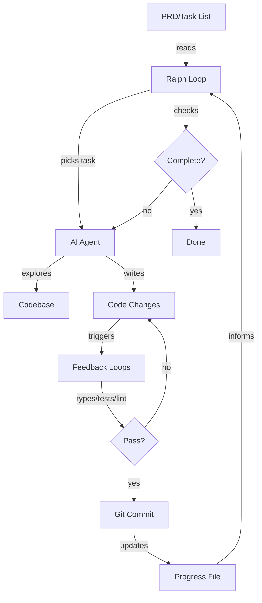

### What is Ralph Wiggum?

[Ralph](https://github.com/m31uk3/ai-skills/blob/main/docs/ralph-wiggum--curated-context.md#what-is-ralph-wiggum) is a shell script that runs your AI coding CLI in a loop. The AI picks tasks from your list, implements them, and repeats until done. Instead of writing a new prompt for each task, you write one prompt that runs repeatedly. The AI reads your plan, checks what's done, chooses what to do next, implements it, commits the code, and loops. You define the end state. Ralph gets there. If scalable, Ralph has the potential to revolutionize AI coding from interactive (you watch and steer) to autonomous (you set it running and return later).
### Why does Ralph Matter?

**What changed**: The agent now chooses tasks. You don't write phase-by-phase instructions.  
**So What**: This scales beyond single context windows without constant human involvement.  
**Now What**: You define requirements, not implementation steps. The AI figures out how.
### What are the Core Entities of Ralph?

Ralph has 6 Core Entitles:
1. **PRD**: Product Requirements Document - your task list
2. **Loop**: Shell script that runs the same prompt repeatedly
3. **Progress File**: Tracks completed work between iterations
4. **Feedback Loops**: Types, tests, linting - automated checks
5. **Commit**: Git commit after each completed task
6. **Context Window**: AI's working memory - resets each iteration

**Critical relationship (See Process Diagram)**: Progress file + git history = context preservation. Without these, each loop starts from zero.
#### Ralph Process Diagram


### What do we do now?

As a TPM my goal isn't to build production-grade software, but to identify what the new the “Light speed” is for our SDLC (e.g. the fastest speed it can cycle)  
Geoffrey Huntley [1](https://www.youtube.com/watch?v=4Nna09dG_c0), [2](https://ghuntley.com/ralph/), [3](https://community.inkdrop.app/23afeb845d96b015582b86156a52ad82/mriJwvCq) describes this as a very different skillset; most similar to learning playing a guitar or learning how to drive a commercial 18-wheeler truck. I have a lots of thoughts on where it’s going, what’s needed and how to change E2E work to get ready for those tools. i.e.:

1. think about organizing specifications in hierarchies of files so the specs are smaller and you don’t burn context (they also easier to read this way, BTW)
2. have all requirements numbered so those can be referenced in implementation plans and then cross-check if requirements are satisfied
3. build your docs as a knowledge router for the model, so it know where and how to get what it needs

If you wrap the process in a docker container. It provides a safe, isolated Linux environment where

**AI agents can:**
1. Execute commands without permission prompts
2. Install packages and modify files freely
3. Run in continuous loops for iterative development

**Security Notes**
1. This container runs as root intentionally for maximum agent flexibility
2. Only mount directories you’re comfortable having modified
3. API keys are passed via environment variables - don’t commit them
4. The container has full network access by default

I strongly advise not to run it in autonomous loop without sandboxing - that thing will murder the box, leak keys, etc. the second you’ll look the other way!
#### Ralph Prompt - Kiro

You can simulate Ralph by hand: get specs, build implementation plan, then build a Ralph-like prompt: (I used this one with Kiro):

```prompt
Study doc/services/README.md
Study doc/services/domain_model_implementation_plan.md and pick the most important thing to do

IMPORTANT:
- use the doc/services/fastapi-service-blueprint.md for fastapi service parts
- use the doc/services/fastapi-service-testing-blueprint.md how to write API tests
- author property-based tests or unit tests (which ever is better); aim for 90%+ coverage
- MUST follow .kiro/steering/testing-standards.md guidance and verify that all added tests implement ALL requirements of this document
- after making the changes, use `brazil-build`, then run tests - see .kiro/steering/build-toolchain.md; it's recommended to use plain pytest with exec before release builds as it's faster
- run `brazil-build format && brazil-build release` once all tests are fixed
- update the implementation plan once the task is done
```