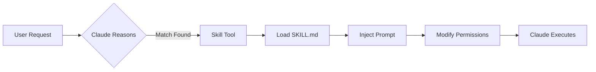

---
source_materials:
  - path: "/Users/ljack/Library/Mobile Documents/iCloud~md~obsidian/Documents/m31uk3/Clippings/Claude Agent Skills A First Principles Deep Dive.md"
    author: "Han Lee"
    published: 2025-10-25
    source_url: "https://leehanchung.github.io/blogs/2025/10/26/claude-skills-deep-dive/"
  - path: "/Users/ljack/Library/Mobile Documents/iCloud~md~obsidian/Documents/m31uk3/Clippings/Skill authoring best practices.md"
    author: "Anthropic (Claude Docs)"
    published: 2026-01-10
    source_url: "https://platform.claude.com/docs/en/agents-and-tools/agent-skills/best-practices"
synthesis_topic: "Claude Agent Skills Architecture & Best Practices"
target_audience: "Both Practitioners & Architects"
document_type: "curated-context"
output_location: "skill-authoring-synthesis.v4.md"
synthesis_strategy:
  convergent:
    - "Core architecture concepts (meta-tool pattern, progressive disclosure)"
    - "SKILL.md structure and directory organization"
    - "Token budget guidelines and conciseness principles"
    - "Workflow patterns and validation loops"
  tension_preserved:
    - "Naming conventions (gerund vs imperative)"
synthesis_date: 2026-01-18
---

# Claude Agent Skills: Architecture & Best Practices

A curated context synthesizing technical architecture with authoring best practices for practitioners building Skills and architects understanding the system.

---

## Source Validation Matrix

| Source | Authority | Recency | Consistency | Quality |
|--------|-----------|---------|-------------|---------|
| Han Lee's Deep Dive | High (reverse-engineered from codebase) | Oct 2025 | High | Strong technical evidence |
| Anthropic Best Practices | Authoritative (official docs) | Jan 2026 | High | Prescriptive guidance |

**Synthesis Notes**: Sources are highly convergent on core concepts. Han Lee provides architectural depth; Anthropic provides authoring guidance. Tensions exist in naming conventions (gerund vs imperative) and emphasis (architecture vs practice).

---

## Core Concepts

### What is a Skill?

A Skill is a prompt-based context modifier that extends Claude's capabilities through instruction injection. Skills are not executable code. They transform how Claude reasons about problems.

When invoked, a Skill:
1. Injects specialized instructions into conversation context
2. Modifies execution context (tool permissions, model selection)
3. Prepares Claude to solve specific problem types



### The Skill Tool (Meta-Tool Architecture)

The `Skill` tool acts as a container for all individual skills. It appears in Claude's tools array alongside Read, Write, and Bash. The tool's description contains a formatted list of available skills with names and descriptions.

**Selection mechanism**: Pure LLM reasoning. No algorithmic routing, no embeddings, no classifiers. Claude reads skill descriptions and matches user intent using language understanding.

### Skills vs Traditional Tools

| Aspect | Traditional Tools | Skills |
|--------|-------------------|--------|
| Execution | Direct action | Prompt expansion |
| Return | Immediate results | Context modification |
| Purpose | Perform operations | Guide workflows |
| Persistence | Tool interaction only | Prompts in conversation |

### Progressive Disclosure

Skills reveal information incrementally:
1. **Startup**: Only metadata (name, description) loads into system prompt
2. **Selection**: Full SKILL.md loads when skill activates
3. **Execution**: Additional files load on-demand via references

This conserves context window space while maintaining discoverability.

---

## Challenges & Solutions

### Challenge: Context Window Competition

**What**: Every token in your Skill competes with conversation history, system prompts, and other Skills. A 5,000-word SKILL.md consumes significant context.

**So What**: Verbose Skills degrade Claude's performance on complex tasks. Users experience slower responses and lower quality outputs.

**Now What**:
- Keep SKILL.md under 500 lines
- Split detailed content into separate reference files
- Challenge each sentence: "Does Claude need this?"
- Default assumption: Claude already knows common concepts

**Good** (~50 tokens):
```markdown
## Extract PDF text
Use pdfplumber for text extraction:
import pdfplumber
with pdfplumber.open("file.pdf") as pdf:
    text = pdf.pages[0].extract_text()
```

**Bad** (~150 tokens):
```markdown
PDF files are a common format containing text and images.
To extract text, you need a library. We recommend pdfplumber
because it handles most cases. First install with pip...
```

### Challenge: Discovery Failures

**What**: Claude fails to invoke the right Skill or invokes the wrong one.

**So What**: Users must manually invoke Skills or get incorrect results.

**Now What**:
- Write descriptions in third person (injected into system prompt)
- Include both what the Skill does AND when to use it
- Add specific trigger terms users might say
- Test with Haiku, Sonnet, and Opus

**Effective description**:
```yaml
description: Extract text and tables from PDF files, fill forms,
  merge documents. Use when working with PDF files or when the
  user mentions PDFs, forms, or document extraction.
```

### Challenge: Instruction Following Failures

**What**: Claude doesn't follow Skill instructions correctly.

**So What**: Output quality suffers. Users lose trust in the Skill.

**Now What**:
- Match instruction specificity to task fragility
- Use validation loops: run script → check output → fix → repeat
- Provide templates for strict output requirements
- Add checklists Claude can track progress against

**Degrees of freedom framework**:

| Freedom Level | When to Use | Example |
|---------------|-------------|---------|
| High (text guidance) | Multiple valid approaches | Code review |
| Medium (pseudocode) | Preferred patterns exist | Report generation |
| Low (specific scripts) | Fragile operations | Database migrations |

---

## Practical Application

### SKILL.md Structure

```yaml
---
name: skill-name          # Required: lowercase, hyphens, max 64 chars
description: Brief desc   # Required: max 1024 chars, third person
allowed-tools: "Read,Write,Bash"  # Optional: comma-separated
model: inherit            # Optional: or specific model
---

# Purpose Statement (1-2 sentences)

## Overview
What this skill does and when to use it.

## Instructions

### Step 1: Action Name
Imperative instructions. Examples if needed.

### Step 2: Next Action
Continue workflow...

## Output Format
Structure for results.

## Resources
Reference {baseDir}/scripts/ and {baseDir}/references/ as needed.
```

### Directory Organization

```
my-skill/
├── SKILL.md              # Core prompt (loaded when triggered)
├── scripts/              # Executable Python/Bash (run via Bash tool)
├── references/           # Documentation (loaded into context via Read)
└── assets/               # Templates, images (referenced by path only)
```

**Key distinction**:
- `references/`: Text loaded into Claude's context
- `assets/`: Files referenced by path, not loaded
- `scripts/`: Executed, only output consumes tokens

### Naming Conventions

Recommended: **gerund form** (verb + -ing)
- `processing-pdfs`
- `analyzing-spreadsheets`
- `writing-documentation`

Acceptable alternatives:
- Noun phrases: `pdf-processing`
- Action-oriented: `process-pdfs`

Avoid:
- Vague: `helper`, `utils`
- Generic: `documents`, `data`
- Reserved: `anthropic-*`, `claude-*`

### Two-Message Pattern (Architecture Detail)

When a Skill executes, Claude Code injects two user messages:

**Message 1** (visible to user, `isMeta: false`):
```xml
<command-message>The "pdf" skill is loading</command-message>
<command-name>pdf</command-name>
```

**Message 2** (hidden from UI, `isMeta: true`):
Full SKILL.md prompt content with instructions.

This separates transparency (users see what's running) from detail (Claude gets full instructions).

### Common Workflow Patterns

**Pattern 1: Script Automation**
```markdown
Run scripts/analyzer.py on the target directory:
python {baseDir}/scripts/analyzer.py --path "$USER_PATH"
Parse the generated report.json and present findings.
```

**Pattern 2: Validation Loop**
```markdown
1. Make edits
2. Run: python scripts/validate.py
3. If validation fails, fix and repeat
4. Only proceed when validation passes
```

**Pattern 3: Progressive Reference Loading**
```markdown
## Quick start
[Basic instructions here]

## Advanced features
**Form filling**: See [FORMS.md](FORMS.md)
**API reference**: See [REFERENCE.md](REFERENCE.md)
```

### Checklist for Effective Skills

#### Core Quality
- [ ] Description includes what AND when
- [ ] SKILL.md under 500 lines
- [ ] No time-sensitive information
- [ ] Consistent terminology
- [ ] References one level deep from SKILL.md
- [ ] Workflows have clear steps

#### Code and Scripts
- [ ] Scripts handle errors explicitly
- [ ] No magic numbers (all values justified)
- [ ] Required packages documented
- [ ] Forward slashes in all paths

#### Testing
- [ ] At least three evaluation scenarios
- [ ] Tested with Haiku, Sonnet, and Opus
- [ ] Tested with real usage patterns

---

## Decision Matrix: When to Use Each Pattern

| Situation | Approach |
|-----------|----------|
| Simple file transformation | Read-Process-Write pattern |
| Multi-step with dependencies | Command chain with validation |
| User input at each step | Wizard-style workflow |
| Batch operations | Plan-validate-execute pattern |
| Complex analysis | Iterative refinement passes |

---

## Preserved Tension: Naming Convention

**Han Lee**: Uses imperative names (`skill-creator`, `internal-comms`)
**Anthropic Docs**: Recommends gerunds (`processing-pdfs`, `analyzing-spreadsheets`)

**Resolution**: Either works. Consistency within your skill library matters more than style choice. Pick one convention and apply it uniformly.

---

## Implementation Guidance

### Developing Skills Iteratively

1. Complete a task without a Skill. Note what context you repeatedly provide.
2. Ask Claude A to create a Skill capturing that pattern.
3. Review for conciseness. Remove unnecessary explanations.
4. Test with Claude B (fresh instance with Skill loaded).
5. Observe failures and return to Claude A with specifics.
6. Iterate based on observed behavior, not assumptions.

### Evaluation-Driven Development

1. Identify gaps: Run Claude on tasks without Skill
2. Create 3+ evaluation scenarios testing gaps
3. Establish baseline performance
4. Write minimal instructions to pass evaluations
5. Iterate: run evaluations, compare baseline, refine

```json
{
  "skills": ["pdf-processing"],
  "query": "Extract all text from this PDF",
  "files": ["test-files/document.pdf"],
  "expected_behavior": [
    "Uses appropriate PDF library",
    "Extracts from all pages",
    "Saves to output.txt"
  ]
}
```

---

## Quick Reference

| Term | Definition |
|------|------------|
| Skill (lowercase) | Individual prompt template (e.g., `pdf`, `skill-creator`) |
| Skill Tool (capital S) | Meta-tool managing all skills in tools array |
| Progressive Disclosure | Loading only metadata initially, full content on-demand |
| Context Modifier | What skills do: inject prompts + modify permissions |
| `{baseDir}` | Variable resolving to skill's installation directory |
| `isMeta` | Flag controlling message visibility in UI |

### Frontmatter Fields

| Field | Required | Notes |
|-------|----------|-------|
| name | Yes | Lowercase, hyphens, max 64 chars |
| description | Yes | Max 1024 chars, third person |
| allowed-tools | No | Comma-separated tool list |
| model | No | Specific model or "inherit" |
| version | No | Metadata for tracking |
| disable-model-invocation | No | Prevents auto-invocation |

### Token Budget Guidelines

| Content Type | Budget |
|--------------|--------|
| SKILL.md body | < 500 lines |
| Skill description | < 1024 chars |
| All skills metadata | ~15,000 chars total |
