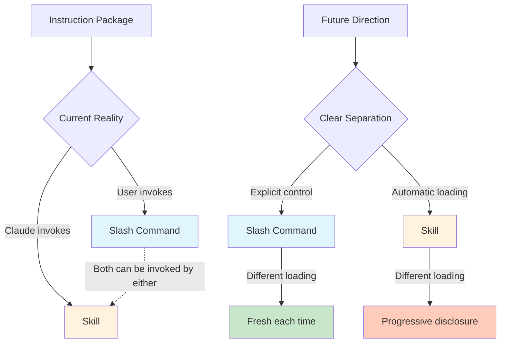

# Claude Code: Slash Commands vs Skills

**Purpose:** Help developers and teams choose between slash commands and skills in Claude Code. Understand current behavior and future direction.

## Core Concepts

### What They Are

**Official definition (Anthropic):**

> "Skills are model-invoked capabilities that Claude autonomously uses based on task context. Unlike commands (user-invoked) or agents (spawned by Claude), skills provide contextual guidance that Claude incorporates into its responses."

**In practice:**

**Slash Commands** are user-facing instruction packages. Type `/my-command` to execute predefined workflows. Think lightweight endpoints with handlers.

**Skills** are Claude-facing knowledge packages with progressive disclosure. Claude invokes them automatically when relevant, or you can call them manually with `/skill-name`. Think service layer that loads on-demand with bundled resources (references, examples, scripts).

Both are reusable instruction sets that load into conversation context. Both can be invoked by users OR Claude.

### The Confusion

They work almost identically today. This creates genuine confusion in the community. Many users ask "what's the difference?" because the mechanics are the same.

### The Intent

Anthropic designed them with distinct purposes despite similar mechanics:

- **Skills:** Claude decides when to use them (automatic invocation)
- **Slash Commands:** You decide when to use them (manual invocation)

**Official position** (from GitHub issue #13115, Anthropic's dicksontsai): "We think this difference is significant enough to keep the two concepts separate, especially since it would help with how Claude authors skills and slash commands."

## Key Differences

| Aspect | Skills | Slash Commands |
|--------|--------|----------------|
| **Primary invoker** | Claude (automatic) | User (manual) |
| **Design intent** | On-demand knowledge | Standardized workflows |
| **Discovery** | Claude decides relevance | User knows what to call |
| **Loading pattern** | Progressive disclosure (3 levels) | Each invocation loads fresh |
| **Structure** | SKILL.md + references/ + examples/ + scripts/ | Single .md file |
| **Content size** | SKILL.md: 1,500-2,000 words + unlimited refs | Typically 100-5,000 words |
| **Best for** | API docs, style guides, domain expertise | PR formatting, test running, refactors |
| **Invocation limit** | Once per conversation (observed) | Multiple times per conversation |
| **Autocomplete** | May not show in autocomplete | Shows in autocomplete |

### Current Reality

**Both can be:**
- Invoked by user with slash prefix (`/name`)
- Invoked by Claude itself
- Used to load instructions into conversation

**The catch:** "We are definitely looking to eliminate this [similarity], but it's tricky since users may depend on the fact that they work the same way." — Anthropic

### Future Direction

**Planned divergence:** "The way they load instructions may diverge over time." — Anthropic

What this means:
- Current overlapping behavior is temporary
- Anthropic plans to make them work differently
- Depending on the overlap is risky
- Design for intent, not current mechanics

## Decision Matrix

### Use Skills When

You want **Claude to decide** when instructions are relevant:

- API documentation that loads when working with specific APIs
- Code style guides that apply to certain file types
- Complex file manipulation templates
- Framework-specific best practices
- Domain expertise requiring references, examples, or scripts
- Content needs progressive disclosure (core + detailed references)

**Example:** Database schema skill loads automatically when you discuss database structure. Core schema overview in SKILL.md (1,500 words), detailed table relationships in `references/schema.md` (5,000 words).

### Use Slash Commands When

You want **explicit control** over when instructions execute:

- Standardized PR descriptions
- Running test suites
- Code formatting workflows
- Git commit message templates

**Example:** `/pr-description` generates formatted PR text exactly when you invoke it.

## Simple Mental Model

**Skills** = Library books on the shelf. Claude grabs them when needed.

**Slash Commands** = Buttons you press. They fire when you click.

Both live in the same library. Both get read into the conversation. But you choose buttons; Claude chooses books.

## Context Management

### Skills: Progressive Disclosure

Skills use "progressive disclosure" - they load only when relevant. This keeps context clean.

**Three-level loading system (official Anthropic architecture):**

1. **Level 1: Metadata** (always in context)
   - Skill name + description (~100 words)
   - Always loaded for all available skills
   - Claude uses this to decide whether to invoke

2. **Level 2: SKILL.md body** (loaded when skill triggers)
   - Core instructions and guidance
   - Recommended: 1,500-2,000 words
   - Maximum: <5,000 words
   - Loaded when Claude or user invokes skill

3. **Level 3: Bundled resources** (loaded as needed)
   - **`references/`** - Detailed docs, patterns, API refs
   - **`examples/`** - Working code examples
   - **`scripts/`** - Utility scripts (can execute without loading to context)
   - Claude loads these only when needed
   - Each reference file can be 2,000-5,000+ words

**Pattern:** Skill loads once, stays in conversation history at invocation point.

**Trade-off:** Claude won't invoke the same skill twice in one conversation (observed behavior).

### Slash Commands: On-Demand Loading

Commands insert into conversation each time invoked. You control the timing.

**Pattern:** Command executes every time you call it, adding to context each time.

**Trade-off:** Multiple invocations consume more context.

### Double-Loading Issue (Being Fixed)

**Problem:** When you manually invoke a slash command (e.g., `/create_plan`), Claude sometimes:
1. Receives the full command content (3-5k tokens)
2. Then invokes the Skill() tool to read the same content again
3. This doubles context usage (~4k extra tokens per command)

**Example:** Same command using 31k tokens (19%) vs 27k tokens (16%) depending on whether double-loading occurs.

**Status:** Anthropic acknowledged this issue and landed a PR to improve the behavior (Dec 2024). Per Boris Cherny: "the model decides whether it needs to re-read the .md file or if it has the context it needs already."

**Workaround:** Use `disable-model-invocation: true` in slash command frontmatter to prevent model from auto-invoking after manual invocation.

### Instruction Following Quality

Per @dexhorthy and power users: User messages (slash command direct injection) drive better instruction following than tool calls (skills reading files). This matters for long, complex instructions (3-5k tokens).

**Implication:** For complex workflows, consider whether instruction quality or context efficiency matters more for your use case.

## Common Confusion Points

### "Can I invoke skills manually?"

**Yes.** Type `/skill-name` even if it doesn't show in autocomplete. Works despite the design intent being automatic invocation.

### "Can Claude invoke slash commands?"

**Yes.** Despite being designed for manual invocation, Claude can call them.

### "Should I merge them into one thing?"

**No.** Anthropic considered this (GitHub issue #13115) and rejected it. The design intent matters for future evolution.

### "Which should I build?"

Ask: **Who decides when this runs?**
- Claude decides → Skill
- You decide → Slash Command

Don't optimize for current mechanics. Optimize for intent.

## Integration with Other Patterns

### CLAUDE.md

Always loads into every conversation. Use for project-wide context that never changes.

**vs Skills:** CLAUDE.md wastes tokens on irrelevant info. Skills load only when needed.

**vs Slash Commands:** CLAUDE.md is passive. Commands are active.

### Plugins

Bundle skills, slash commands, agents, hooks, and MCP servers together. Distribution format, not a distinct feature.

**Example:** Anthropic's `frontend-design` plugin is just a skill in plugin packaging.

### Agents (Subagents)

Multi-step workflows with isolated context. Different from both skills and commands.

**Agents** handle complex tasks autonomously. **Skills** provide knowledge. **Commands** execute single-shot tasks.

## Skill Architecture Best Practices

These guidelines come from official Anthropic plugin development documentation.

### Skill Directory Structure

**Minimal skill:**
```
skills/skill-name/
└── SKILL.md (required)
```

**Standard skill (recommended):**
```
skills/skill-name/
├── SKILL.md
├── references/           # Detailed docs (2k-5k+ words each)
│   └── patterns.md
└── examples/            # Working code examples
    └── example.sh
```

**Complete skill:**
```
skills/skill-name/
├── SKILL.md             # Core (1,500-2,000 words)
├── references/          # Detailed documentation
│   ├── patterns.md
│   └── advanced.md
├── examples/            # Working examples
│   └── sample.sh
└── scripts/             # Utility scripts
    └── validate.sh
```

### SKILL.md Frontmatter

Required fields using third-person format:

```yaml
---
name: Skill Name
description: This skill should be used when the user asks to "specific phrase 1", "specific phrase 2", or mentions "keyword". Include exact trigger phrases.
version: 1.0.0
---
```

**Good description examples:**
```yaml
description: This skill should be used when the user asks to "create a hook", "add a PreToolUse hook", "validate tool use", or mentions hook events.
```

**Bad description examples:**
```yaml
description: Use this skill for hooks.           # Wrong person, vague
description: Provides hook guidance.              # No trigger phrases
```

### Writing Style Requirements

**SKILL.md body:** Use imperative/infinitive form (not second person)

**Correct:**
```markdown
To create a skill, define the frontmatter.
Configure the structure with bundled resources.
Validate the trigger description.
```

**Incorrect:**
```markdown
You should create a skill by defining the frontmatter.
You need to configure the structure.
You must validate the description.
```

### Progressive Disclosure Strategy

**SKILL.md (1,500-2,000 words):**
- Core concepts and overview
- Essential procedures
- Quick reference tables
- Pointers to references/examples
- Most common use cases

**references/ (unlimited):**
- Detailed patterns and techniques
- API documentation
- Migration guides
- Edge cases and troubleshooting
- Comprehensive walkthroughs

**examples/ (unlimited):**
- Complete, runnable code
- Configuration templates
- Real-world usage

**scripts/ (unlimited):**
- Validation utilities
- Testing helpers
- Can execute without loading to context

### Auto-Discovery

Claude Code automatically:
- Scans `skills/` directories in plugins
- Loads skill metadata (name + description) always
- Loads SKILL.md body when skill triggers
- Loads references/examples when Claude determines need

## Practical Recommendations

### For Individual Contributors

1. **Start with slash commands** for workflows you control
2. **Add skills** when Claude needs automatic access to knowledge
3. **Don't rely on overlap** - it's temporary
4. **Test invocation patterns** to understand current behavior
5. **Use `disable-model-invocation: true`** in slash command frontmatter if experiencing double-loading issues
6. **Monitor context usage** - long commands (3-5k tokens) can significantly impact available context

### For Teams

1. **Document intent** in command/skill descriptions
2. **Use skills for standards** (style guides, API docs)
3. **Use commands for workflows** (PR templates, test runs)
4. **Prepare for divergence** - don't build on current similarity
5. **Set context budget** - decide max token allocation for commands/skills

### When Building

```markdown
# Ask yourself:
- Who decides when this runs? (You → Command, Claude → Skill)
- Does it need to load multiple times? (Yes → Command, No → Skill)
- Is it knowledge or workflow? (Knowledge → Skill, Workflow → Command)
- Does user need explicit control? (Yes → Command, No → Skill)
- How large is the content? (>3k tokens → Consider skill with references/)
- Would bundled resources help? (Yes → Skill with references/examples/scripts/)
- Should model auto-invoke? (No → Add disable-model-invocation: true)
```

See the **Skill Architecture Best Practices** section below for detailed structure guidance.


### Slash Command Frontmatter Options

```yaml
---
# Prevent model from auto-invoking this command
disable-model-invocation: true
---
```

Use this when:
- You only want manual invocation
- Experiencing double-loading issues
- Want to reserve command for explicit user control

## What Anthropic Says

### From GitHub Issue #13115 (dicksontsai):

> "We think this difference is significant enough to keep the two concepts separate, especially since it would help with how Claude authors skills and slash commands."

> "We are definitely looking to eliminate this [overlap], but it's tricky since users may depend on the fact that they work the same way."

> "The way they load instructions may diverge over time."

### From Twitter/X Thread (Boris Cherny, Claude Code team):

On how context loading works:

> "1. The model sees only the skill's description and name. It does not see the skill content until the skill is invoked
> 2. When you invoke /skill or /command manually, the entire content of the .md file is pulled into context. This is an explicit signal that you want to add something to context.
> 3. When you ask the model to invoke a skill or command, the model decides whether it needs to re-read the .md file or if it has the context it needs already."

On double-loading issue:

> "Just landed a PR to improve this behavior a bit, going out with the next release."

### From Thariq (@trq212, Anthropic):

On preventing auto-invocation:

> "if you want to disable model invocation of a command you can use 'disable-model-invocation: true' in the slash command frontmatter"

**Translation:** Build for the intent (user-invoked vs Claude-invoked), not the current mechanics (both work the same way).

## Mermaid: Current State vs Future Direction



## Related Concepts

This document focuses on **task-level** instruction packages (skills/commands).

For **project-level** guidance, see:
- **AGENTS.md** - Project-wide agent context
- **CLAUDE.md** - Default prompts that always load

For **workflow patterns**, see:
- [AI Workflow Engineering](../skills/ai--workflow-engineering/SKILL.md) - Meta-pattern for creating SOPs
- [FAQs.md](../FAQs.md) - Format disambiguation and pattern convergence

---

**Source Validation:**
- Official Anthropic plugin-dev skill documentation (`~/.claude/plugins/.../plugin-dev/skills/skill-development/SKILL.md`) - Progressive disclosure architecture, writing style requirements, best practices (HIGH reliability)
- Official Anthropic example-skill (`~/.claude/plugins/.../example-plugin/skills/example-skill/SKILL.md`) - Official definition and structure template (HIGH reliability)
- [GitHub Issue #13115](https://github.com/anthropics/claude-code/issues/13115) - Official Anthropic responses from dicksontsai (HIGH reliability)
- [Twitter/X @dexhorthy thread](https://x.com/dexhorthy/status/2003656814995603809) - Includes responses from Boris Cherny (Claude Code team) and Thariq (@trq212, Anthropic) on context management, double-loading issue, and frontmatter flags (HIGH reliability)
- Reddit r/ClaudeAI discussion - Community explanation and confusion examples (MEDIUM reliability)

**Last Updated:** 2025-12-28
