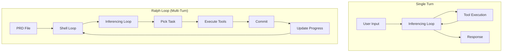

# SWE Baseline Skills for 2026: Build Your First Agent

**Purpose**: Learn the five baseline technical skills software engineers need to stay employable in 2026 by building a working coding agent.

**Target audience**: Junior to mid-level software engineers who need hands-on practice with AI agent construction.

**What you'll learn**: The inferencing loop, tool calling, tool primitives, context management, and agent construction through a step-by-step workshop with real code examples.

**Workshop repository**: [`how-to-build-a-coding-agent`](https://github.com/ghuntley/how-to-build-a-coding-agent)

---

## Section A: Core Technical Skills (The Five Baseline Skills)

### Skill 1: The Inferencing Loop

**Answer**: The request-response cycle that makes AI coding work.

**Explain**: The inferencing loop is how agents maintain conversations. You send an array of messages to the LLM server. The server responds. You append the response to the array. Repeat. The server has no memory—it's stateless. Every turn, you send the entire conversation history.

**Code Example** (from [`chat.go:99-106`](https://github.com/ghuntley/how-to-build-a-coding-agent/blob/main/chat.go#L99-L106)):

```go
message, err := a.runInference(ctx, conversation)
if err != nil {
    return err
}
conversation = append(conversation, message.ToParam())
```

**The runInference method** ([`chat.go:126-146`](https://github.com/ghuntley/how-to-build-a-coding-agent/blob/main/chat.go#L126-L146)):

```go
func (a *Agent) runInference(ctx context.Context, conversation []anthropic.MessageParam) (*anthropic.Message, error) {
    message, err := a.client.Messages.New(ctx, anthropic.MessageNewParams{
        Model:     anthropic.ModelClaude3_7SonnetLatest,
        MaxTokens: int64(1024),
        Messages:  conversation,  // ← The entire conversation array
    })
    return message, err
}
```

**Key insight**: `conversation` is just an array (`[]anthropic.MessageParam`). It grows each turn. When it exceeds the context window (200k tokens), the model forgets the beginning. This is **context rot**.

**Whiteboard this**: Can you draw the inferencing loop from memory? User input → append to array → send to server → receive response → append to array → repeat. Companies ask this in interviews now.

---

### Skill 2: Tool Calling System

**Answer**: How AI agents execute functions on your computer.

**Explain**: Tool calling automated copy-paste. Before tool calling, you copied AI output to your IDE, compiled it, copied errors back. Tool calling is that loop—automated. You register tools (functions) with the LLM. The AI sees the registry, decides which tool to call, returns a tool call in its response. Your harness executes the tool, appends the result to the conversation array, sends it back.

**Architecture** (from [`read.go:219-251`](https://github.com/ghuntley/how-to-build-a-coding-agent/blob/main/read.go#L219-L251)):

```go
func (a *Agent) runInference(ctx context.Context, conversation []anthropic.MessageParam) (*anthropic.Message, error) {
    // Convert your tool definitions into Anthropic's format
    anthropicTools := []anthropic.ToolUnionParam{}
    for _, tool := range a.tools {
        anthropicTools = append(anthropicTools, anthropic.ToolUnionParam{
            OfTool: &anthropic.ToolParam{
                Name:        tool.Name,
                Description: anthropic.String(tool.Description),
                InputSchema: tool.InputSchema,  // ← JSON schema
            },
        })
    }

    // Send conversation + tools to Claude
    message, err := a.client.Messages.New(ctx, anthropic.MessageNewParams{
        Model:     anthropic.ModelClaude3_7SonnetLatest,
        MaxTokens: int64(1024),
        Messages:  conversation,
        Tools:     anthropicTools,  // ← Tool registry
    })
    return message, err
}
```

**Tool execution loop** (from [`read.go:122-210`](https://github.com/ghuntley/how-to-build-a-coding-agent/blob/main/read.go#L122-L210)):

```go
for {
    var toolResults []anthropic.ContentBlockParamUnion
    var hasToolUse bool

    for _, content := range message.Content {
        switch content.Type {
        case "text":
            fmt.Printf("Claude: %s\n", content.Text)
        case "tool_use":
            hasToolUse = true
            toolUse := content.AsToolUse()

            // Find and execute the tool
            for _, tool := range a.tools {
                if tool.Name == toolUse.Name {
                    toolResult, toolError = tool.Function(toolUse.Input)
                    break
                }
            }

            // Append result to collection
            toolResults = append(toolResults,
                anthropic.NewToolResultBlock(toolUse.ID, toolResult, false))
        }
    }

    if !hasToolUse {
        break  // No more tools, we're done
    }

    // Send tool results back for more inferencing
    toolResultMessage := anthropic.NewUserMessage(toolResults...)
    conversation = append(conversation, toolResultMessage)
    message, err = a.runInference(ctx, conversation)
}
```

**Key insight**: The nested loop structure. Outer loop: wait for user input. Inner loop: execute tools until the model stops requesting them. This is the pattern all coding agents use.

---

### Skill 3: The Four Tool Primitives

**Answer**: All coding agents are built from four primitives: Read, List, Bash, Edit.

**Explain**: These tools compose into powerful agents. The agent doesn't know your file system—it uses `list_files` to discover. It doesn't know file contents—it uses `read_file` to see. It can't run commands—it uses `bash`. It can't modify code—it uses `edit_file`. Each tool is a separate inferencing turn.

#### Primitive 1: Read File

**What it does**: Reads file contents and returns them as a string.

**Tool definition** (from [`read.go:260-265`](https://github.com/ghuntley/how-to-build-a-coding-agent/blob/main/read.go#L260-L265)):

```go
var ReadFileDefinition = ToolDefinition{
    Name:        "read_file",
    Description: "Read the contents of a given relative file path. Use this when you want to see what's inside a file. Do not use this with directory names.",
    InputSchema: ReadFileInputSchema,
    Function:    ReadFile,
}

type ReadFileInput struct {
    Path string `json:"path" jsonschema_description:"The relative path of a file in the working directory."`
}
```

**Implementation** (from [`read.go:273-288`](https://github.com/ghuntley/how-to-build-a-coding-agent/blob/main/read.go#L273-L288)):

```go
func ReadFile(input json.RawMessage) (string, error) {
    readFileInput := ReadFileInput{}
    err := json.Unmarshal(input, &readFileInput)  // Parse JSON input
    if err != nil {
        panic(err)
    }

    content, err := os.ReadFile(readFileInput.Path)  // Read file
    if err != nil {
        return "", err  // Return error if file doesn't exist
    }
    return string(content), nil  // Return file contents
}
```

**Try it**: Run `go run read.go` and ask: *"What's in riddle.txt?"*

---

#### Primitive 2: List Files

**What it does**: Lists files and directories at a given path.

**Why it matters**: The AI can't see your file system. It needs `list_files` to discover what exists before calling `read_file`.

**Implementation** (from [`list_files.go:302-355`](https://github.com/ghuntley/how-to-build-a-coding-agent/blob/main/list_files.go#L302-L355)):

```go
func ListFiles(input json.RawMessage) (string, error) {
    listFilesInput := ListFilesInput{}
    json.Unmarshal(input, &listFilesInput)

    dir := "."
    if listFilesInput.Path != "" {
        dir = listFilesInput.Path
    }

    var files []string
    filepath.Walk(dir, func(path string, info os.FileInfo, err error) error {
        relPath, _ := filepath.Rel(dir, path)

        // Skip certain directories
        if info.IsDir() && relPath == ".devenv" {
            return filepath.SkipDir
        }

        if relPath != "." {
            if info.IsDir() {
                files = append(files, relPath+"/")
            } else {
                files = append(files, relPath)
            }
        }
        return nil
    })

    result, _ := json.Marshal(files)
    return string(result), nil  // Returns JSON array of paths
}
```

**Observation**: The model receives a JSON array like `["chat.go", "read.go", "prompts/"]`. It parses this and decides what to explore.

**Try it**: Run `go run list_files.go` and ask: *"List all files in this project"*

---

#### Primitive 3: Bash

**What it does**: Executes shell commands and returns output.

**Why it matters**: This enables running tests, type checks, git commands, compilation—everything command-line.

**Implementation** (from [`bash_tool.go:372-389`](https://github.com/ghuntley/how-to-build-a-coding-agent/blob/main/bash_tool.go#L372-L389)):

```go
func Bash(input json.RawMessage) (string, error) {
    bashInput := BashInput{}
    json.Unmarshal(input, &bashInput)

    log.Printf("Executing bash command: %s", bashInput.Command)
    cmd := exec.Command("bash", "-c", bashInput.Command)
    output, err := cmd.CombinedOutput()

    if err != nil {
        return fmt.Sprintf("Command failed with error: %s\nOutput: %s",
            err.Error(), string(output)), nil
    }

    return strings.TrimSpace(string(output)), nil
}
```

**Key decision**: Errors return as strings, not Go errors. The AI sees "Command failed" in the tool result, not a broken inferencing loop.

**Try it**: Run `go run bash_tool.go` and ask: *"Run git status"* or *"List all .go files"*

---

#### Primitive 4: Edit File

**What it does**: Replaces `old_str` with `new_str` in a file. Creates file if it doesn't exist.

**Why it matters**: This is how agents modify code. No direct writes—only search-and-replace to ensure precise edits.

**Implementation** (from [`edit_tool.go:412-464`](https://github.com/ghuntley/how-to-build-a-coding-agent/blob/main/edit_tool.go#L412-L464)):

```go
func EditFile(input json.RawMessage) (string, error) {
    editFileInput := EditFileInput{}
    json.Unmarshal(input, &editFileInput)

    content, err := os.ReadFile(editFileInput.Path)
    if err != nil {
        if os.IsNotExist(err) && editFileInput.OldStr == "" {
            // File doesn't exist, create it
            return createNewFile(editFileInput.Path, editFileInput.NewStr)
        }
        return "", err
    }

    oldContent := string(content)

    // Special case: if old_str is empty, append to file
    var newContent string
    if editFileInput.OldStr == "" {
        newContent = oldContent + editFileInput.NewStr
    } else {
        // Ensure exactly one match
        count := strings.Count(oldContent, editFileInput.OldStr)
        if count == 0 {
            return "", fmt.Errorf("old_str not found in file")
        }
        if count > 1 {
            return "", fmt.Errorf("old_str found %d times, must be unique", count)
        }

        newContent = strings.Replace(oldContent, editFileInput.OldStr, editFileInput.NewStr, 1)
    }

    os.WriteFile(editFileInput.Path, []byte(newContent), 0644)
    return "OK", nil
}
```

**Safety mechanism**: `old_str` must match exactly once. This prevents ambiguous edits.

**Try it**: Run `go run edit_tool.go` and ask: *"Create a Python hello world script"*

---

### Skill 4: Context Windows and Memory

**Answer**: AI agents have no memory between turns. Context windows are limited.

**Explain**: The server is stateless. It doesn't remember previous turns. Every API call sends the entire conversation array. If the array exceeds the context window (200k tokens for Sonnet 4.5), the model forgets the beginning.

**Evidence from code** ([`chat.go:63-72`](https://github.com/ghuntley/how-to-build-a-coding-agent/blob/main/chat.go#L63-L72)):

```go
func (a *Agent) Run(ctx context.Context) error {
    conversation := []anthropic.MessageParam{}  // ← Starts empty each session

    for {
        userInput, ok := a.getUserMessage()
        userMessage := anthropic.NewUserMessage(anthropic.NewTextBlock(userInput))
        conversation = append(conversation, userMessage)  // ← Grows unbounded

        message, err := a.runInference(ctx, conversation)  // ← Entire array sent
        conversation = append(conversation, message.ToParam())
    }
}
```

**Context rot**: As `conversation` grows, quality degrades. Long conversations produce worse code. This is measurable and real.

**Mitigation strategies**:
1. **Small tasks**: Keep each task focused. Commit often. Start fresh conversations.
2. **Progress files**: Write what's done to a file. New conversations read the file instead of replaying history.
3. **Git commits**: Provenance chain. Each commit preserves state. New conversations inspect git history.

---

### Skill 5: Agent Construction (The Loop)

**Answer**: Wrapping the inferencing loop in a shell loop.

**Explain**: A coding agent is just the inferencing loop + tools + a shell loop. The shell loop calls your agent repeatedly until work is complete.

**Basic Ralph loop**:

```bash
#!/bin/bash
for i in {1..10}; do
  go run edit_tool.go "@plan.md Implement next unchecked item"
done
```

**Ralph reads the plan, finds unchecked items, picks one, implements it, checks it off, loops.**

**Architecture comparison**:



**The key shift**: The agent picks tasks, not you. You define requirements. The agent orchestrates execution.

---

## Section B: Skill Development Path (Workshop Progression)

### Phase 1: Basic Chat (0 Tools)

**Goal**: Understand the inferencing loop without tools.

**File**: [`chat.go`](https://github.com/ghuntley/how-to-build-a-coding-agent/blob/main/chat.go)

**What you'll build**: A basic chatbot that talks to Claude. No tools. Just conversation.

**Run it**:
```bash
cd /path/to/how-to-build-a-coding-agent
export ANTHROPIC_API_KEY="your-key-here"
go run chat.go
```

**Try**: "Hello!" or "Tell me a joke"

**What to observe**:
- The `conversation` array structure ([`chat.go:63`](https://github.com/ghuntley/how-to-build-a-coding-agent/blob/main/chat.go#L63))
- The `runInference` method ([`chat.go:126`](https://github.com/ghuntley/how-to-build-a-coding-agent/blob/main/chat.go#L126))
- How `conversation` grows each turn ([`chat.go:93, 106`](https://github.com/ghuntley/how-to-build-a-coding-agent/blob/main/chat.go#L93-L106))

**Use `--verbose` flag** to see detailed logs:
```bash
go run chat.go --verbose
```

**Key insight**: The model is stateless. Every turn sends the entire `conversation` array.

---

### Phase 2: File Reader (1 Tool)

**Goal**: Add your first tool and understand tool calling.

**File**: [`read.go`](https://github.com/ghuntley/how-to-build-a-coding-agent/blob/main/read.go)

**What changes**:
- `ToolDefinition` struct introduced ([`read.go:253-258`](https://github.com/ghuntley/how-to-build-a-coding-agent/blob/main/read.go#L253-L258))
- Tool registration in `runInference` ([`read.go:220-229`](https://github.com/ghuntley/how-to-build-a-coding-agent/blob/main/read.go#L220-L229))
- Inner tool execution loop ([`read.go:122-210`](https://github.com/ghuntley/how-to-build-a-coding-agent/blob/main/read.go#L122-L210))

**Run it**:
```bash
go run read.go
```

**Try**: "Read riddle.txt" or "What's in AGENT.md?"

**What to observe**:
- Claude responds with `"type": "tool_use"` instead of `"type": "text"`
- Your code executes `ReadFile` function
- Tool result appends to conversation
- Claude processes result and responds with final answer

**Debugging tip**: Use `--verbose` to see:
- Tool use detection
- Tool execution
- Result sent back to Claude

---

### Phase 3: File Explorer (2 Tools)

**Goal**: Combine multiple tools. See multi-turn tool execution.

**File**: [`list_files.go`](https://github.com/ghuntley/how-to-build-a-coding-agent/blob/main/list_files.go)

**What changes**:
- Two tools registered: `ReadFileDefinition` and `ListFilesDefinition` ([`list_files.go:45`](https://github.com/ghuntley/how-to-build-a-coding-agent/blob/main/list_files.go#L45))

**Run it**:
```bash
go run list_files.go
```

**Try**: "What files are in this project?" then "What's in fizzbuzz.js?"

**What to observe**:
- Claude calls `list_files` first (discovery phase)
- Claude sees the JSON array of files
- Claude decides which file to read
- Claude calls `read_file` with specific path
- **Two tool calls, two inferencing turns**

**Key insight**: The AI doesn't know your file system. It explores, just like you would.

---

### Phase 4: Command Runner (3 Tools)

**Goal**: Execute shell commands. Run tests, git commands, compilation.

**File**: [`bash_tool.go`](https://github.com/ghuntley/how-to-build-a-coding-agent/blob/main/bash_tool.go)

**What changes**:
- `BashDefinition` added ([`bash_tool.go:277-282`](https://github.com/ghuntley/how-to-build-a-coding-agent/blob/main/bash_tool.go#L277-L282))
- `Bash` function executes commands via `exec.Command` ([`bash_tool.go:372-389`](https://github.com/ghuntley/how-to-build-a-coding-agent/blob/main/bash_tool.go#L372-L389))

**Run it**:
```bash
go run bash_tool.go
```

**Try**:
- "Run git status"
- "List all .go files in this directory"
- "Run go version"

**What to observe**:
- Command output returned as string
- Errors returned as string (not Go error)
- Claude processes output and responds

**Safety note**: This workshop has no sandboxing. Production agents should restrict commands or use Docker sandboxes.

---

### Phase 5: File Editor (4 Tools)

**Goal**: Modify files. This makes it a real coding agent.

**File**: [`edit_tool.go`](https://github.com/ghuntley/how-to-build-a-coding-agent/blob/main/edit_tool.go)

**What changes**:
- `EditFileDefinition` added ([`edit_tool.go:285-295`](https://github.com/ghuntley/how-to-build-a-coding-agent/blob/main/edit_tool.go#L285-L295))
- `EditFile` function does search-and-replace ([`edit_tool.go:412-464`](https://github.com/ghuntley/how-to-build-a-coding-agent/blob/main/edit_tool.go#L412-L464))

**Run it**:
```bash
go run edit_tool.go
```

**Try**:
- "Create a Python hello world script in hello.py"
- "Add a comment to the top of fizzbuzz.js"
- "Create a file called test.txt with 'Hello, World!' in it"

**What to observe**:
- Claude uses `edit_file` with `old_str=""` to create new files
- Claude reads file first, then edits with exact match
- If `old_str` appears multiple times, edit fails (safety mechanism)

**You now have a functioning coding agent**: read, list, bash, edit. That's all Cursor, Windsurf, and Claude Code do. They're just this loop + polish.

---

### Phase 6: Code Search (5 Tools)

**Goal**: Pattern search with ripgrep integration.

**File**: [`code_search_tool.go`](https://github.com/ghuntley/how-to-build-a-coding-agent/blob/main/code_search_tool.go)

**What changes**:
- `code_search` tool added (requires `ripgrep` installed)

**Try**:
- "Find all function definitions in Go files"
- "Search for TODO comments"

**Note**: This is optional. The four primitives (read, list, bash, edit) are sufficient.

---

## Section C: Advanced Concepts & Patterns

### Message Array Structure

The `conversation` array follows Anthropic's message format:

```go
type MessageParam struct {
    Role    string                     // "user" or "assistant"
    Content []ContentBlockParamUnion   // Array of text blocks or tool results
}
```

**User messages** contain text or tool results:
```go
userMessage := anthropic.NewUserMessage(anthropic.NewTextBlock("What's in riddle.txt?"))
```

**Assistant messages** contain text or tool use requests:
```go
// Claude's response after executing tools
conversation = append(conversation, message.ToParam())
```

**Tool result messages** are user messages containing tool results:
```go
toolResultMessage := anthropic.NewUserMessage(
    anthropic.NewToolResultBlock(toolUse.ID, toolResult, false)
)
```

### Schema Generation

Tools use JSON schemas to define input parameters. The workshop uses `jsonschema` package with Go structs:

```go
type ReadFileInput struct {
    Path string `json:"path" jsonschema_description:"The relative path of a file"`
}

func GenerateSchema[T any]() anthropic.ToolInputSchemaParam {
    reflector := jsonschema.Reflector{
        AllowAdditionalProperties: false,
        DoNotReference:            true,
    }
    var v T
    schema := reflector.Reflect(v)
    return anthropic.ToolInputSchemaParam{
        Properties: schema.Properties,
    }
}
```

This converts Go structs into JSON schemas that Anthropic understands.

### Error Handling Patterns

**Tool errors vs. execution errors**:
- **Tool execution errors**: Return as strings in tool result, not Go errors
- **Agent errors**: Return as Go errors, break the loop

Example from [`bash_tool.go:382-389`](https://github.com/ghuntley/how-to-build-a-coding-agent/blob/main/bash_tool.go#L382-L389):

```go
output, err := cmd.CombinedOutput()
if err != nil {
    // Don't return err - return error message as string
    return fmt.Sprintf("Command failed with error: %s\nOutput: %s",
        err.Error(), string(output)), nil
}
```

**Why**: You want Claude to see "Command failed: exit status 1" as a tool result, not break the inferencing loop.

### Verbose Logging

All files support `--verbose` flag for detailed logging:

```bash
go run edit_tool.go --verbose
```

Logging pattern (from [`chat.go:15-26`](https://github.com/ghuntley/how-to-build-a-coding-agent/blob/main/chat.go#L15-L26)):

```go
verbose := flag.Bool("verbose", false, "enable verbose logging")
flag.Parse()

if *verbose {
    log.SetOutput(os.Stderr)
    log.SetFlags(log.LstdFlags | log.Lshortfile)
} else {
    log.SetOutput(os.Stdout)
    log.SetFlags(0)
}
```

Use verbose mode to see:
- API calls
- Tool registrations
- Tool executions
- Conversation length
- Token counts (not shown, but you could add)

### Building Your Own Ralph Loop

**Basic pattern**:

```bash
#!/bin/bash
# ralph.sh

for i in {1..20}; do
  echo "=== Iteration $i ==="
  go run edit_tool.go <<< "
@PRD.md @progress.txt
1. Read PRD and progress
2. Find next unchecked item
3. Implement it
4. Update progress.txt
5. Respond with 'COMPLETE' when all items are checked
"
done
```

**With completion detection**:

```bash
#!/bin/bash
set -e

for i in {1..20}; do
  result=$(go run edit_tool.go <<< "
@PRD.md @progress.txt
Implement next item. Output 'COMPLETE' when done.
")

  echo "$result"

  if [[ "$result" == *"COMPLETE"* ]]; then
    echo "All items complete after $i iterations"
    exit 0
  fi
done
```

**Key decisions**:
- **Max iterations**: Never infinite. Always cap (10, 20, 50).
- **Completion signal**: Explicit marker like `<promise>COMPLETE</promise>`
- **Progress tracking**: Write to file, read each iteration
- **Error handling**: What happens if a tool fails? Continue or break?

---

## Section D: Interview Preparation

### What Companies Ask

**Whiteboard exercises**:
1. "Draw the inferencing loop. Label each part."
2. "How does tool calling work? Explain the flow."
3. "What are the four tool primitives? Why these four?"
4. "How do agents handle context windows? What is context rot?"
5. "Build a simple agent on the whiteboard. What tools does it need?"

**Coding exercises**:
1. "Implement a `get_weather(location)` tool."
2. "Add tool registration to this agent."
3. "Debug this tool execution loop—why does it fail?"
4. "Add error handling to this bash tool."

**Conceptual questions**:
1. "What's the difference between a thinking model and an agentic model?"
2. "Why is tool calling better than copy-paste?"
3. "What happens when a tool call fails?"
4. "How do coding agents like Cursor and Claude Code work?"

### Practice Exercises

**Exercise 1: Build a weather agent**

Start from [`chat.go`](https://github.com/ghuntley/how-to-build-a-coding-agent/blob/main/chat.go). Add:
1. `GetWeatherDefinition` tool
2. Tool registration in `runInference`
3. Tool execution in main loop
4. `GetWeather` function (return fake data or call API)

**Time**: 30 minutes

**Exercise 2: Add git integration**

Start from [`bash_tool.go`](https://github.com/ghuntley/how-to-build-a-coding-agent/blob/main/bash_tool.go). Add:
1. `GitStatusDefinition` tool (uses bash under the hood)
2. `GitCommitDefinition` tool
3. Test: "Show git status" → "Commit these changes with message 'test commit'"

**Time**: 45 minutes

**Exercise 3: Build a test coverage agent**

Start from [`edit_tool.go`](https://github.com/ghuntley/how-to-build-a-coding-agent/blob/main/edit_tool.go). Add:
1. Coverage tool (runs `go test -cover`, parses output)
2. Loop: find uncovered lines → write tests → run coverage → repeat
3. Stop when coverage hits target (e.g., 80%)

**Time**: 2 hours

### Demonstrating Curiosity

**Portfolio projects**:
1. Complete the workshop. Push to GitHub.
2. Build custom tools (database query, API caller, code formatter).
3. Build a Ralph loop for a real task (test coverage, linting, refactoring).
4. Write a blog post explaining what you learned.

**Interview talking points**:
- "I completed the 'How to Build an Agent' workshop in Go."
- "I built a Ralph loop that increased test coverage from X% to Y%."
- "I understand the four primitives and can implement them from scratch."
- "I know the difference between models doing work vs harnesses orchestrating."

---

## FAQs: Industry Context & Career Implications

### What changed in 2026?

**The baseline shifted**. Knowing linked lists and system design is still required. But now you also need to know inferencing loops, tool calling, agent construction. Companies receive candidates who know these skills. They demonstrate curiosity. They built agents.

If you don't know these skills, you're competing against candidates who do. How much is your paycheck? How much is theirs? They have a 6-12 month head start.

### Why does this matter now?

**Unit economics changed**. Running Claude Sonnet 4.5 in a loop costs $10.42/hour. This is cheaper than minimum wage. A human junior developer costs $40-60/hour. A human senior costs $80-120/hour. The leverage ratio is 4x-12x.

This doesn't mean mass layoffs tomorrow. Corporate transformation takes 3-4 years. But model-first companies are already building with 2 people. They're entering your market. They have no overhead.

### What's the Z80 story about?

**Proof of concept for clean room design**. In February 2025, the speaker took a C application, compiled it to assembly, threw away the source, fed assembly to AI, got specifications, threw away assembly, fed specs to AI, and generated a working Z80 application from specs alone.

Then took it further: ran Ralph loop over Hashicorp Nomad source code to generate specs, ran Ralph over user guides and marketing materials to capture enterprise features (the remaining 20%), generated complete product specs from publicly available information.

**Implication**: If products can be cloned via clean room + Ralph loops, what's valuable? Infrastructure. Infrastructure may be the only remaining moat.

### What's the timeline?

- **February 2025**: Z80 experiment, Ralph discovered
- **July 2025**: Ralph released publicly
- **Present (January 2026)**: 6-12 month cohort exists, practices daily, knows tricks

You're not competing against models getting better. Models are already good enough. You're competing against engineers who learned to tune the guitar while you waited.

### Should I wait for models to improve?

**No**. When models get good enough that you finally pay attention, it's game over. The cohort is already hired. The lifeboat is full.

Start now. Build agents. Practice. Learn the fundamentals. Models will improve, but your skill gap won't close unless you act.

### What about corporate jobs?

**Corporate transformation lag**: Corporations will take 3-4 years to transform. You might not see the shift yet. They'll implement multi-year transformation programs—like agile coaches, but for AI. They'll bend LLMs to corporate standards: coding standards, data sets, compliance.

By the time they finish, model-first companies will have eaten their market.

**Two choices**:
1. Stay in corporate, be one of the few who get it (risky—you're waiting while competitors move)
2. Find a model-first company, surround yourself with people who understand urgency

**Red flags** (slow-moving org):
- No one talks about AI coding tools
- "We'll evaluate AI next quarter"
- Leadership doesn't code anymore
- No budget for AI tooling subscriptions

**Green flags** (fast-moving org):
- Leadership is back on the tools
- Commit graphs show leadership pushing more code than ICs
- AI tooling is default, not experimental
- Conversations about agent design, not "should we use AI"

### What about experience vs. skill?

**Highly experienced in 2024 ≠ skilled in 2026**. Baseline knowledge shifted. Companies receive candidates who know tool calling, inferencing loops, agent construction. These candidates demonstrate curiosity. They built agents. They practiced.

If you're a senior engineer picking up AI tools now, you're behind juniors who started 6 months ago. They know loop backs, context management, tool orchestration. They've been practicing.

### What's the consumer vs. builder divide?

```
Consumers                    │  Builders
─────────────────────────────┼──────────────────────
Use AI as autocomplete       │  Build agents that automate tasks
Copy-paste from ChatGPT      │  Understand tool calling and loops
Dependent on tool UX         │  Can build custom harnesses
Wait for models to get good  │  Already leveled up their skills
```

Founders look for builders. Consumers aren't in the hiring pool unless they have exceptional skills or are close to getting there.

### Do I need to worry about this?

**Yes, if**:
- You're a software engineer in 2026
- You haven't built an agent yet
- You don't know what tool calling is
- You think AI is just autocomplete
- You're waiting for models to improve before learning

**No, if**:
- You've been practicing for 6+ months
- You can whiteboard the inferencing loop
- You understand the four primitives
- You've built custom agents
- You work at a model-first company

### What should I do next?

**Immediate (this week)**:
1. Complete the workshop: [`github.com/ghuntley/how-to-build-a-coding-agent`](https://github.com/ghuntley/how-to-build-a-coding-agent)
2. Whiteboard the inferencing loop from memory
3. Explain tool calling to a friend

**Short-term (1-2 weeks)**:
1. Build a custom tool (weather, database query, API caller)
2. Build a Ralph loop for a small task
3. Practice the five baseline skills daily

**Medium-term (1-3 months)**:
1. Build a portfolio project (test coverage agent, linting agent, refactoring agent)
2. Write a blog post about what you learned
3. Update resume with "AI Agent Construction" skills
4. Start interviewing if you're in a slow-moving org

**Ongoing**:
1. Practice daily
2. Build agents for your workflow
3. Contribute to open source agents
4. Stay current with model releases

---

## Key Takeaways

**The five baseline skills**:
1. Inferencing loop: request-response cycle, message array, stateless server
2. Tool calling: register tools, execute tools, append results, repeat
3. Four primitives: read, list, bash, edit—all agents are built from these
4. Context management: stateless server, context windows, context rot
5. Agent construction: wrap inferencing loop in shell loop, the agent picks tasks

**Workshop progression**: Chat → Read → List → Bash → Edit → (optional) Code Search

**Whiteboard these**: Inferencing loop diagram, tool calling flow, nested loop structure

**Build these**: Weather agent (30 min), git integration (45 min), test coverage agent (2 hrs)

**Interview prep**: Complete workshop, build portfolio projects, demonstrate curiosity

**The shift**: Experience in 2024 ≠ skill in 2026. Baseline knowledge changed. Companies hire builders, not consumers.

**Timeline**: 6-12 month cohort exists. They practiced while you waited. Start now.

**What's valuable**: Infrastructure. Model-first companies are real. Unit economics changed forever.

---

## Source Validation

**Primary Sources**:
1. Technical vlog transcript "fundamental skills and knowledge you must have in 2026 for SWE" (Jr2auYrBDA4), recorded January 13, 2026
2. Workshop codebase: [`github.com/ghuntley/how-to-build-a-coding-agent`](https://github.com/ghuntley/how-to-build-a-coding-agent)
3. Ralph Wiggum curated context documents (organizational pattern reference)

**Code Examples**: All code snippets are directly from the workshop repository with line number references for verification.

**Authority**: Creator of Ralph Wiggum technique, experienced software engineer with deep knowledge of AI coding agents and industry transformation. Workshop has 5.5k+ GitHub stars.

**Reliability**: High for technical accuracy. All code examples are runnable. Workshop progression is proven. Industry trend analysis based on founder conversations and real experiments.

**Synthesis Approach**:
- **Convergence**: Technical skills + workshop code (unified hands-on learning path)
- **Convergence**: All five baseline skills (sequential building blocks)
- **Separation**: Industry context moved to FAQs (important but not skill-building)

**Limitations**: Single practitioner's perspective. Timeline predictions are estimates. Economic impacts may vary by region and company size. Harsh framing in FAQs—opportunity exists for those who act.

---

*This curated context document synthesizes a technical vlog with a hands-on workshop codebase. It transforms abstract concepts into concrete skills using real code examples. Optimized for engineers who learn by building. Applies Golden Path criteria, Answer-Explain-Educate framework, short sentences, strong verbs, and reader empathy throughout.*
