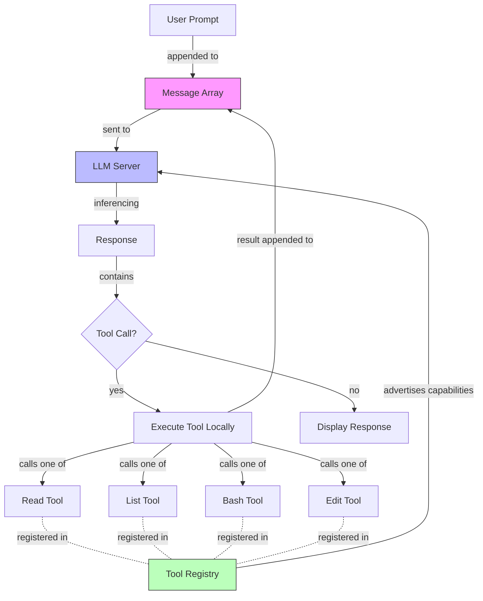

# SWE Baseline Skills for 2026: What You Must Know Now

**Purpose**: Understand what baseline technical skills software engineers need to stay employed in 2026.

**Target audience**: Junior to mid-level software engineers who need to assess their skill gaps and take action.

**What you'll learn**: The fundamental shift in hiring criteria, specific technical skills that are now baseline, why experience in 2024 doesn't equal skill in 2026, and concrete steps to close your gaps.

---

## Section A: Core Concepts and Entities

### The Fundamental Shift

**Answer**: AI coding changed the baseline skills required for software engineering jobs in 2026.

**Explain**: Companies now hire based on your ability to build with AI, not just use AI. Tool calling, inferencing loops, and agent construction are baseline knowledge—the equivalent of knowing linked lists in 2020. A cohort of engineers has been practicing for 6-12 months. They know tricks. They tune the guitar. They understand loop backs. If you're just picking up the tools now, you're competing against this cohort for the same jobs.

**Educate**: This isn't about models getting better. Models are already good enough. This is about your skill in wielding them. Great engineers with no AI skills are now less hireable than mediocre engineers who can build agents.

### Key Entities and Relationships



**Core entities**:
- **Message Array**: The AI's "memory"—just an array that grows each turn
- **Inferencing Loop**: Send array to server, get response, append, repeat
- **Tool Call**: AI's request to execute a function (read file, run command, etc.)
- **Tool Registry**: Billboard advertising what capabilities the AI can invoke
- **Tool**: Local function the AI can execute (read, list, bash, edit)
- **Context Window**: Maximum array size before the AI forgets

**Critical insight**: The server has no memory. It's stateless. Every turn, you send the entire array. Context window fills, AI gets dumber. This is context rot.

### The Five Baseline Technical Skills

If you can't whiteboard these, your career is in jeopardy.

#### 1. Inferencing Loop Mechanics

**What**: The request-response cycle that makes AI coding work.

**How it works**:
1. You send user prompt
2. Prompt appends to message array
3. Array sent to LLM server for inferencing
4. Server returns response
5. Response appends to array
6. If response contains tool call, execute tool
7. Tool result appends to array
8. Repeat from step 3

**Why it matters**: Every coding agent (Cursor, Windsurf, Claude Code, Aider, Cody) is this loop. 300 lines of code. If you don't understand the loop, you're a consumer, not a builder.

#### 2. Tool Calling System

**What**: How AI agents interact with your computer.

**How it works**: You register tools (functions) with the LLM. Each tool has a name, description, and parameter schema. When the AI wants to use a tool, it returns a tool call in its response. Your harness executes the tool, appends the result to the message array, and sends it back for more inferencing.

**Example**:
- You ask: "What's the weather in Sydney?"
- AI doesn't know
- You register a `get_weather(location)` tool
- AI sees tool in registry
- AI responds with tool call: `get_weather("Sydney")`
- Your code executes the tool
- Result appends to array
- AI responds: "The weather in Sydney is 22°C and sunny"

**Why it matters**: Tool calling automated copy-paste. Before tool calling, you manually copied AI output to your IDE, ran it, copied errors back. Tool calling is that loop automated.

#### 3. The Four Primitive Tools

All coding agents are built from these four primitives:

| Tool | Purpose | Example |
|------|---------|---------|
| **Read** | Read file contents | AI asks to read `auth.ts`, gets file contents |
| **List** | List directory contents | AI discovers what files exist |
| **Bash** | Execute shell commands | Run tests, type checks, compile |
| **Edit** | Modify files | Change code, fix bugs |

**How they combine**: User says "study spec.md and implement it." AI calls List to find files, calls Read to read spec, calls Edit to write code, calls Bash to run tests, calls Edit to fix failures, calls Bash again. Each call is a separate inferencing turn.

**Why it matters**: If you understand these primitives, you understand all coding agents. They're all just loops over these four tools. Build your own agent in 30 minutes. That's the bar.

#### 4. Context Windows and Memory

**What**: AI agents have no memory. Context windows are limited.

**How it works**: Every turn, you send the entire message array to the server. The server is stateless—it doesn't remember previous turns. If the array exceeds the context window (200k tokens for Sonnet 4.5), the AI forgets the beginning.

**Context rot**: As context windows fill, output quality degrades. Long conversations produce worse code. This is measurable and real.

**Why it matters**: Knowing context limits determines your agent design. Small tasks, tight loops, frequent commits. Fight context rot.

#### 5. Agent Construction (The Loop)

**What**: Wrapping the inferencing loop in a shell loop.

**How it works**:
```bash
#!/bin/bash
for i in {1..10}; do
  claude --permission-mode acceptEdits "@plan.md Implement next item"
done
```

That's a coding agent. Read plan, pick task, implement, commit, loop.

**Why it matters**: Cursor, Windsurf, Claude Code—they're all loops. The models do the work. The harness just orchestrates turns. Understanding this means you're not locked into tools. You build what you need.

### Models vs. Harnesses: Who Does the Work?

**Answer**: Models do all the work. Harnesses just orchestrate.

**Explain**: Cursor, Windsurf, Claude Code, Aider, Cody—they're 300 lines of code in a loop. The models generate the code. The harnesses provide tools and run the loop. Marketing makes one seem better than another, but they're the same. Stop fluffing around with model dropdown selectors unless you have specific needs.

**Educate**: Use thinking models (OpenAI O3) for planning and reasoning. Use agentic models (Sonnet, Opus) for code generation and execution. Pick based on task type, not brand marketing.

---

## Section B: Critical Insights with Impact Quantification

### Insight 1: Unit Economics Changed Forever

**What**: Software development now costs $10.42 per hour.

**So What**: Running Sonnet 4.5 in a loop for 24 hours costs $250. Divide by 24 hours = $10.42/hour. This is cheaper than minimum wage. Cheaper than a burger flipper at McDonald's. And it can be done while you sleep.

**Now What**: If software development is cheaper than minimum wage, what happens to developers who cost $150k/year? Natural attrition. Performance reviews. Bell curves. The line is coming.

**Quantified Impact**:
- Claude Sonnet 4.5 in loop: **$10.42/hour**
- Human junior developer: **~$40-60/hour**
- Human senior developer: **~$80-120/hour**
- Leverage ratio: **4x-12x cost difference**

**Context**: This doesn't mean mass layoffs tomorrow. Corporate transformation programs take 3-4 years. But model-first companies are already building with 2 people in Bali. They're entering your market. They have no overhead. They're Clayton Christensen disruptive innovation, and they're real.

### Insight 2: Experience in 2024 ≠ Skill in 2026

**What**: Being highly experienced as a software engineer in 2024 doesn't mean you're skilled in 2026.

**So What**: Baseline knowledge shifted. Companies now receive candidates who know tool calling, inferencing loops, and agent construction. These candidates demonstrate curiosity. They built agents. They practiced.

**Now What**: If you're a senior engineer picking up AI tools now, you're behind juniors who started 6 months ago. How much is your paycheck? How much is theirs? They have a 6-month advantage.

**Real-world evidence**:
- Stanford now teaches agent construction
- A cohort of engineers got the memo in early 2025 (posts syndicated by ThePrimeagen)
- They've been practicing for 6-12 months
- They know loop backs, context management, and tool orchestration
- You're competing against them

### Insight 3: Consumer vs. Builder Divide

**What**: There's now a hiring line between consumers and builders.

```
Consumers                    │  Builders
─────────────────────────────┼──────────────────────
Use AI as autocomplete       │  Build agents that automate tasks
Copy-paste from ChatGPT      │  Understand tool calling and loops
Dependent on tool UX         │  Can build custom harnesses
Wait for models to get good  │  Already leveled up their skills
```

**So What**: Founders look for builders. Consumers aren't in the hiring pool unless they have exceptional skills or are close to getting there. You pay builders well. You pay builders who automate their job function exceptionally.

**Now What**: If you're on the left side, move right. Build your own agent. Learn the primitives. Demonstrate curiosity.

**Hiring criteria shift**:
| Old Baseline (2020-2024) | New Baseline (2026) |
|--------------------------|---------------------|
| Data structures (linked lists, trees) | Inferencing loops, tool calling |
| Algorithms (sorting, searching) | Agent construction, context management |
| System design (scalability, CAP) | Still required + AI agent design |
| Language proficiency (Python, JS) | Still required + prompt engineering |

### Insight 4: The Z80 Proof of Concept (Clean Room Risk)

**What**: In February 2025, the speaker proved you could clone companies using AI through clean room design.

**The Process**:
1. Take a C application
2. Compile it to assembly
3. Throw away the C source
4. Feed assembly to AI: "What is this application?"
5. AI generates specifications
6. Throw away the assembly
7. Feed specs to AI: "Build this for Sinclair Z80"
8. AI generates working Z80 assembly from specs alone

**So What**: This proved you can port applications across CPU architectures with no source code—just specs. Then the speaker took it further: ran Ralph loop over Hashicorp Nomad source code to generate specs, then ran Ralph over user guides and marketing materials to capture the remaining 20% (enterprise features). Generated complete product specs from publicly available information.

**Now What**: What does intellectual property mean when you can clean room a 5,000-person SaaS company with 2 people on a beach in Bali? What are software licenses? What is a moat?

**Implication for SWE**: If products can be cloned in Ralph loops, what's valuable? Infrastructure. Infrastructure may be the only remaining moat. Employment market tightens because teams shrink. Model-first companies don't need 5,000 engineers.

### Insight 5: The Cohort Already Exists

**What**: A cohort of engineers has been practicing AI coding for 6-12 months. They're ahead of you.

**So What**: You're not competing against models getting better. Models are already good enough. You're competing against engineers who learned to tune the guitar while you waited.

**Now What**: Don't wait for models to improve. When models get good enough that you finally pay attention, it's too late. The cohort is already hired. The lifeboat is full.

**Timeline**:
- **February 2025**: Z80 experiment, Ralph discovered
- **July 2025**: Ralph released publicly
- **Present (January 2026)**: 6-12 month cohort exists, practices daily, knows tricks

**What they know that you don't**:
- Loop back patterns
- Context management strategies
- When to use thinking models vs. agentic models
- How to structure PRDs for agent loops
- Feedback loop design (types, tests, linting)
- Progress file patterns

### Insight 6: Corporate Transformation Lag

**What**: Corporations will take 3-4 years to transform. You might not see the shift yet.

**So What**: If you're in corporate, expect multi-year transformation programs. Like agile coaches, but for AI. Corporations bend LLMs to corporate standards: coding standards, data sets, compliance. By the time they finish, model-first companies will have eaten their market.

**Now What**: Two choices:
1. Stay in corporate and be one of the few who get it (risky—you're waiting for a multi-year transformation while competing teams move faster)
2. Find a model-first company and surround yourself with people who understand the urgency

**Red flags you're in a slow-moving org**:
- No one talks about AI coding tools
- "We'll evaluate AI next quarter"
- Leadership doesn't code anymore
- No budget for AI tooling subscriptions

**Green flags you're in a fast-moving org**:
- Leadership is back on the tools
- Commit graphs show leadership pushing more code than ICs
- AI tooling is default, not experimental
- Conversations about agent design, not "should we use AI"

### Insight 7: Curiosity as Hiring Signal

**What**: Building an agent demonstrates curiosity. Curiosity is the hiring signal.

**So What**: Companies look for engineers who saw the shift and invested in themselves. Did you wait? Or did you build? Did you complain AI is fascism? Or did you learn the primitives?

**Now What**: Build your own agent. Complete the workshop at github.com/how-to-build-an-agent. Whiteboard the inferencing loop in interviews. Talk about tool calling, context windows, loop backs. This signals: I'm a builder, not a consumer.

**Interview questions you'll face**:
- Draw the inferencing loop
- Explain how tool calling works
- What's the difference between a thinking model and an agentic model?
- How do you handle context rot?
- Build a simple agent on the whiteboard

---

## Section C: Implementation Playbook

### Decision Matrix: Am I at Risk?

| Your Situation | Risk Level | Action Required | Timeline |
|----------------|------------|-----------------|----------|
| Senior dev, no AI skills | **High** | Build agent this week, start HITL Ralph | Immediate |
| Mid-level dev, using Cursor casually | **Medium** | Learn primitives, build custom agent | 1-2 weeks |
| Junior dev, practicing 6+ months | **Low** | Keep building, document your work | Ongoing |
| At model-first company | **Low** | You're in the right place | Ongoing |
| At corporate with no AI strategy | **High** | Start job search, build skills in parallel | 1-3 months |
| Believes "AI is fascism" | **Critical** | Mindset shift required first | Immediate |

### Learning Path: From Consumer to Builder

**Phase 1: Understand the Mechanics (1-2 days)**
- [ ] Read how inferencing loops work
- [ ] Watch demos of tool calling
- [ ] Understand message arrays and context windows
- [ ] Learn the difference between thinking and agentic models

**Phase 2: Build Your First Agent (1 week)**
- [ ] Complete "How to Build an Agent" workshop (github.com/how-to-build-an-agent)
- [ ] Implement the four primitives: read, list, bash, edit
- [ ] Run the inferencing loop manually
- [ ] Observe multi-turn conversations
- [ ] Whiteboard the architecture from memory

**Phase 3: Build a Ralph Loop (1-2 weeks)**
- [ ] Create a small PRD (5-10 tasks)
- [ ] Write a bash loop script
- [ ] Run HITL Ralph (human-in-the-loop, watching each iteration)
- [ ] Observe how the agent picks tasks
- [ ] Refine your prompts based on what you see
- [ ] Run AFK Ralph (away from keyboard, autonomous)

**Phase 4: Deepen Your Understanding (Ongoing)**
- [ ] Experiment with context management patterns
- [ ] Build feedback loops (types, tests, linting)
- [ ] Try alternative loop types (test coverage, linting, duplication detection)
- [ ] Build custom agents for your specific workflow
- [ ] Contribute to open source agents

### Workshop Reference: How to Build an Agent

**Location**: github.com/how-to-build-an-agent (5.5k+ stars)

**What you'll build**: A coding agent from scratch in 30 minutes using Go and Anthropic API.

**What you'll learn**:
- Tool registration (advertising capabilities to the AI)
- Inferencing loop implementation (send, receive, append, repeat)
- Tool execution (read, list, bash, edit)
- Multi-turn conversation handling
- Context window management

**Key insight from the workshop**: Cursor, Windsurf, Claude Code, Aider—they're all 300 lines of code in a loop. The models do the work. Once you build your own agent, you understand all agents.

### Career Positioning Strategy

**For Interviews**:
1. **Lead with projects**: "I built an agent that automates test coverage. Here's how it works." Then whiteboard the inferencing loop.
2. **Demonstrate curiosity**: "I completed the agent-building workshop six months ago. Since then, I've been experimenting with Ralph loops and context management."
3. **Show tool literacy**: "I understand the primitives—read, list, bash, edit—and how they compose into coding agents."
4. **Explain tradeoffs**: "Thinking models for planning, agentic models for execution. Context rot is real, so I keep tasks small and loops tight."

**For Resume**:
- Add "AI Agent Construction" to skills
- Include projects: "Built Ralph loop for test coverage automation (16% → 100%)"
- Show tool proficiency: "Claude Code, Cursor, custom agent harnesses"
- Quantify impact: "Reduced implementation time by X%, increased test coverage by Y%"

**For Networking**:
- Seek out model-first companies
- Join AI coding communities
- Share your agent-building experiments
- Contribute to open source AI coding tools
- Attend conferences where AI coding is discussed

### What to Build First (Concrete Projects)

**Project 1: Weather Agent (Easiest)**
- Registers `get_weather(location)` tool
- User asks: "What's the weather in Sydney?"
- Agent calls tool, returns result
- **Time**: 30 minutes
- **Purpose**: Learn tool registration and calling

**Project 2: File Explorer Agent (Easy)**
- Registers read and list tools
- User asks: "What files are in this project?"
- Agent lists directory, reads interesting files
- **Time**: 1 hour
- **Purpose**: Learn multi-turn conversations

**Project 3: Test Coverage Agent (Medium)**
- Registers read, bash, edit tools
- User provides coverage report
- Agent finds uncovered lines, writes tests, runs coverage again
- **Time**: 1 day
- **Purpose**: Learn Ralph loops and feedback loops

**Project 4: Code Review Agent (Hard)**
- Registers read, bash, list tools
- Agent reads PR diff, runs tests, checks types, suggests improvements
- **Time**: 2-3 days
- **Purpose**: Learn complex multi-tool orchestration

### Resources and Next Steps

**Official Workshops**:
- How to Build an Agent: github.com/how-to-build-an-agent
- Stanford CS25: Transformers United (now includes agent construction)

**Community**:
- Claude Code Discord: Discuss agent patterns
- r/ClaudeAI: Share experiments
- AI Hero CLI: Matt Pocock's examples

**Tools to Practice With**:
- Claude Code (Anthropic's official CLI)
- Cursor (coding agent IDE)
- Aider (terminal-based coding agent)
- Build your own (best learning method)

**Cost Management**:
- Start with Claude Code (free tier available)
- Anthropic 5x Max plan: ~$90-200/month (depends on usage)
- Open source models: Not ready yet, wait 6-12 months

---

## Key Takeaways

**Unit economics changed**. Software development costs $10.42/hour. This is cheaper than minimum wage.

**Experience ≠ Skill**. Being experienced in 2024 doesn't mean you're skilled in 2026. Baseline knowledge shifted.

**Consumer vs. Builder divide**. Hiring criteria now separates those who use AI from those who build with AI.

**Five baseline skills**: Inferencing loops, tool calling, the four primitives, context management, agent construction. If you can't whiteboard these, you're at risk.

**The cohort exists**. Engineers have been practicing for 6-12 months. They have a head start. They know tricks you don't.

**Models do the work**. Harnesses just orchestrate. Cursor, Windsurf, Claude Code—they're 300 lines in a loop.

**Build your own agent**. 30 minutes. Four primitives. github.com/how-to-build-an-agent. This is the bar.

**Curiosity is the signal**. Companies hire builders who demonstrate curiosity. Did you wait, or did you invest in yourself?

**Timeline is tight**. Corporate takes 3-4 years to transform. Model-first companies are already building. The line is coming.

**Take action now**. Don't wait for models to get good. They're already good enough. The question is: are you?

---

## Source Validation

**Primary Source**: Technical vlog transcript "fundamental skills and knowledge you must have in 2026 for SWE" (Jr2auYrBDA4), recorded January 13, 2026

**Authority**: Creator of Ralph Wiggum technique, experienced software engineer with deep knowledge of AI coding agents and industry transformation

**Supporting Context**:
- Ralph Wiggum curated context (organizational pattern reference)
- Ralph Wiggum synthesized v2 (narrative flow reference)
- References to real technologies: Claude Code, Cursor, Windsurf, Anthropic API, Stanford CS25
- Historical examples: Z80 experiment, Hashicorp Nomad reverse engineering
- Quantified impacts: $10.42/hour cost, 6-12 month cohort, 300 lines of code

**Reliability**: High for technical accuracy and market trend analysis. Speaker has direct experience building agents and observing industry shifts. Strong opinions based on real experiments and founder conversations.

**Limitations**: Single practitioner's perspective. Timeline predictions (3-4 year corporate transformation) are estimates. Economic impacts may vary by region, company size, and industry vertical. Harsh framing may create unnecessary fear—opportunity exists for those who act.

**Synthesis Approach**:
- **Convergence**: Technical skills + agent architecture (unified system view)
- **Convergence**: Economic reality + career guidance (both drive urgency)
- **Tension preservation**: Harsh reality vs. opportunity (context-dependent framing)
- **Logical organization**: Historical context → Technical fundamentals → Economic implications → Action plan

---

*This curated context document synthesizes a technical vlog about fundamental SWE skills for 2026. It organizes parallel concept streams (technical, economic, historical, career) into a logical flow optimized for junior to mid-level engineers. Applies Golden Path criteria, Answer-Explain-Educate framework, short sentences, strong verbs, and reader empathy throughout.*
