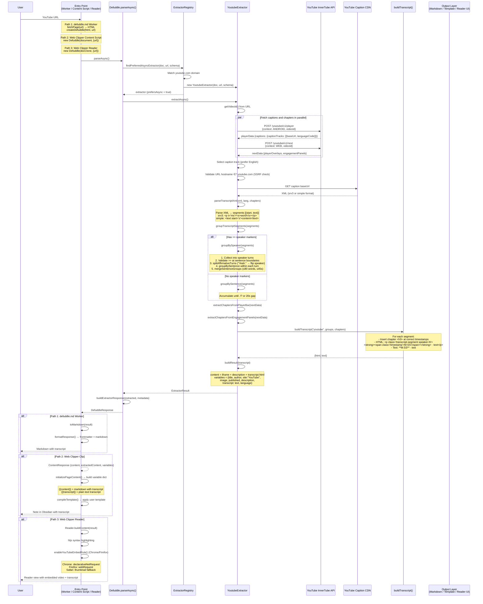

# How YouTube Transcripts Work: Defuddle + Obsidian Web Clipper

> Full decomposition of how Defuddle extracts YouTube transcripts and how they flow through the Obsidian Web Clipper via clipping and Reader mode.

## The Pieces

There are **three separate runtime paths** that all converge on the same Defuddle YouTube extractor:

| Path | Entry Point | Environment | User Action |
|------|------------|-------------|-------------|
| **1. defuddle.md** | Cloudflare Worker | linkedom (no real DOM) | Paste YouTube URL into defuddle.md |
| **2. Web Clipper — Clip** | Content script | Browser DOM | Click extension icon on YouTube |
| **3. Web Clipper — Reader** | Reader script | Browser DOM | Press Alt+Shift+R on YouTube |

All three call the same code: `Defuddle.parseAsync()` → `YoutubeExtractor.extractAsync()`.

## The Critical Insight: `prefersAsync()`

The YouTube extractor is the only extractor that returns `prefersAsync() = true`. This means `parseAsync()` **immediately routes to the async path** before even attempting sync parsing. This is what makes transcript fetching work — the sync `parse()` path has no network access.

```
defuddle.ts:325  parseAsync()
    ↓
defuddle.ts:327  tryAsyncExtractor(findPreferredAsyncExtractor)
    ↓
extractor-registry.ts  → YoutubeExtractor (prefersAsync = true)
    ↓
youtube.ts:60  extractAsync()
    ↓
youtube.ts:61  fetchTranscript()  ← THIS is where the magic happens
```

## The Transcript Pipeline (Inside Defuddle)

`fetchTranscript()` makes **3 parallel-ish HTTP requests** to YouTube's unofficial InnerTube API:

1. **Player API** (`/youtubei/v1/player`) — Android client context → returns caption track URLs
2. **Next API** (`/youtubei/v1/next`) — Web client context → returns chapter data
3. **Caption XML** — Fetches the actual caption track from YouTube's CDN

Then it processes:

4. **XML parsing** — Two formats: srv3 (`<p t="ms"><s>word</s></p>`) or simple (`<text start="s">`)
5. **Diarization** — Detects `>>` speaker markers from auto-captions, validates against sentence boundaries, splits affirmative responses ("Yeah." → new speaker)
6. **Grouping** — With speakers: by turn → by sentence → merge within turn. Without speakers: by sentence boundaries with 20s gap flush
7. **Chapter insertion** — Sorted chapter headings interleaved at correct timestamps
8. **Output** — `buildTranscript()` produces both HTML (with `speaker-0`/`speaker-1` CSS classes and `data-timestamp` attributes) and plain text (with `**M:SS** ·` prefixes)

## End-to-End Sequence Diagram



## Per-Path Details

### Path 1 — defuddle.md Worker

- `website/src/index.ts` receives `GET /https://youtube.com/watch?v=...`
- `convert.ts:convertToMarkdown()` fetches the YouTube HTML with a bot UA
- `defuddleHtmlAsync()` creates a linkedom DOM + calls `parseAsync()`
- Result goes through `toMarkdown()` → `formatResponse()` → YAML frontmatter + markdown
- Response cached with `s-maxage=300` (5 min)

### Path 2 — Web Clipper Clip

- `content.ts` has the real YouTube DOM already loaded
- Calls `new Defuddle(document, {url}).parseAsync()`
- Returns `ContentResponse` with `extractedContent.transcript` and the full HTML content
- `content-extractor.ts:initializePageContent()` maps `defuddled.variables` into template variables
- `{{transcript}}` becomes available as a template variable, `{{content}}` includes the transcript HTML
- User's template is compiled via the AST-based template engine

### Path 3 — Web Clipper Reader

- `background.ts` injects `reader-script.ts` via `scripting.executeScript`
- `Reader.toggle()` clones the document, calls `parseAsync()`
- Builds a clean reading view with the transcript rendered inline
- **YouTube embed header fix**: Chrome sends `enableYouTubeEmbedRule` to background which adds a `declarativeNetRequest` rule setting `Referer: https://obsidian.md/` on YouTube embed requests. Firefox uses `webRequest.onBeforeSendHeaders`. Safari can't modify headers, so it replaces the iframe with a clickable thumbnail.

## Diarization Algorithm Detail

The "pretty good diarization" works like this:

1. YouTube auto-captions insert `>>` at detected speaker changes
2. Defuddle validates these aren't false positives by checking if the **previous segment ended at a sentence boundary** (`.!?` not `,`)
3. Short affirmatives like "Yeah", "Mhm", "Right" at the start of a turn with 30+ words following get **split into their own turn** — the affirmative stays with the current speaker, the rest flips to the other speaker
4. Within each speaker turn, sentences are grouped and then **merged** if they're: not questions, not short standalone utterances (≤3 words), under 80 words combined, and within 45 seconds of each other
5. Speaker identity alternates as `speaker-0` / `speaker-1` CSS classes, producing visual differentiation in both Reader mode and markdown output

## InnerTube API Details

### Player API (Caption Tracks)

```
POST https://www.youtube.com/youtubei/v1/player?prettyPrint=false
User-Agent: com.google.android.youtube/20.10.38 (Linux; U; Android 14)
Content-Type: application/json

{
  "context": {
    "client": {
      "clientName": "ANDROID",
      "clientVersion": "20.10.38"
    }
  },
  "videoId": "dQw4w9WgXcQ"
}
```

Response path: `captions.playerCaptionsTracklistRenderer.captionTracks[].baseUrl`

### Next API (Chapters)

```
POST https://www.youtube.com/youtubei/v1/next?prettyPrint=false
Content-Type: application/json

{
  "context": {
    "client": {
      "clientName": "WEB",
      "clientVersion": "2.20240101.00.00"
    }
  },
  "videoId": "dQw4w9WgXcQ"
}
```

Chapter sources (priority order):
1. **Player bar chapters** (explicit): `playerOverlays.playerOverlayRenderer.decoratedPlayerBarRenderer...markersMap[].value.chapters[].chapterRenderer`
2. **Engagement panel chapters** (auto "Key moments"): `engagementPanels[].engagementPanelSectionListRenderer.content.macroMarkersListRenderer.contents[].macroMarkersListItemRenderer`

## Grouping Constants

| Constant | Value | Purpose |
|----------|-------|---------|
| `TRANSCRIPT_GROUP_GAP_SECONDS` | 20 | Force flush buffer on large time gaps |
| `TURN_MERGE_MAX_WORDS` | 80 | Don't merge sentence groups exceeding this |
| `TURN_MERGE_MAX_SPAN_SECONDS` | 45 | Don't merge groups spanning more than this |
| `SHORT_UTTERANCE_MAX_WORDS` | 3 | Keep short utterances (≤3 words + punctuation) standalone |
| `FIRST_GROUP_MERGE_MIN_WORDS` | 8 | Don't merge if first group in turn has fewer words |

## Output Formats

### HTML (in `{{content}}` / Reader mode)

```html
<div class="youtube transcript">
<h2>Transcript</h2>
<h3>Chapter Title</h3>
<p class="transcript-segment speaker-0">
  <strong><span class="timestamp" data-timestamp="0">0:00</span></strong> · Speaker one's text here.
</p>
<p class="transcript-segment speaker-1">
  <strong><span class="timestamp" data-timestamp="45">0:45</span></strong> · Speaker two responds.
</p>
</div>
```

### Plain Text (in `{{transcript}}` variable)

```
### Chapter Title

**0:00** · Speaker one's text here.

**0:45** · Speaker two responds.
```

## Key Source Files

### Defuddle (`/Users/ljack/github/resources/code/defuddle/`)

| File | Purpose |
|------|---------|
| `src/extractors/youtube.ts` | YouTube detection, metadata, InnerTube API, transcript parsing, diarization, grouping |
| `src/utils/transcript.ts` | `buildTranscript()` — HTML/text output with timestamps, chapters, speaker classes |
| `src/defuddle.ts:parseAsync()` | Async entry point — routes to preferred async extractors |
| `src/extractor-registry.ts` | Extractor matching by domain |
| `src/extractors/_base.ts` | Base extractor with `canExtractAsync()`, `prefersAsync()`, `extractAsync()` |
| `src/markdown.ts` | YouTube iframe → markdown link conversion |
| `website/src/convert.ts` | Cloudflare Worker — `convertToMarkdown()`, `defuddleHtmlAsync()` |
| `website/src/index.ts` | Worker request handler |

### Obsidian Web Clipper (`/Users/ljack/github/resources/code/obsidian-clipper/`)

| File | Purpose |
|------|---------|
| `src/content.ts` | Content script — `parseAsync()` call, variable extraction |
| `src/utils/reader.ts` | Reader mode — `parseAsync()`, YouTube embed header fix |
| `src/reader-script.ts` | Reader entry point — `Reader.toggle()` |
| `src/background.ts` | YouTube embed header rules (declarativeNetRequest / webRequest) |
| `src/utils/content-extractor.ts` | Maps Defuddle variables to template variables (`{{transcript}}`) |
| `src/manifest.chrome.json` | `declarativeNetRequest` permission |
| `src/manifest.firefox.json` | `webRequest` + `webRequestBlocking` permissions |

## FAQ

### 1. Where does the Reader view content live in memory, and can you persist it into Obsidian?

**In memory, Reader content lives in three places:**

1. **`Reader.originalHTML`** (static string property) — A snapshot of `document.documentElement.outerHTML` taken before Reader replaces the page. Used only for `Reader.restore()` to undo Reader mode.
2. **`content`** (local variable in `Reader.apply()`) — The extracted HTML string returned by `Defuddle.parseAsync()`. Lives briefly during setup, then parsed into a temporary DOM via `DOMParser.parseFromString()`.
3. **Live DOM** — The final resting place. Content nodes are moved into an `<article>` element inside `.obsidian-reader-content > main > article`. This _is_ the page the user sees — it's not stored separately.

**The Reader view is purely in-memory — it exists only in the browser tab's live DOM, which lives in the browser's renderer process heap (system RAM).** The browser may also hold it in its internal page cache (e.g. Chrome's bfcache for back/forward navigation), but this is still volatile memory — not disk. Nothing is written to disk, `localStorage`, `sessionStorage`, IndexedDB, or extension storage. If the user closes the tab, navigates away, or toggles Reader off (Alt+Shift+R), the rendered content is gone. The `Reader.originalHTML` string (used to restore the original page) similarly lives only in the content script's JavaScript heap — also system RAM, also lost on navigation or tab close.

**The only path to disk is clicking Web Clipper to clip it into Obsidian.**

When you click the Web Clipper extension icon while Reader mode is active, `content.ts:getPageContent` runs `new Defuddle(document, {url}).parseAsync()` on the **current document** — which _is_ the Reader DOM, not the original page. So Defuddle re-extracts from the clean Reader view (including the YouTube transcript HTML), and the result flows into the normal clipping pipeline:

- **`{{content}}`** — Markdown with the transcript embedded
- **`{{transcript}}`** — Plain text transcript (`**M:SS** · text` format)
- All other template variables (`{{title}}`, `{{author}}`, etc.) populated from the Defuddle result

These get compiled through the user's template and saved to Obsidian via the `obsidian://new` URI scheme. No special mechanism needed — Reader mode just gives you a cleaner extraction source.

### 2. How does Defuddle auto-detect the transcript URL, and what happens if YouTube changes it?

**There is no hardcoded transcript URL.** The caption track URL is dynamically discovered at runtime through a two-step process:

**Step 1 — Ask YouTube's InnerTube API for caption metadata:**

Defuddle POSTs to `https://www.youtube.com/youtubei/v1/player?prettyPrint=false` with an Android client context (`clientName: "ANDROID"`, `clientVersion: "20.10.38"`) and the video ID. YouTube responds with the full player data, which includes a `captions.playerCaptionsTracklistRenderer.captionTracks[]` array. Each entry has a `baseUrl` — this is the dynamically generated, signed URL pointing to the timedtext XML on YouTube's caption CDN.

**Step 2 — Fetch the caption XML from the discovered URL:**

Defuddle picks the best track (prefers English, falls back to first available), validates the hostname ends with `.youtube.com` (SSRF prevention), then fetches the XML. The URL looks something like `https://www.youtube.com/api/timedtext?v=...&lang=en&fmt=srv3&...` with expiring signature parameters — it's not a stable URL, it's generated per-request by YouTube.

**What could break and what's resilient:**

| Surface | Risk | Notes |
|---------|------|-------|
| InnerTube `/player` endpoint | **Medium** | This is the main fragility point. If Google changes the API path, response schema, or starts rejecting the Android client context, Defuddle would need to update `INNERTUBE_API_URL`, `INNERTUBE_CONTEXT`, and/or the response traversal path (`captions.playerCaptionsTracklistRenderer.captionTracks`). The constants at the top of `youtube.ts` (lines 17–32) are designed to make this a quick fix. |
| InnerTube `/next` endpoint | **Medium** | Same risk for chapter data. The deeply nested response paths for player bar chapters and engagement panel chapters could change. |
| Android client version | **Low-Medium** | The hardcoded version `20.10.38` may eventually be rejected. Updating `INNERTUBE_CLIENT_VERSION` is a one-line fix. |
| Caption XML format | **Low** | Two formats are already handled (srv3 and simple). These have been stable for years. |
| Blocking/rate limiting | **Very Low (browser paths)** | In Paths 2 and 3 (Web Clipper Clip and Reader), the `fetch()` calls originate from the user's browser with the user's cookies and IP. To YouTube, this is **indistinguishable from a normal user request** — it's a real browser, on a real IP, with real session cookies, making the same InnerTube API calls that YouTube's own player JavaScript makes. There's no bot fingerprint to detect. |
| Blocking/rate limiting | **Higher (Worker path)** | In Path 1 (defuddle.md Cloudflare Worker), requests come from Cloudflare edge IPs without user cookies, using a spoofed Android User-Agent. This is more detectable and more likely to be rate-limited or blocked. |

**In summary:** The transcript URL is never hardcoded — it's discovered fresh each time via the InnerTube API. The main risk is Google changing the InnerTube API contract (endpoints, client validation, response schema), not the caption URL itself. The browser-based paths (Web Clipper) are inherently robust against blocking because they execute as the user's own browser session.

### 3. What transcript variants does YouTube actually serve, and is Defuddle picking the best one?

YouTube can serve **multiple English transcript tracks** for a single video. The InnerTube `/player` API returns a `captionTracks[]` array where each entry has a `kind` field that distinguishes them:

| `kind` | `vssId` | Meaning | Quality |
|--------|---------|---------|---------|
| *(empty)* | `.en` | Creator-uploaded transcript | Higher — proper punctuation, capitalization, sentence-level segments |
| `asr` | `a.en` | Auto-generated (speech recognition) | Lower — word-level segments, mid-sentence breaks, transcription errors |

**Tested with two reference videos:**

**Video 1: `zcwqTkbaZ0o`** (Level1Techs — no creator transcript)
- InnerTube returns **1 track**: `{languageCode: "en", kind: "asr", vssId: "a.en"}`
- yt-dlp surfaces two keys (`en-orig`, `en`) but they are **byte-identical** — same content, same MD5

**Video 2: `DAX2_mPr9W8`** (Technology Connections — has creator transcript)
- InnerTube returns **2 tracks**, both `languageCode: "en"`:
  - Track 0: `{kind: (none), vssId: ".en"}` — creator-uploaded
  - Track 1: `{kind: "asr", vssId: "a.en"}` — auto-generated
- yt-dlp surfaces this as `subtitles.en` (creator) + `automatic_captions.en-orig` / `automatic_captions.en` (auto, identical)

**Quality comparison (first few segments of `DAX2_mPr9W8`):**

| Creator transcript | Auto-generated |
|--------------------|----------------|
| `Hello and welcome to No Effort November,` | `Hello and welcome to Noeffort November,` |
| `a series of videos for the month of November where no effort is made.` | `a series of videos for the month of` / `November where no effort is made. And` |
| `And you know where I never make any effort?` | `you know where I never make any effort?` |
| `I was right!` | `I was right.` |

Creator transcripts have correct capitalization ("No Effort" vs "Noeffort"), preserve sentence boundaries in segment breaks, and retain original punctuation (exclamation marks vs periods).

**Current gap in Defuddle's track selection:**

The current code at `youtube.ts:230`:

```typescript
const track = captionTracks.find((t: any) => t.languageCode === 'en')
    || captionTracks[0];
```

This uses `find()` which returns the **first** track with `languageCode === 'en'`. For `DAX2_mPr9W8`, that happens to be Track 0 (creator) — so it's **accidentally correct**. But the code has no explicit preference for creator tracks over `kind: "asr"` tracks. If YouTube ever reorders the array (asr first), Defuddle would silently pick the worse transcript.

**Suggested fix:**

```typescript
const enTracks = captionTracks.filter((t: any) => t.languageCode === 'en');
const track = enTracks.find((t: any) => t.kind !== 'asr')
    || enTracks[0]
    || captionTracks[0];
```

This explicitly prefers creator-uploaded tracks (no `kind` or `kind !== 'asr'`) over auto-generated ones, then falls back to first English, then first available.

**Other metadata available but not used:**

| Field | Source | Used by Defuddle | Notes |
|-------|--------|-----------------|-------|
| Chapters | `/next` API | Yes | Both explicit and auto "Key moments" — solid coverage |
| `kind` field on tracks | `/player` API | **No** | The gap described above |
| Tags | Page DOM / schema.org | No | Out of scope for content extraction |
| Categories | Page DOM | No | Out of scope |
| Like/view/comment counts | Page DOM | No | Out of scope |
| Duration | schema.org | No | Could be useful as a template variable |

#### Reproducible examples

##### Using yt-dlp

```bash
# Install: brew install yt-dlp

# === Video with ONLY auto-captions ===
VIDEO1="zcwqTkbaZ0o"

# List all available subtitle tracks
yt-dlp --list-subs "https://www.youtube.com/watch?v=$VIDEO1"

# Dump full metadata as JSON (chapters, counts, description, etc.)
yt-dlp --dump-json --skip-download "https://www.youtube.com/watch?v=$VIDEO1" \
  | python3 -c "
import json, sys
d = json.load(sys.stdin)
print('Title:', d['title'])
print('Channel:', d['channel'])
print('Chapters:', len(d.get('chapters') or []))
for ch in (d.get('chapters') or []):
    m, s = divmod(int(ch['start_time']), 60)
    print(f'  {m}:{s:02d} - {ch[\"title\"]}')
print('Creator subs:', list((d.get('subtitles') or {}).keys()))
auto = d.get('automatic_captions') or {}
print('Auto-caption English variants:', [k for k in auto if k.startswith('en')])
"

# Download auto-captions in srv3 format (what Defuddle parses)
yt-dlp --write-auto-sub --sub-lang en --sub-format srv3 \
  --skip-download -o "/tmp/$VIDEO1" \
  "https://www.youtube.com/watch?v=$VIDEO1"

# === Video with CREATOR transcript ===
VIDEO2="DAX2_mPr9W8"

# Download creator transcript
yt-dlp --write-sub --sub-lang en --sub-format srv3 \
  --skip-download -o "/tmp/$VIDEO2-creator" \
  "https://www.youtube.com/watch?v=$VIDEO2"

# Download auto-captions for comparison
yt-dlp --write-auto-sub --sub-lang en-orig --sub-format srv3 \
  --skip-download -o "/tmp/$VIDEO2-auto" \
  "https://www.youtube.com/watch?v=$VIDEO2"

# Compare file sizes (creator transcripts are ~5x smaller — no word-level <s> tags)
ls -la /tmp/$VIDEO2-creator.en.srv3 /tmp/$VIDEO2-auto.en-orig.srv3

# Diff the first 20 text segments
diff <(head -30 /tmp/$VIDEO2-creator.en.srv3) <(head -30 /tmp/$VIDEO2-auto.en-orig.srv3)
```

##### Using the InnerTube API directly (curl)

```bash
VIDEO_ID="DAX2_mPr9W8"

# Step 1: Get caption track metadata from /player API
# This is exactly what Defuddle's fetchPlayerData() does
curl -s 'https://www.youtube.com/youtubei/v1/player?prettyPrint=false' \
  -H 'Content-Type: application/json' \
  -H 'User-Agent: com.google.android.youtube/20.10.38 (Linux; U; Android 14)' \
  -d "{
    \"context\": {
      \"client\": {
        \"clientName\": \"ANDROID\",
        \"clientVersion\": \"20.10.38\"
      }
    },
    \"videoId\": \"$VIDEO_ID\"
  }" | python3 -c "
import json, sys
d = json.load(sys.stdin)
tracks = d.get('captions', {}).get('playerCaptionsTracklistRenderer', {}).get('captionTracks', [])
print(f'Caption tracks returned: {len(tracks)}')
for i, t in enumerate(tracks):
    print(f'  Track {i}: lang={t.get(\"languageCode\")} kind={t.get(\"kind\", \"(none)\")} vssId={t.get(\"vssId\", \"?\")}')
    print(f'    baseUrl: {t[\"baseUrl\"][:100]}...')
"

# Step 2: Get chapters from /next API
# This is exactly what Defuddle's fetchChapters() does
curl -s 'https://www.youtube.com/youtubei/v1/next?prettyPrint=false' \
  -H 'Content-Type: application/json' \
  -d "{
    \"context\": {
      \"client\": {
        \"clientName\": \"WEB\",
        \"clientVersion\": \"2.20240101.00.00\"
      }
    },
    \"videoId\": \"$VIDEO_ID\"
  }" | python3 -c "
import json, sys
d = json.load(sys.stdin)

# Try player bar chapters (explicit)
panels = (d.get('playerOverlays', {}).get('playerOverlayRenderer', {})
  .get('decoratedPlayerBarRenderer', {}).get('decoratedPlayerBarRenderer', {})
  .get('playerBar', {}).get('multiMarkersPlayerBarRenderer', {}).get('markersMap', []))
chapters = []
for panel in panels:
    for marker in (panel.get('value', {}).get('chapters', [])):
        ch = marker.get('chapterRenderer', {})
        title = ch.get('title', {}).get('simpleText', '')
        start_ms = ch.get('timeRangeStartMillis', 0)
        if title:
            chapters.append((start_ms / 1000, title))

# Fall back to engagement panels (auto 'Key moments')
if not chapters:
    for panel in (d.get('engagementPanels', [])):
        content = panel.get('engagementPanelSectionListRenderer', {}).get('content', {})
        for item in (content.get('macroMarkersListRenderer', {}).get('contents', [])):
            r = item.get('macroMarkersListItemRenderer', {})
            title = r.get('title', {}).get('simpleText', '')
            ts = r.get('timeDescription', {}).get('simpleText', '')
            if title and ts:
                chapters.append((ts, title))

print(f'Chapters found: {len(chapters)}')
for ch in chapters:
    if isinstance(ch[0], float):
        m, s = divmod(int(ch[0]), 60)
        print(f'  {m}:{s:02d} - {ch[1]}')
    else:
        print(f'  {ch[0]} - {ch[1]}')
"

# Step 3: Fetch the actual caption XML
# Copy a baseUrl from Step 1 output, then:
# curl -s '<baseUrl>' -H 'User-Agent: Mozilla/5.0' | head -20
```

##### Using Defuddle programmatically (Node.js)

```typescript
// npm install defuddle
// Run with: npx tsx test-transcript.ts

import Defuddle from 'defuddle/node';

async function testVideo(videoId: string) {
  const url = `https://www.youtube.com/watch?v=${videoId}`;

  // Fetch the YouTube page HTML
  const resp = await fetch(url, {
    headers: { 'User-Agent': 'Mozilla/5.0 (Macintosh; Intel Mac OS X 10_15_7)' }
  });
  const html = await resp.text();

  // Parse with Defuddle (async path triggers YouTube extractor)
  const result = await Defuddle.parseAsync(html, { url });

  console.log(`=== ${videoId} ===`);
  console.log(`Title: ${result.title}`);
  console.log(`Author: ${result.author}`);
  console.log(`Language: ${result.variables?.language}`);
  console.log(`Has transcript: ${!!result.variables?.transcript}`);
  console.log(`Transcript length: ${result.variables?.transcript?.length ?? 0} chars`);
  console.log(`\nFirst 500 chars of transcript:\n${result.variables?.transcript?.slice(0, 500)}`);
  console.log(`\nFirst 500 chars of content HTML:\n${result.content?.slice(0, 500)}`);
}

// Auto-captions only
await testVideo('zcwqTkbaZ0o');

// Creator transcript available
await testVideo('DAX2_mPr9W8');
```

##### Using the Defuddle CLI

```bash
# Install globally or use from the repo
npm install -g defuddle

# Get markdown output with transcript
npx defuddle parse "https://www.youtube.com/watch?v=DAX2_mPr9W8" --markdown

# Get JSON output (includes variables.transcript separately)
npx defuddle parse "https://www.youtube.com/watch?v=DAX2_mPr9W8" --json \
  | python3 -c "
import json, sys
d = json.load(sys.stdin)
print('Title:', d.get('title'))
print('Author:', d.get('author'))
v = d.get('variables', {})
print('Language:', v.get('language'))
print('Transcript preview:', v.get('transcript', '')[:300])
"
```
