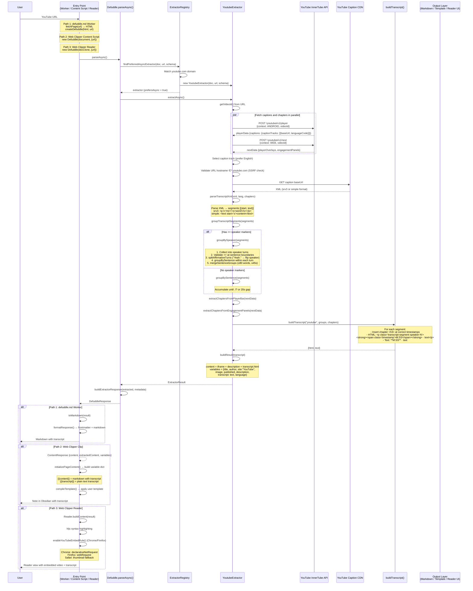

# How YouTube Transcripts Work: Defuddle + Obsidian Web Clipper

> Full decomposition of how Defuddle extracts YouTube transcripts and how they flow through the Obsidian Web Clipper via clipping and Reader mode.

## The Pieces

There are **three separate runtime paths** that all converge on the same Defuddle YouTube extractor:

| Path | Entry Point | Environment | User Action |
|------|------------|-------------|-------------|
| **1. defuddle.md** | Cloudflare Worker | linkedom (no real DOM) | Paste YouTube URL into defuddle.md |
| **2. Web Clipper — Clip** | Content script | Browser DOM | Click extension icon on YouTube |
| **3. Web Clipper — Reader** | Reader script | Browser DOM | Press Alt+Shift+R on YouTube |

All three call the same code: `Defuddle.parseAsync()` → `YoutubeExtractor.extractAsync()`.

## The Critical Insight: `prefersAsync()`

The YouTube extractor is the only extractor that returns `prefersAsync() = true`. This means `parseAsync()` **immediately routes to the async path** before even attempting sync parsing. This is what makes transcript fetching work — the sync `parse()` path has no network access.

```
defuddle.ts:325  parseAsync()
    ↓
defuddle.ts:327  tryAsyncExtractor(findPreferredAsyncExtractor)
    ↓
extractor-registry.ts  → YoutubeExtractor (prefersAsync = true)
    ↓
youtube.ts:60  extractAsync()
    ↓
youtube.ts:61  fetchTranscript()  ← THIS is where the magic happens
```

## The Transcript Pipeline (Inside Defuddle)

`fetchTranscript()` makes **3 parallel-ish HTTP requests** to YouTube's unofficial InnerTube API:

1. **Player API** (`/youtubei/v1/player`) — Android client context → returns caption track URLs
2. **Next API** (`/youtubei/v1/next`) — Web client context → returns chapter data
3. **Caption XML** — Fetches the actual caption track from YouTube's CDN

Then it processes:

4. **XML parsing** — Two formats: srv3 (`<p t="ms"><s>word</s></p>`) or simple (`<text start="s">`)
5. **Diarization** — Detects `>>` speaker markers from auto-captions, validates against sentence boundaries, splits affirmative responses ("Yeah." → new speaker)
6. **Grouping** — With speakers: by turn → by sentence → merge within turn. Without speakers: by sentence boundaries with 20s gap flush
7. **Chapter insertion** — Sorted chapter headings interleaved at correct timestamps
8. **Output** — `buildTranscript()` produces both HTML (with `speaker-0`/`speaker-1` CSS classes and `data-timestamp` attributes) and plain text (with `**M:SS** ·` prefixes)

## End-to-End Sequence Diagram



## Per-Path Details

### Path 1 — defuddle.md Worker

- `website/src/index.ts` receives `GET /https://youtube.com/watch?v=...`
- `convert.ts:convertToMarkdown()` fetches the YouTube HTML with a bot UA
- `defuddleHtmlAsync()` creates a linkedom DOM + calls `parseAsync()`
- Result goes through `toMarkdown()` → `formatResponse()` → YAML frontmatter + markdown
- Response cached with `s-maxage=300` (5 min)

### Path 2 — Web Clipper Clip

- `content.ts` has the real YouTube DOM already loaded
- Calls `new Defuddle(document, {url}).parseAsync()`
- Returns `ContentResponse` with `extractedContent.transcript` and the full HTML content
- `content-extractor.ts:initializePageContent()` maps `defuddled.variables` into template variables
- `{{transcript}}` becomes available as a template variable, `{{content}}` includes the transcript HTML
- User's template is compiled via the AST-based template engine

### Path 3 — Web Clipper Reader

- `background.ts` injects `reader-script.ts` via `scripting.executeScript`
- `Reader.toggle()` clones the document, calls `parseAsync()`
- Builds a clean reading view with the transcript rendered inline
- **YouTube embed header fix**: Chrome sends `enableYouTubeEmbedRule` to background which adds a `declarativeNetRequest` rule setting `Referer: https://obsidian.md/` on YouTube embed requests. Firefox uses `webRequest.onBeforeSendHeaders`. Safari can't modify headers, so it replaces the iframe with a clickable thumbnail.

## Diarization Algorithm Detail

The "pretty good diarization" works like this:

1. YouTube auto-captions insert `>>` at detected speaker changes
2. Defuddle validates these aren't false positives by checking if the **previous segment ended at a sentence boundary** (`.!?` not `,`)
3. Short affirmatives like "Yeah", "Mhm", "Right" at the start of a turn with 30+ words following get **split into their own turn** — the affirmative stays with the current speaker, the rest flips to the other speaker
4. Within each speaker turn, sentences are grouped and then **merged** if they're: not questions, not short standalone utterances (≤3 words), under 80 words combined, and within 45 seconds of each other
5. Speaker identity alternates as `speaker-0` / `speaker-1` CSS classes, producing visual differentiation in both Reader mode and markdown output

## InnerTube API Details

### Player API (Caption Tracks)

```
POST https://www.youtube.com/youtubei/v1/player?prettyPrint=false
User-Agent: com.google.android.youtube/20.10.38 (Linux; U; Android 14)
Content-Type: application/json

{
  "context": {
    "client": {
      "clientName": "ANDROID",
      "clientVersion": "20.10.38"
    }
  },
  "videoId": "dQw4w9WgXcQ"
}
```

Response path: `captions.playerCaptionsTracklistRenderer.captionTracks[].baseUrl`

### Next API (Chapters)

```
POST https://www.youtube.com/youtubei/v1/next?prettyPrint=false
Content-Type: application/json

{
  "context": {
    "client": {
      "clientName": "WEB",
      "clientVersion": "2.20240101.00.00"
    }
  },
  "videoId": "dQw4w9WgXcQ"
}
```

Chapter sources (priority order):
1. **Player bar chapters** (explicit): `playerOverlays.playerOverlayRenderer.decoratedPlayerBarRenderer...markersMap[].value.chapters[].chapterRenderer`
2. **Engagement panel chapters** (auto "Key moments"): `engagementPanels[].engagementPanelSectionListRenderer.content.macroMarkersListRenderer.contents[].macroMarkersListItemRenderer`

## Grouping Constants

| Constant | Value | Purpose |
|----------|-------|---------|
| `TRANSCRIPT_GROUP_GAP_SECONDS` | 20 | Force flush buffer on large time gaps |
| `TURN_MERGE_MAX_WORDS` | 80 | Don't merge sentence groups exceeding this |
| `TURN_MERGE_MAX_SPAN_SECONDS` | 45 | Don't merge groups spanning more than this |
| `SHORT_UTTERANCE_MAX_WORDS` | 3 | Keep short utterances (≤3 words + punctuation) standalone |
| `FIRST_GROUP_MERGE_MIN_WORDS` | 8 | Don't merge if first group in turn has fewer words |

## Output Formats

### HTML (in `{{content}}` / Reader mode)

```html
<div class="youtube transcript">
<h2>Transcript</h2>
<h3>Chapter Title</h3>
<p class="transcript-segment speaker-0">
  <strong><span class="timestamp" data-timestamp="0">0:00</span></strong> · Speaker one's text here.
</p>
<p class="transcript-segment speaker-1">
  <strong><span class="timestamp" data-timestamp="45">0:45</span></strong> · Speaker two responds.
</p>
</div>
```

### Plain Text (in `{{transcript}}` variable)

```
### Chapter Title

**0:00** · Speaker one's text here.

**0:45** · Speaker two responds.
```

## Key Source Files

### Defuddle (`/Users/ljack/github/resources/code/defuddle/`)

| File | Purpose |
|------|---------|
| `src/extractors/youtube.ts` | YouTube detection, metadata, InnerTube API, transcript parsing, diarization, grouping |
| `src/utils/transcript.ts` | `buildTranscript()` — HTML/text output with timestamps, chapters, speaker classes |
| `src/defuddle.ts:parseAsync()` | Async entry point — routes to preferred async extractors |
| `src/extractor-registry.ts` | Extractor matching by domain |
| `src/extractors/_base.ts` | Base extractor with `canExtractAsync()`, `prefersAsync()`, `extractAsync()` |
| `src/markdown.ts` | YouTube iframe → markdown link conversion |
| `website/src/convert.ts` | Cloudflare Worker — `convertToMarkdown()`, `defuddleHtmlAsync()` |
| `website/src/index.ts` | Worker request handler |

### Obsidian Web Clipper (`/Users/ljack/github/resources/code/obsidian-clipper/`)

| File | Purpose |
|------|---------|
| `src/content.ts` | Content script — `parseAsync()` call, variable extraction |
| `src/utils/reader.ts` | Reader mode — `parseAsync()`, YouTube embed header fix |
| `src/reader-script.ts` | Reader entry point — `Reader.toggle()` |
| `src/background.ts` | YouTube embed header rules (declarativeNetRequest / webRequest) |
| `src/utils/content-extractor.ts` | Maps Defuddle variables to template variables (`{{transcript}}`) |
| `src/manifest.chrome.json` | `declarativeNetRequest` permission |
| `src/manifest.firefox.json` | `webRequest` + `webRequestBlocking` permissions |
