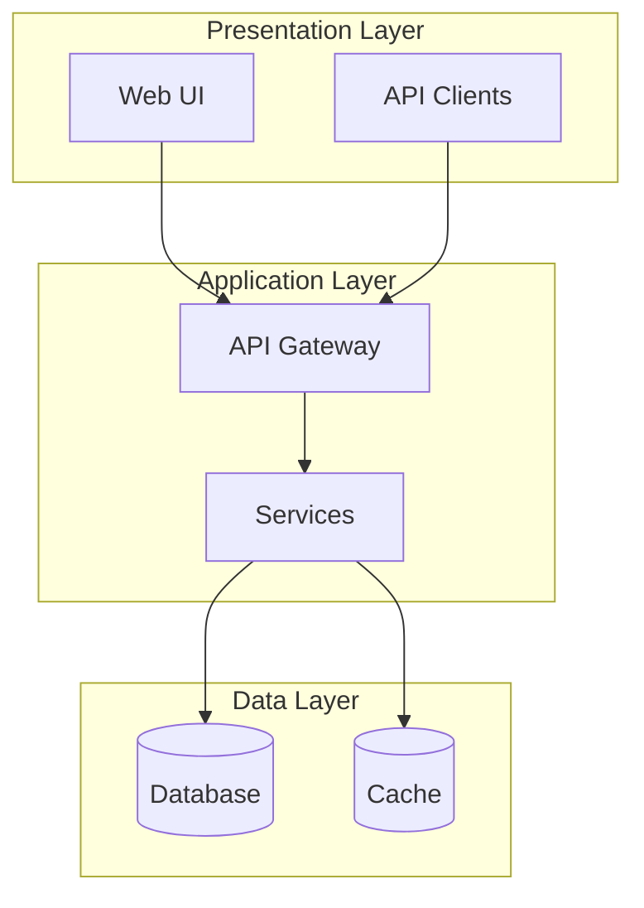
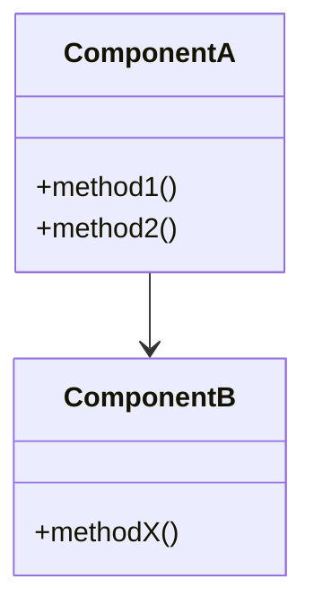
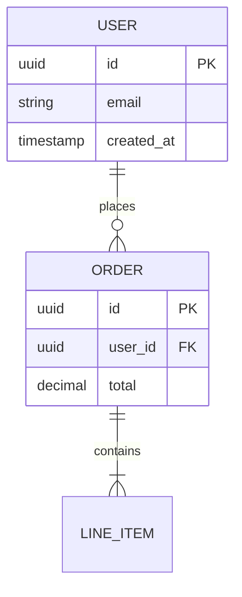
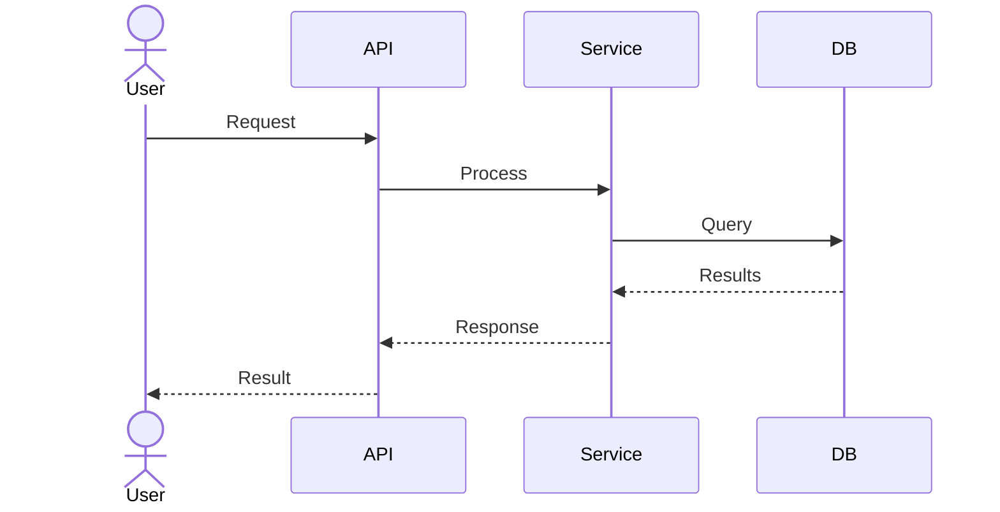

# Documentation Templates

Templates for generated documentation files.

## index.md (Knowledge Base Index)

```markdown
# Codebase Knowledge Base

## AI Assistant Instructions

This file is the primary context for understanding this codebase. Use it to:
1. Understand overall architecture and purpose
2. Find which documentation files contain specific information
3. Navigate to detailed documentation as needed

## Quick Reference

| Question Type | Consult |
|--------------|---------|
| System architecture | architecture.md |
| How components work | components.md |
| API endpoints/interfaces | interfaces.md |
| Data structures | data_models.md |
| Key processes | workflows.md |
| External libraries | dependencies.md |

## Codebase Overview

[2-3 paragraph description of what this codebase does]

## Table of Contents

### architecture.md
**Purpose:** System architecture and design patterns
**Contains:** High-level diagrams, layer descriptions, design decisions
**Use when:** Understanding how the system is structured

### components.md
**Purpose:** Detailed component documentation
**Contains:** Responsibilities, interfaces, dependencies, implementation
**Use when:** Working on or understanding specific parts

[Continue for each file...]
```

## architecture.md

```markdown
# System Architecture

## Overview
[1-2 paragraph high-level description]

## Architecture Diagram


## Layer Descriptions

### Presentation Layer
[Description]

### Application Layer
[Description]

### Data Layer
[Description]

## Design Patterns
| Pattern | Where Used | Purpose |
|---------|-----------|---------|
| Repository | Data access | Abstract storage |
| Factory | Object creation | Flexible instantiation |

## Key Design Decisions

### [Decision Title]
**Context:** [Why needed]
**Decision:** [What was decided]
**Consequences:** [Trade-offs]
```

## components.md

```markdown
# Components

## Overview


## Component Details

### [Component Name]
**Purpose:** [What it does]
**Location:** `src/components/[name]/`

**Key Files:**
| File | Purpose |
|------|---------|
| index.ts | Entry point |
| types.ts | Type definitions |

**Dependencies:**
- Internal: [list]
- External: [list]

**Public Interface:**
```typescript
interface ComponentName {
  method1(param: Type): ReturnType;
}
```
```

## interfaces.md

```markdown
# Interfaces and APIs

## API Overview
Base URL: `[url]`
Authentication: `[method]`

## Endpoints

### [Resource Name]

#### GET /resource
**Purpose:** [Description]

**Request:**
| Parameter | Type | Required | Description |
|-----------|------|----------|-------------|
| id | string | Yes | Resource ID |

**Response:**
```json
{
  "id": "string",
  "name": "string"
}
```

**Errors:**
| Code | Description |
|------|-------------|
| 400 | Invalid request |
| 404 | Not found |
```

## data_models.md

```markdown
# Data Models

## Entity Relationship Diagram


## Model Details

### [Model Name]
**Table:** `[table_name]`
**Purpose:** [Description]

**Fields:**
| Field | Type | Constraints | Description |
|-------|------|-------------|-------------|
| id | UUID | PK | Identifier |
| name | VARCHAR | NOT NULL | Display name |

**Indexes:**
- `idx_name` on `name`

**Relationships:**
- belongsTo User via user_id
```

## workflows.md

```markdown
# Workflows

## [Workflow Name]

### Overview
[Brief description]

### Sequence Diagram


### Steps
1. **[Step 1]**
   - Trigger: [What initiates]
   - Action: [What happens]
   - Output: [Result]

### Error Handling
| Scenario | Handling |
|----------|----------|
| [Error 1] | [How handled] |
```

## AGENTS.md (Consolidation Target)

```markdown
# AGENTS.md

AI Coding Assistant Context for [Project Name]

## Quick Start
[Essential info for AI to start helping]

## Project Structure
```
project/
├── src/           # Source code
│   ├── components/
│   ├── services/
│   └── utils/
├── tests/         # Test files
└── docs/          # Documentation
```

## Key Patterns

### [Pattern Name]
[Brief description with example]

### Coding Conventions
- [Convention 1]
- [Convention 2]

## Common Tasks

### Running Tests
```bash
[test command]
```

### Building
```bash
[build command]
```

### Adding a New Feature
1. [Step 1]
2. [Step 2]

## Package-Specific Notes

### [Package Name]
[Important context]

## Gotchas
- [Warning 1]
- [Warning 2]
```

## Mermaid Diagram Guidelines

**Architecture:** Use `graph TB` or `graph LR` with `subgraph` for grouping
**Classes:** Use `classDiagram` showing key methods and relationships
**Sequences:** Use `sequenceDiagram` with actor for user interactions
**ER Diagrams:** Use `erDiagram` showing cardinality and key fields
**State:** Use `stateDiagram-v2` for state machines
