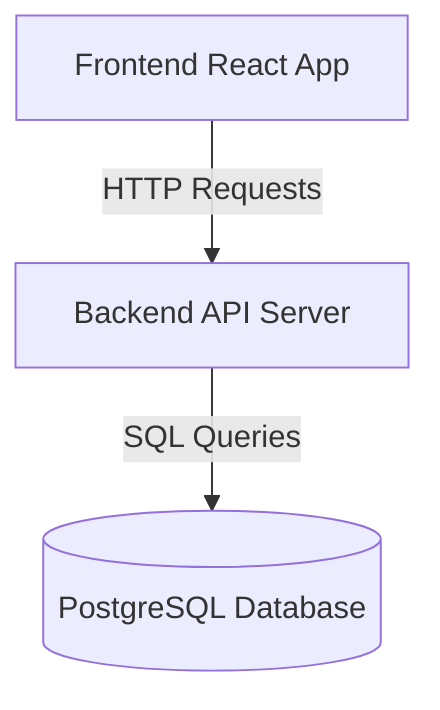

# OODA Pattern: Deep Dive

## Origins and History

### John Boyd's Military Framework

The OODA Loop was developed by U.S. Air Force Colonel John Boyd in the 1950s and 1960s during his analysis of aerial combat. Boyd observed that fighter pilots who could rapidly cycle through Observe-Orient-Decide-Act sequences gained decisive advantages over opponents, even when flying technically inferior aircraft.

**Key Insight:** Speed through the OODA loop matters more than individual phase optimization. The pilot who completes cycles faster forces opponents into reactive mode, disrupting their decision-making.

**Boyd's Original Context:**
- **Observe:** Gather sensory data (visual, instruments, communication)
- **Orient:** Most critical phase - filter observations through mental models, experience, cultural background
- **Decide:** Select maneuver or tactic
- **Act:** Execute the decision, creating new observations

### Expansion Beyond Military

The OODA framework expanded into business strategy, cybersecurity, emergency response, and competitive environments where:
- Situations change rapidly
- Decisions must be made under uncertainty
- Speed and adaptability create competitive advantage
- Feedback loops drive continuous improvement

## Application to LLM Interaction

### The Context Window Challenge

Large Language Models operate within finite context windows. Traditional conversation flows can:
- **Meander:** Losing focus across many turns
- **Bloat:** Accumulating redundant information
- **Degrade:** Losing coherence as context fills
- **Hallucinate:** Generating inconsistencies when overwhelmed

### OODA as Context Management

The OODA pattern addresses these challenges by:

**1. Phased Progression**
- Each phase has specific objectives and outputs
- Context loads only what's relevant to current phase
- Artifacts externalize memory, freeing context space

**2. Structured Interaction**
- Clear transitions between phases prevent wandering
- Explicit checkpoints ensure alignment
- User guidance maintains direction

**3. Progressive Refinement**
- Each phase builds on previous artifacts
- Reference files loaded on-demand, not preemptively
- Summary tracks state across sessions

**4. Artifact-Based Memory**
- Decisions captured in files reduce in-context retention needs
- Structured formats (YAML frontmatter) enable quick parsing
- Files serve as checkpoints for recovery

## The Four Phases in Detail

### Phase 1: Observe (Research)

**Purpose:** Gather comprehensive raw data without premature filtering.

**In LLM Context:**
- Read relevant files, documentation, code
- Fetch web resources or internal knowledge bases
- Collect user-provided context and requirements
- Document everything in `observe/research.md`

**Key Principles:**
- **Breadth over depth** initially
- **No judgment** during collection
- **Cite sources** for future reference
- **Visual representation** (mermaid diagrams) for complex systems

**Anti-patterns:**
- Analyzing while observing (breaks into Orient too early)
- Skipping documentation of sources
- Assuming knowledge instead of gathering evidence

**Outputs:**
- `rough-idea.md` - Initial problem statement
- `observe/research.md` - Comprehensive findings
- `summary.md` - Status tracking

### Phase 2: Orient (Analysis & Sense-Making)

**Purpose:** Filter, analyze, and make sense of observations.

**Boyd's Critical Insight:** Orient is the most important phase. It's where mental models, cultural background, and previous experience filter raw observations into understanding.

**In LLM Context:**
- Ask clarifying questions one at a time
- Probe edge cases and constraints
- Identify patterns in research
- Refine rough idea into detailed requirements
- Document in `observe/idea-honing.md`

**Key Principles:**
- **One question at a time** - prevents overwhelm
- **Wait for complete responses** - multi-turn dialogue is acceptable
- **Suggest options** but never assume answers
- **Explicit confirmation** before proceeding

**Critical Constraints:**
- NEVER batch multiple questions
- NEVER pre-populate answers
- ALWAYS wait for user's actual response
- Document both questions AND answers

**Anti-patterns:**
- Assuming user preferences
- Moving too quickly through clarification
- Skipping validation of understanding
- Creating answers based on research alone

**Outputs:**
- `observe/idea-honing.md` - Complete Q&A record
- Updated `summary.md` with refined understanding

### Phase 3: Decide (Planning)

**Purpose:** Select course of action based on analysis.

**In LLM Context:**
- Create high-level design
- Identify major components and interfaces
- Make architectural decisions with rationales
- Define success criteria
- Document in `decide/` directory

**Key Principles:**
- **Explicit rationales** for decisions
- **Visual architecture** (mermaid diagrams)
- **Trade-off analysis** where applicable
- **User review** before proceeding

**Decision Categories:**
- Architecture patterns
- Technology choices
- Component boundaries
- Data models
- Integration approaches

**Anti-patterns:**
- Jumping to implementation details
- Skipping rationale documentation
- Making decisions without user input on preferences
- Over-designing before validation

**Outputs:**
- `decide/to-do.md` - Focused task list
- `decide/high-level-design.md` - Architecture and approach
- Updated `summary.md` with key decisions

### Phase 4: Act (Execution-Ready Tasks and Actions)

**Purpose:** Create execution-ready artifacts with detailed implementation plans.

**In LLM Context:**
- Generate detailed design document
- Create step-by-step implementation plan with actionable checklists
- Define testing strategy
- Establish demoable milestones
- Document in `act/` directory
- **Note:** This skill creates execution-ready artifacts only. It does NOT execute any tasks or actions.

**Key Principles:**
- **Incremental steps** that build on each other
- **Testable milestones** at each stage
- **Demo-driven** - every step shows working functionality
- **Core-first** - validate end-to-end flow early

**Implementation Plan Structure:**
- Checklist at top for tracking
- Numbered steps with clear objectives
- Integration guidance for each step
- Test requirements where appropriate
- Explicit "Demo" section per step

**Anti-patterns:**
- Big-bang steps (too much at once)
- Orphaned code (not integrated)
- Skipping tests until the end
- Excessive detail (belongs in design doc)

**Outputs:**
- `act/detailed-design.md` - Complete specifications
- `act/implementation-plan.md` - Step-by-step guide with checklist
- Final `summary.md` (status: complete)

## Context Convergence Mechanics

### How OODA Manages Context Windows

**1. Temporal Separation**
```
Time →
[Observe] → [Orient] → [Decide] → [Act]
   ↓          ↓           ↓          ↓
 Files      Files       Files      Files
```

At each phase, only relevant artifacts are in active context:
- **Observe:** rough-idea.md + research.md (growing)
- **Orient:** research.md (read-only) + idea-honing.md (growing)
- **Decide:** idea-honing.md (read-only) + design docs (growing)
- **Act:** All previous (read-only) + implementation plan (growing)

**2. Artifact Externalization**

Instead of holding everything in context:
```
❌ Bad: All context in conversation history
User: "I want to build X"
LLM: [Analyzes, asks questions, proposes design, all in memory]
Result: Context bloats, coherence degrades

✅ Good: OODA with artifacts
User: "I want to build X"
LLM: → Creates rough-idea.md, research.md
     → Q&A in idea-honing.md
     → Design in decide/high-level-design.md
     → Plan in act/implementation-plan.md
Result: Context stays focused on current phase
```

**3. Checkpoint Recovery**

`summary.md` with YAML frontmatter enables:
- **Session resumption:** Know exactly where you are
- **Status awareness:** in-progress vs. complete
- **Phase tracking:** Which step is current
- **Quick reference:** Key decisions without reading all files

Example:
```yaml
---
status: in-progress
phase: orient
domain: software
started: 2026-01-03T15:00:45Z
updated: 2026-01-03T16:30:12Z
---
```

**4. Progressive Detail**

Information flows from broad to specific:
```
Level 1: rough-idea.md (50-200 words)
Level 2: research.md (500-2000 words)
Level 3: idea-honing.md (1000-3000 words)
Level 4: high-level-design.md (1500-3000 words)
Level 5: detailed-design.md (3000-8000 words)
```

Each level builds on previous, but you don't load all levels at once.

## Reducing Hallucinations

### Structured Interaction Prevents Drift

**Common LLM Failure Mode:**
```
User: "Help me design a system"
LLM: [Generates entire design based on assumptions]
     [Includes features not requested]
     [Makes technology choices without input]
Result: Design doesn't match user needs, requires rework
```

**OODA Structured Approach:**
```
User: "Help me design a system"
LLM: → Observe: "Let me gather context. What is the system for?"
     → Orient: "Should it be real-time or batch processing?"
              "What scale are we targeting?"
              [One question at a time, wait for answers]
     → Decide: "Based on your answers, I propose..."
              [Explicit rationale, user confirms]
     → Act: "Here's the implementation plan..."
              [Builds on confirmed decisions]
Result: Design matches user needs, minimal rework
```

### Explicit Confirmation Checkpoints

**Hallucination Prevention Points:**

1. **Before phase transitions:** "Are you ready to proceed to [next phase]?"
2. **After major decisions:** "Does this approach align with your goals?"
3. **During Orient:** "Is my understanding correct that...?"
4. **Before Act:** "Before I create the implementation plan, let me confirm..."

### Documentation of Sources

**Research Phase Requirement:**
- Cite all sources (files, URLs, documentation)
- Link to specific sections where possible
- Note when information is inferred vs. explicit

**Benefits:**
- User can verify claims
- Future sessions can re-access sources
- Reduces confidence in unsupported assertions

### Visual Validation

**Mermaid Diagrams Force Precision:**

Text description (prone to hallucination):
```
"The system has a frontend that talks to a backend which uses a database"
```

Mermaid diagram (requires explicit structure):


Diagrams make assumptions visible and verifiable.

## Iteration and Feedback Loops

### The OODA Cycle

Boyd emphasized the LOOP aspect - Act generates new observations:

```
Observe → Orient → Decide → Act
   ↑                          ↓
   └──────────────────────────┘
        (Feedback Loop)
```

In guided-ooda-loop skill:
- **Within phases:** Orient may trigger additional Observe
- **Between phases:** Decide may reveal gaps requiring Orient
- **Post-Act:** Implementation feedback starts new OODA cycle

### Iteration Patterns

**1. Observe ↔ Orient Iteration:**
```
Research reveals unknown technology
→ Return to Observe to research that technology
→ Return to Orient with new context
```

**2. Orient ↔ Decide Iteration:**
```
High-level design reveals missing requirements
→ Return to Orient for clarification
→ Return to Decide with complete understanding
```

**3. Cross-Session Iteration:**
```
Session 1: Complete OODA through Act (planning)
Session 2: Execute implementation, discover issues
Session 3: New OODA cycle to address learnings
```

### When to Iterate vs. Proceed

**Iterate when:**
- User expresses uncertainty or confusion
- Research uncovers contradictory information
- Design reveals missing requirements
- Complexity seems overwhelming

**Proceed when:**
- User explicitly confirms readiness
- Sufficient clarity achieved for current phase
- Artifacts capture necessary detail
- Next phase's work is unblocked

## Comparison to Other Patterns

### OODA vs. Traditional Design Docs

**Traditional Approach:**
- Write comprehensive design document upfront
- Attempt to capture all requirements at once
- Often becomes outdated quickly
- Loaded entirely into context when referenced

**OODA Approach:**
- Phased progression through understanding
- Captures requirements through structured Q&A
- Artifacts evolve with understanding
- Selective loading based on current phase

### OODA vs. Agile/Iterative

**OODA is Compatible with Agile:**
- Both emphasize iteration and feedback
- Both value working increments
- Both adapt to changing understanding

**OODA Adds Structure:**
- Explicit phases for LLM context management
- Artifact-based memory system
- Checkpoint recovery mechanism

### OODA vs. Test-Driven Development

**TDD Focus:** Test → Code → Refactor

**OODA Focus:** Observe → Orient → Decide → Act

**Integration:**
OODA's Act phase can incorporate TDD:
```
Act: Implementation Plan
  Step 1: Write tests for [component]
  Step 2: Implement [component] to pass tests
  Step 3: Refactor and demo
```

## Domain-Specific Adaptations

While the core OODA pattern is universal, each domain adapts it:

### Software Development
- **Observe:** Codebase analysis, API research, existing solutions
- **Orient:** Requirements clarification, technical constraints, architecture patterns
- **Decide:** Technology selection, component design, data models
- **Act:** Implementation plan with TDD, integration strategy

### Strategy/Planning
- **Observe:** Market research, competitive analysis, internal capabilities
- **Orient:** SWOT analysis, stakeholder interviews, constraint identification
- **Decide:** Strategic options, trade-off analysis, resource allocation
- **Act:** Execution roadmap with milestones, metrics, responsibilities

### Writing/Documentation
- **Observe:** Audience research, existing content, style guides
- **Orient:** Content structure, tone requirements, key messages
- **Decide:** Outline, section organization, examples to include
- **Act:** Writing plan with sections, review checkpoints, publication steps

### Research/Analysis
- **Observe:** Literature review, data collection, expert interviews
- **Orient:** Pattern identification, hypothesis formation, methodology selection
- **Decide:** Research approach, analysis methods, validation criteria
- **Act:** Research plan with experiments, analysis steps, reporting structure

## Advanced Concepts

### Subagent Support (Future)

For OODA loops that exceed single context windows:

**Problem:**
Large brownfield codebase analysis requires examining thousands of files.

**Solution:**
- Launch specialized Explore agent for Observe phase
- Agent analyzes codebase, creates summary artifacts
- Return to main OODA loop with condensed findings
- Main loop continues with Orient phase

**Benefits:**
- Parallelization of research tasks
- Specialized agents for specific domains
- Main OODA loop stays focused on progression

### Multi-Domain OODA

**Scenario:** System spanning multiple domains (frontend + backend + infrastructure)

**Approach:**
1. Top-level OODA loop for overall system
2. Domain-specific sub-loops for each component
3. Summary artifacts roll up to top level
4. Coordination through decide/to-do.md

### Automated OODA

**Future Enhancement:**
- Scripts automate Observe phase (code analysis, metrics collection)
- LLM focuses on Orient and Decide phases
- Automated testing provides Act phase feedback
- Continuous OODA loops for ongoing systems

## Best Practices Summary

### For Success

1. **Trust the structure:** Don't skip phases, even if tempting
2. **One question at a time:** Prevents overwhelm, ensures clarity
3. **Document rationales:** Future you (and LLM) will thank you
4. **Use checkpoints:** summary.md is your recovery mechanism
5. **Iterate freely:** OODA is a loop, not a waterfall
6. **Visual aids:** Mermaid diagrams force precision
7. **Cite sources:** Enables verification and re-access
8. **Incremental progress:** Small steps compound quickly

### For Context Management

1. **Externalize early:** Create artifacts as soon as possible
2. **Reference, don't duplicate:** Link to files rather than copying
3. **Progressive detail:** Start broad, add specificity as needed
4. **Selective loading:** Only read artifacts relevant to current phase
5. **Structured formats:** YAML frontmatter enables quick parsing

### For User Experience

1. **Explain the process:** Help users understand OODA benefits
2. **Offer options:** Suggest but don't prescribe
3. **Check in regularly:** Don't disappear into long research
4. **Summarize before transitions:** Ensure alignment before proceeding
5. **Be adaptive:** Recognize when to iterate vs. forge ahead

---

**Key Takeaway:** OODA is a universal pattern for managing complex problem-solving within LLM context constraints. By structuring interaction through distinct phases and creating persistent artifacts, it enables coherent progression from rough idea to detailed plan while optimizing for context convergence and minimizing hallucinations.
