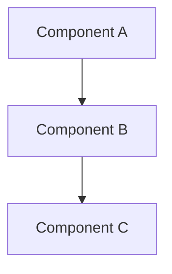
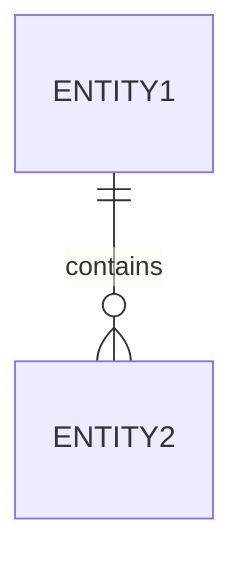

# Document Templates

Templates for artifacts created during the PDD workflow.

## Table of Contents
- [Idea Honing Template](#idea-honing-template)
- [Detailed Design Template](#detailed-design-template)
- [Implementation Plan Template](#implementation-plan-template)
- [Summary Template](#summary-template)

---

## Idea Honing Template

Format for `{project_dir}/idea-honing.md`:

```markdown
# Requirements Clarification

## Question 1: [Question text]

**Answer:** [User's response]

*Alternatives considered:* [Optional - other options discussed]

---

## Question 2: [Question text]

**Answer:** [User's response]

---

[Continue for each question/answer pair]
```

---

## Detailed Design Template

Format for `{project_dir}/design/detailed-design.md`:

```markdown
# [Project Name] - Detailed Design

## 1. Overview

[1-2 paragraph summary of what this design addresses. Should be understandable without reading other project files.]

## 2. Detailed Requirements

### 2.1 Functional Requirements
- [Requirement 1]
- [Requirement 2]

### 2.2 Non-Functional Requirements
- [Performance, security, scalability requirements]

### 2.3 Constraints
- [Technical or business constraints]

### 2.4 Success Criteria
- [Measurable success criteria]

## 3. Architecture Overview

[High-level description of the system architecture]



## 4. Components and Interfaces

### 4.1 [Component Name]

**Purpose:** [What this component does]

**Interfaces:**
- Input: [Description]
- Output: [Description]

**Dependencies:** [Other components this depends on]

[Repeat for each component]

## 5. Data Models

### 5.1 [Entity Name]

```
[Field definitions, types, constraints]
```

**Relationships:**
- [Relationship to other entities]



## 6. Error Handling

### 6.1 Error Categories
- [Category 1]: [How handled]
- [Category 2]: [How handled]

### 6.2 Recovery Strategies
- [Strategy descriptions]

## 7. Testing Strategy

### 7.1 Unit Tests
- [Key areas to cover]

### 7.2 Integration Tests
- [Key integration points]

### 7.3 End-to-End Tests
- [Critical user flows]

## 8. Appendices

### 8.1 Technology Choices

| Technology | Purpose | Pros | Cons |
|------------|---------|------|------|
| [Tech 1]   | [Use]   | [+]  | [-]  |

### 8.2 Research Findings Summary
- [Key finding 1]
- [Key finding 2]

### 8.3 Alternative Approaches Considered
- **[Alternative 1]:** [Why not chosen]
- **[Alternative 2]:** [Why not chosen]
```

---

## Implementation Plan Template

Format for `{project_dir}/implementation/plan.md`:

```markdown
# Implementation Plan

## Progress Checklist

- [ ] Step 1: [Brief description]
- [ ] Step 2: [Brief description]
- [ ] Step 3: [Brief description]
[Continue for all steps]

---

## Step 1: [Objective]

**Objective:** [Clear statement of what this step accomplishes]

**Implementation Guidance:**
- [Key implementation details]
- [Patterns or approaches to use]

**Test Requirements:**
- [ ] [Test 1 description]
- [ ] [Test 2 description]

**Integration:** [How this connects to previous work, or "Foundation step" if first]

**Demo:** [Explicit description of the working functionality that can be demonstrated after completing this step]

---

## Step 2: [Objective]

[Same structure as Step 1]

---

[Continue for all steps]

---

## Notes

- Each step should result in working, demoable functionality
- Core end-to-end functionality should be available early
- No hanging or orphaned code - each step integrates with previous work
```

---

## Summary Template

Format for `{project_dir}/summary.md`:

```markdown
# Project Summary

## Artifacts Created

| File | Description |
|------|-------------|
| `rough-idea.md` | Original concept |
| `idea-honing.md` | Requirements clarification Q&A |
| `research/[file].md` | [Research topic] |
| `design/detailed-design.md` | Complete design specification |
| `implementation/plan.md` | Implementation steps with checklist |

## Design Overview

[2-3 paragraph summary of the key design decisions and architecture]

## Implementation Approach

[Brief summary of the implementation strategy - number of steps, key milestones]

## Next Steps

1. Review the detailed design at `design/detailed-design.md`
2. Check the implementation plan at `implementation/plan.md`
3. Begin implementation following the checklist

## Areas for Refinement

- [Any areas identified during the process that may need further work]
```
