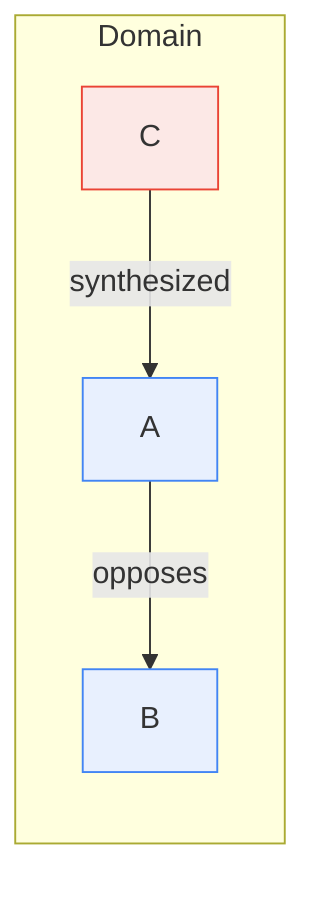

# Prior Art Research — Prose + Ontology Markdown Notation

## Date: 2026-02-26

---

## Obsidian Ecosystem

### Native Graph View
- Uses only [[wikilinks]] as edges. No edge types, labels, or semantic filtering.
- Color-code node groups by search query. Toggle tags/attachments/orphans.
- Becomes hairball at scale. Irrelevant for structured knowledge graphs.

### Breadcrumbs Plugin (Production-ready)
- Five directional edge fields: `up`, `down`, `same`, `next`, `prev` via frontmatter
- V4 uses WASM graph engine, supports transitive inference
- **Hierarchical by design** — no `contradicts`, `causes`, `enables`

### Juggl Plugin (Niche)
- Typed links: `- linkType [[Node]]` in lists, or `linkType:: [[Node]]` inline
- Single-word types only. Built on Cytoscape.js
- Developer built Neo4j export plugin (hit Obsidian-native limits)

### Dataview Plugin (De facto query engine)
- Reads YAML frontmatter and `key:: value` inline fields
- DataviewJS can generate mermaid FROM metadata
- Pattern: `metadata → Dataview query → mermaid output`
- **Nobody uses mermaid as data source** — always the other direction

### Bases (Core plugin since 1.9)
- Database views, reads only YAML frontmatter, ignores inline fields

---

## Mermaid as Structural Truth Source

### Prior Art (Thin)
- **Carleton X-Lab:** GPT-3 reading mermaid ER diagrams → RDF-Turtle. LLM as parser.
- **OntoMermaid:** OWL → mermaid (one direction only, not the reverse)
- **SynDevs blog:** LLMs extracting KGs from text → mermaid as output format
- **Kurt Cagle:** Conceptual writing on RDF graphs + mermaid intersection

**Nobody has built a mature system treating mermaid as canonical graph definition.**

### Obsidian Mermaid Limitations
- Bundles mermaid ~11.4.x (lags upstream)
- `@{}` node metadata: **broken**
- Edge IDs `e1@`: **broken**
- Rendering directives: partially ignored
- ~280 edge limit (not configurable)
- `.mmd` file embedding: not supported

### Safe Subset

### Programmatic Parsing (If Ever Needed)
- `@mermaid-js/parser` — official Langium-based AST parser (JS)
- `@lifeomic/mermaid-simple-flowchart-parser` — JSON graph output (JS)
- `go-mermaid` (sammcj) — full AST parser (Go)
- Regex for core subset: `^(\w+)\s*(-->|-.->|==>|<-->)\|([^|]+)\|\s*(\w+)$`
- **LLMs parse mermaid with high reliability** — deterministic syntax, in training data

---

## Tension Preservation & Knowledge Convergence

### Zettelkasten Patterns
| Pattern | Mechanism |
|---------|-----------|
| Folgezettel branching | Contradictions get sibling branches (1a vs 1b) |
| Terminal status notes | TRUE/FALSE/MAYBE terminal nodes |
| Active structure notes | Curated index of current principles; obsolete notes remain |
| Question notes | Tension markers linking both sides of a conflict |
| Gap notes | Known unknowns as first-class objects |
| Never edit substance | Append-only evolution, preserves intellectual lineage |

**Key gap:** Standard Zettelkasten link taxonomies have NO oppositional relationship types.

### Formal Intersection Semantics
| Approach | Mechanism | K-DAG Application |
|----------|-----------|-------------------|
| IAR (Intersection of ABox Repairs) | Must hold across ALL repairs | Consensus layer |
| Brave semantics | Accepted if derivable from ANY repair | Extensions layer |
| Paraconsistent logic | Third truth value for contradictions | Tensions layer |
| Confidence-weighted repair | Uncertainty scores determine acceptability | Confidence on edges |

### Dialectical Structures
- **Hegelion** — LLM dialectical reasoning. Separate calls for thesis/antithesis/synthesis. MCP server exists.
- **Self-Reflecting LLMs paper** — Hegelian dialectics formalized with temperature annealing
- **Argdown** — Markdown-native argument mapping: `+` support, `-` attack, `_` undercut, `><` contradiction
- **IBIS in Obsidian** — `#issue`, `#position`, `#pro`, `#con` tags + Juggl visualization

### Three-Layer Intersection Model
1. **Consensus (IAR)** — survives all interpretations
2. **Tensions (Paraconsistent)** — conflict preserved, not resolved
3. **Extensions (Brave)** — single-source, included with provenance

---

## Sources
- [Zettelkasten Forum: Managing contradictions](https://forum.zettelkasten.de/discussion/2756/)
- [Different Kinds of Ties](https://zettelkasten.de/posts/kinds-of-ties/)
- [Hegelion](https://github.com/Hmbown/Hegelion)
- [Self-Reflecting LLMs](https://arxiv.org/html/2501.14917v3)
- [Argdown](https://argdown.org/)
- [IBIS in Obsidian](https://forum.obsidian.md/t/tips-for-making-an-issue-based-information-system/31353)
- [KG Inconsistency Survey](https://arxiv.org/html/2502.19023v1)
- [OntoMermaid](https://github.com/floresbakker/OntoMermaid)
- [Mermaid → Ontology via GPT](https://carleton.ca/xlab/2023/mermaid-diagram-to-ontology-via-gpt3-for-the-illicit-antiquities-trade/)
- [Mermaid Flowchart Syntax](https://mermaid.js.org/syntax/flowchart.html)
- [@mermaid-js/parser](https://www.npmjs.com/package/@mermaid-js/parser)
- [Mermaid AST Issue #2523](https://github.com/mermaid-js/mermaid/issues/2523)
- [Obsidian Mermaid Edge ID Bug](https://forum.obsidian.md/t/obsidian-mermaid-edge-id-giving-error/100448)
- [Andy Matuschak: Evergreen Notes](https://notes.andymatuschak.org/Evergreen_notes)
